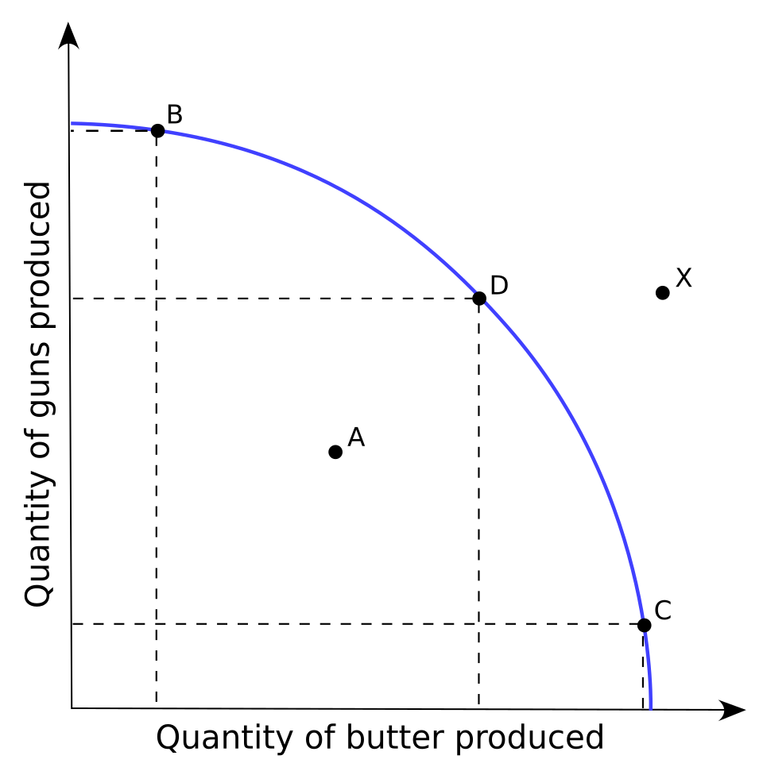
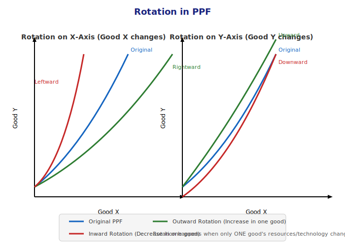

# Class 11 Economics – Chapter 1: Introduction to Microeconomics

---

## 1. What is an Economy?

> An **Economy** is a **system** that provides people the **means to work and earn a living**.

**Simple Definition:**
> An Economy is a system which provides people the means to work and earn a living.

### Real Life Examples (From Lecture):

| Person | Work | How They Earn |
|--------|------|---------------|
| Prashant Bhaiya | Farming | Grows crops, sells them for money |
| Shovit Bhaiya | Railway Tickets | Works in railway department |
| Digra Bhaiya | Truck Driving | Drives a truck for living |

> Everyone is earning through their work in different ways – that's what an **Economy** is!

---

## 2. Why Study Economics? – The Story of Scarcity

We study Economics because of **Scarcity** (shortage/lack of resources).

### Story: Four Brothers at a Fair with ₹50

> Four brothers had only **₹50** in total. They went to a fair:
> - 🍕 Pizza costs more than they had
> - 🍰 Pastry = ₹50 (too expensive for four people)
> - 🥟 Chaat = ₹100 (way beyond budget)
> - 🥤 Sugarcane Juice = ₹10 (Yes! They could afford this!)

**Moral:** Our **Wants** are unlimited, but **Resources** are limited → This creates an **Economic Problem**.

---

## 3. Scarcity – The Mother of Economics

> **Scarcity** = Supply is limited, but Demand is unlimited!

### Example:
- 100 people want a Car (Demand)
- But we only have 10 Cars available (Supply)
- → This is **Scarcity**

> **Scarcity is the reason Economics was born!**

### Two Aspects of Scarcity:

| Aspect | Explanation |
|--------|-------------|
| **Limited Supply** | Resources like Petrol, Land, Money, Time are all limited |
| **Alternative Uses** | Petrol is used not just in Cars but in Airplanes, Machines, etc. |

> **Definition of Economics:** "Economics is the study of how society manages its **scarce resources**."

---

## 4. Economic Problem

### Three Main Reasons:

```
┌─────────────────────────────────────────────┐
│            ECONOMIC PROBLEM                 │
│                                             │
│  1. Unlimited Wants                         │
│  2. Scarce Resources (Limited)              │
│  3. Alternative Uses of Resources           │
└─────────────────────────────────────────────┘
```

### Story of Bablu Bhaiya – Unlimited Wants:

Bablu Bhaiya's wishes:
1. ✅ Get married
2. ✅ Have 101 children
3. ✅ Build a big house
4. ✅ Buy a car
5. ✅ Build a muscular body (dumble workout)

> **Problem:** He has only a **₹1** coin in his pocket, but everything costs so much more!

### Important Definition:
> **Economic Problem** arises because:
> - Human wants are **unlimited**
> - Resources are **scarce** (limited)
> - Resources have **alternative uses**

### Example: The 1 Liter Milk Problem

| Person Wants | Dish |
|-------------|------|
| One wants Tea | ☕ Tea |
| One wants Coffee | 🫘 Coffee |
| One wants Buttermilk | 🥛 Buttermilk |
| One wants Paneer | 🧀 Paneer |
| One wants Ghee | 🫗 Ghee |
| One wants Butter | 🧈 Butter |
| One wants Sweets | 🍬 Sweets |

> **Problem:** With just 1 liter of milk, you cannot fulfill everyone's different wishes → You have to make a **Choice**!

---

## 5. Positive vs Normative Economics

### Positive Economics

> **Positive Economics** deals with **"What Is"** – It gives factual statements that can be verified.

### Normative Economics

> **Normative Economics** deals with **"What Ought to Be"** – It gives value judgments / opinions.

### Comparison Table:

| Basis | Positive Economics | Normative Economics |
|-------|-------------------|-------------------|
| **Deals With** | What Is (facts) | What Ought to Be (opinions) |
| **Verification** | Can be verified with actual data | Cannot be verified with data |
| **Nature** | Objective (factual) | Subjective / Suggestive |
| **Value Judgement** | No value judgement | Involves value judgement |
| **Purpose** | Description of economic activity | Ideal description of how things should work |
| **Example 1** | "India's prices are rising" | "India should take steps to control rising prices" |
| **Example 2** | "Income inequality exists in India" | "Income inequality should be reduced" |

---

## 6. Microeconomics vs Macroeconomics

### Microeconomics (Study in Class 11)

> **Microeconomics** = Study of **Individual** Economic Units (one person, one firm, one product)

### Macroeconomics (Study in Class 12)

> **Macroeconomics** = Study of **Aggregate** (entire) Economy (whole country)

### Difference Table:

| Basis | Microeconomics | Macroeconomics |
|-------|---------------|---------------|
| **Meaning** | Studies individual units | Studies aggregate economy |
| **Tools** | Demand & Supply of individual product | Aggregate Demand & Aggregate Supply |
| **Objective** | Determine price of a commodity | Determine income & employment level of economy |
| **Scope** | Limited (narrow scope) | Highest (wide scope) |
| **Assumption** | Macro variables assumed constant (ceteris paribus) | Micro variables assumed constant |
| **Other Names** | **Price Theory** | **Income & Employment Theory** |
| **Examples** | Your monthly income, price of 1 kg sugar | India's National Income, Total Employment |

### Ceteris Paribus (All Other Things Being Equal):

> When you want to check one variable, you keep all other variables **constant**.

**Real Life Example:** To check how much electricity AC consumes, you switch off all other appliances (lights, fan, TV) and run only the AC. This way you isolate one variable's effect → This is **Ceteris Paribus**.

---

## 7. Central Problems of an Economy

```
┌────────────────────────────────────────────────────┐
│           CENTRAL PROBLEMS OF ECONOMY              │
├────────────────────────────────────────────────────┤
│                                                    │
│   1. WHAT to Produce?                              │
│      ├── Which commodities to produce?             │
│      └── How much quantity?                        │
│                                                    │
│   2. HOW to Produce?                               │
│      ├── Labour Intensive Technique                │
│      └── Capital Intensive Technique               │
│                                                    │
│   3. FOR WHOM to Produce?                          │
│      └── Who gets the goods? (Distribution)         │
│                                                    │
└────────────────────────────────────────────────────┘
```

### 1 WHAT to Produce?

> **Question:** Which goods should be produced and in what quantity?

**Example:** Mom asks every day "What should I cook today?"
- Should I make Idli?
- Should I make Dosa?
- Should I make Pav Bhaji?
- → Everyone gives a different suggestion!

### 2 HOW to Produce?

> **Question:** How should we produce – using Labour (people) or Capital (machines)?

| Technique | Meaning | Real Example |
|-----------|---------|-------------|
| **Labour Intensive** | Use more human labour | Building a bridge in India (many workers) |
| **Capital Intensive** | Use more machines | Building a bridge in USA (machines) |

> **India** → Labour Intensive (labour is cheaper and abundant)
> **USA** → Capital Intensive (machines are more advanced)

### 3 FOR WHOM to Produce?

> **Question:** Who should get the goods that are produced?

**Example from Lecture:**
- A poor man comes → hasn't eaten for 2 days
- A beautiful woman comes → asking for food
- A rich man comes → wants a fancy meal

> **Problem:** Whom should we produce for? → Society must make a **Choice** about distribution!

---

## 8. Opportunity Cost

> **This is one of the MOST IMPORTANT concepts of the chapter!**

### Definition:
> **Opportunity Cost** = **Cost of the next best alternative foregone**  
> The value of what you give up when you make a choice.

### Example: You have ₹10 – What do you do?

```
Option A: Watch a Movie (₹10)
Option B: Eat something  (₹10)  ← You chose this
```

> **Opportunity Cost** = The **enjoyment** you would have got from watching the movie, which you **forego** (give up) by choosing to eat instead.

### Key Point:
> Whenever you **choose** something, you are **sacrificing** something else!

---

## 9. Production Possibility Frontier (PPF) / Production Possibility Curve (PPC)

### What is PPF?

> **PPF** is a **Graphical Representation** that shows the **possible combinations of two goods** that can be produced with available resources and given technology.

### Other Names (Important for Exams!):

| Name | Meaning |
|------|---------|
| Production Possibility Curve (PPC) | Same as PPF |
| Production Possibility Frontier (PPF) | This one |
| Production Possibility Boundary | Same concept |
| **Transformation Curve** | Same |
| **Transformation Boundary** | Same |

> Just like one person can have multiple names (e.g. Bablu = CM = Chandramauli), PPF also has multiple names!

### Assumptions of PPF:

```
┌──────────────────────────────────────────┐
│         ASSUMPTIONS OF PPF               │
├──────────────────────────────────────────┤
│                                          │
│  1. Resources are FIXED                  │
│     → 10 kg flour = 10 kg only           │
│                                          │
│  2. Only TWO Goods are produced          │
│     → For easy understanding             │
│                                          │
│  3. Resources are FULLY utilized         │
│     → No waste, everything used          │
│                                          │
│  4. Technology is CONSTANT               │
│     → Neither improving nor declining    │
│                                          │
└──────────────────────────────────────────┘
```

### PPF Graph:



### PPF Schedule Example (Guns & Butter):

| Possibility | Guns | Butter |
|-------------|------|--------|
| A | 21 | 0 |
| B | 20 | 1 |
| C | 18 | 2 |
| D | 15 | 3 |
| E | 11 | 4 |
| F | 6 | 5 |
| G | 0 | 6 |

> As we keep **decreasing** Guns → **Butter keeps increasing**!

---

## 10. Marginal Opportunity Cost (MOC) / Marginal Rate of Transformation (MRT)

### Definition:
> **MOC** = Number of units of a commodity **sacrificed** to gain **one additional unit** of another commodity.

### Formula:

```
                    Units of Good X sacrificed
MRT (MOC) = ────────────────────────────────────
                 Units of Good Y gained
```

### Calculation from Schedule:

| Change | Guns Sacrificed | Butter Gained | MRT |
|--------|----------------|---------------|-----|
| A → B | 1 (21→20) | 1 (0→1) | 1/1 = 1 |
| B → C | 2 (20→18) | 1 (1→2) | 2/1 = 2 |
| C → D | 3 (18→15) | 1 (2→3) | 3/1 = 3 |
| D → E | 4 (15→11) | 1 (3→4) | 4/1 = 4 |
| E → F | 5 (11→6) | 1 (4→5) | 5/1 = 5 |

> **MRT is increasing** → This is why PPF is **Concave** shaped!

---

## 11. Shape of PPF – Why is it Concave?

### Why is PPF **Downward Sloping**?

> Because to increase quantity of one good, you **must decrease** the quantity of the other good → **Inverse Relationship**

### Why is PPF **Concave** (Bowed Outward)?

> Because **MRT increases** (Increasing MRT) – to get each additional unit, you have to sacrifice more and more of the other good!

### Shape vs MRT Relationship:

| PPF Shape | MRT |
|-----------|-----|
| **Concave** (Bowed Outward) | **Increasing** MRT |
| **Convex** (Bowed Inward) | **Decreasing** MRT |
| **Straight Line** | **Constant** MRT |

---

## 12. Attainable & Unattainable Combinations


| Type | Location | Meaning |
|------|----------|---------|
| **Efficient** ✅ | **ON** the PPF Curve | Resources fully utilized, no waste |
| **Inefficient** ⚠️ | **INSIDE** the PPF Curve | Resources underutilized (unemployment/waste) |
| **Unattainable** ❌ | **OUTSIDE** the PPF Curve | Not possible with current resources |

### Remember:
- **ON the curve** = Best use of all resources (Optimum Utilization)
- **INSIDE the curve** = Resources are being wasted (Unemployment / Inefficiency)
- **OUTSIDE the curve** = Can be achieved in future if resources / technology increase

---

## 13. Shift in PPF (Change in BOTH Goods)


| Shift | Direction | Reason |
|-------|-----------|--------|
| **Rightward Shift** ➡️ | Curve moves outward | Resources ↑ / Technology ↑ |
| **Leftward Shift** ⬅️ | Curve moves inward | Resources ↓ / Technology ↓ |

### Causes of Rightward Shift (Economic Growth):
- 📈 Increase in Resources (more Raw Material, Labour, Capital)
- 🔧 Technology Improvement (better machines & methods)
- 📚 Better Education & Skill Development

### Causes of Leftward Shift (Economic Decline):
- 🌊 Natural Disasters (Earthquake, Flood)
- ⚔️ War
- 🏭 Technology Degradation
- 📉 Decrease in Resources

---

## 14. Rotation in PPF (Change in ONLY ONE Good)



| Rotation | Effect | Reason |
|----------|--------|--------|
| **On X-Axis (Rightward)** | Good X ↑ increases | X's resources/technology improves |
| **On X-Axis (Leftward)** | Good X ↓ decreases | X's resources/technology degrades |
| **On Y-Axis (Upward)** | Good Y ↑ increases | Y's resources/technology improves |
| **On Y-Axis (Downward)** | Good Y ↓ decreases | Y's resources/technology degrades |

### Shift vs Rotation – Key Difference:

| Shift | Rotation |
|-------|----------|
| **BOTH** goods' resources/technology change | **Only ONE** good's resources/technology change |
| Entire curve moves as a whole | Only one side of the curve moves |

---

## Chapter Summary – At a Glance

```
┌─────────────────────────────────────────────┐
│         CHAPTER 1: INTRODUCTION             │
├─────────────────────────────────────────────┤
│                                             │
│  Economy → System for work & earning        │
│                                             │
│  Scarcity → Limited Resources, Unlimited    │
│             Wants, Alternative Uses         │
│                                             │
│  Economic Problem → What, How, For Whom     │
│                                             │
│  Positive Economics → What Is (Facts)       │
│  Normative Economics → What Ought to Be     │
│                                             │
│  Microeconomics → Individual Units          │
│  Macroeconomics → Aggregate/Economy-wide    │
│                                             │
│  Opportunity Cost → Next Best Alternative   │
│                     Foregone                │
│                                             │
│  PPF / PPC → Graphical Representation of    │
│               2 goods combinations          │
│   └── Concave (Increasing MRT)              │
│   └── Downward Sloping (Inverse Relation)   │
│   └── Shift (Both goods change)             │
│   └── Rotation (One good changes)           │
│                                             │
└─────────────────────────────────────────────┘
```

---

## Important Exam Questions

### Short Questions (2-3 Marks):

1. **Define Scarcity.** Why does scarcity arise?
2. **What is Opportunity Cost?** Give an example.
3. **Distinguish between Microeconomics and Macroeconomics.**
4. **What is Positive Economics?** Give one example.
5. **What is Normative Economics?** Give one example.
6. **Why is PPF downward sloping?**
7. **Why is PPF concave to the origin?**
8. **What is Marginal Opportunity Cost?**

### Long Questions (4-6 Marks):

1. **Explain the three Central Problems of an Economy** with examples.
2. **Distinguish between Positive and Normative Economics.**
3. **Explain PPF with the help of a schedule and diagram.**
4. **What is Shift and Rotation in PPF?** Explain with diagrams.
5. **Explain the concept of Opportunity Cost and Marginal Rate of Transformation (MRT).**
6. **Differentiate between Microeconomics and Macroeconomics** under different heads.

### Numerical:

1. If to gain 1 unit of Good X, 2 units of Good Y are sacrificed, calculate MRT.
2. Draw a PPF schedule with 5 combinations showing increasing MRT.

---

> **Tip:** Always practice drawing graphs and solving numericals. In Economics, **Diagram + Explanation = Full Marks!**
