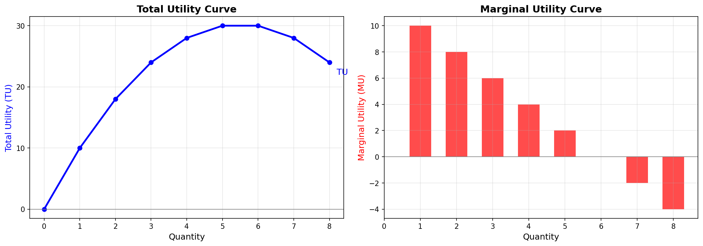
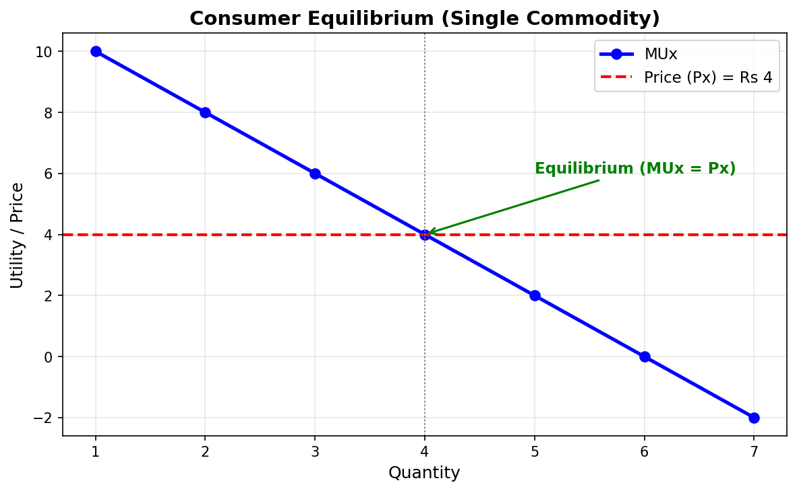
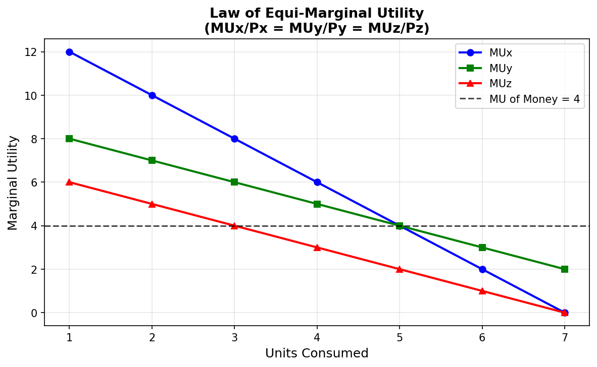
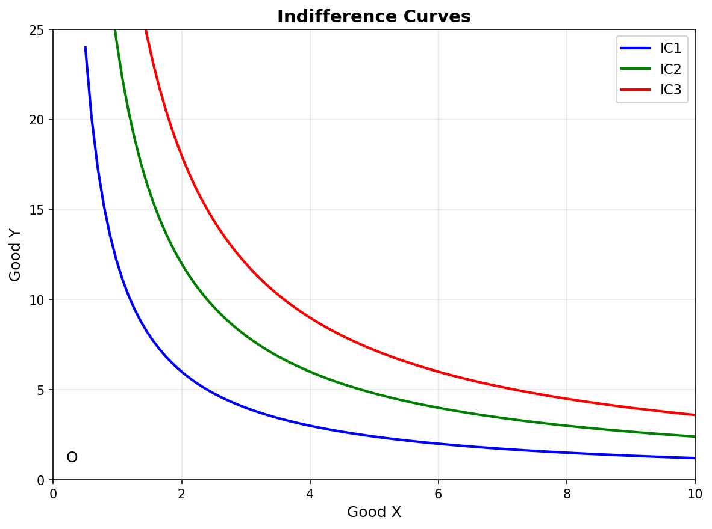
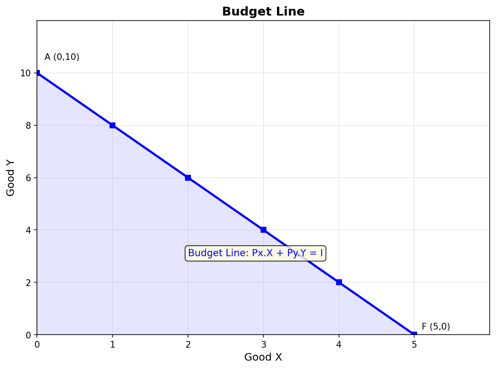
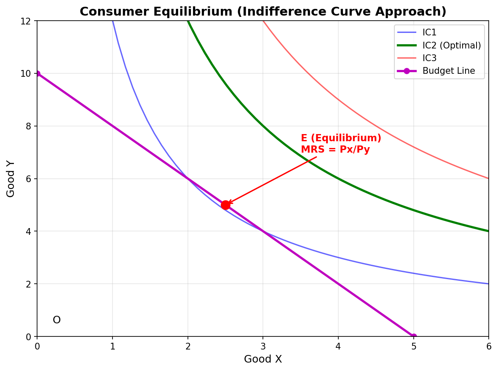

# Class 11 Economics – Chapter 2: Consumer's Equilibrium

---

## 1. What is a Consumer?

> A **Consumer** is a person who **buys goods and services** to satisfy their **wants**.

**Key Point:** Consumer ≠ Customer. A consumer is the **end user** who actually uses the product to get **satisfaction**.

### Real Life:
You go to a shop and buy a samosa → You eat it → You feel happy → That happiness is called **Utility** in Economics.

---

## 2. What is Utility?

> **Utility** = The **satisfaction** or **happiness** a consumer gets from consuming a good/service.

### Important Points about Utility:

| Point | Explanation |
|-------|-------------|
| **Utility is subjective** | Same thing gives different satisfaction to different people |
| **Utility ≠ Usefulness** | A thing may have no use but still give satisfaction (e.g., painting) |
| **Utility varies** | Same thing can give different utility to same person at different times |

### Example:
- Ice cream in summer → High utility 🍦
- Ice cream in winter → Low utility ❄️

---

## 3. Cardinal vs Ordinal Utility

Economics has **two approaches** to measure utility:

### Cardinal Utility Approach (Old School)

> **Cardinal** = Utility can be **measured in numbers** (like 1, 2, 3...)

- Utility is measured in **Utils** (imaginary units)
- Alfred Marshall gave this approach
- Example: "I get 10 utils from eating a pizza"

### Ordinal Utility Approach (Modern)

> **Ordinal** = Utility **cannot be measured** but can be **ranked/compared**

- We can say: Pizza > Burger > Sandwich (in terms of preference)
- We CANNOT say: Pizza gives 10 utils, Burger gives 5 utils
- J.R. Hicks & R.G.D. Allen gave this approach

### Comparison:

| Basis | Cardinal Utility | Ordinal Utility |
|-------|-----------------|-----------------|
| **Measurement** | Can be measured in numbers | Cannot be measured, only ranked |
| **Who gave?** | Alfred Marshall | Hicks & Allen |
| **Unit** | Utils | No unit (just ranking) |
| **Realistic?** | Less realistic | More realistic |
| **Tool used** | TU, MU curves | Indifference Curves |
| **Example** | "I got 20 utils" | "I prefer tea over coffee" |

> **Important:** In this chapter, we will study BOTH approaches!

---

## 4. Total Utility (TU) & Marginal Utility (MU)

### Total Utility (TU)

> **TU** = Total satisfaction from consuming **ALL units** of a good.

### Marginal Utility (MU)

> **MU** = **Additional** satisfaction from consuming **ONE more unit**.

### Formula:

```
TU = Sum of MU of all units consumed
MU = Change in TU / Change in Quantity = ΔTU / ΔQ
```

### Example: Eating Samosas 🥟

| Samosa No. | MU (Extra Happiness) | TU (Total Happiness) |
|:----------:|:--------------------:|:--------------------:|
| 1st | 10 | 10 |
| 2nd | 8 | 18 |
| 3rd | 6 | 24 |
| 4th | 4 | 28 |
| 5th | 2 | 30 |
| 6th | 0 | 30 |
| 7th | -2 | 28 |
| 8th | -4 | 24 |

### Let's Understand with Real Life:

**Story from Lecture:**
> "Bablu Bhaiya went to eat samosas. 1st samosa → maza aa gaya (10 happiness). 2nd samosa → theek thaak (8 happiness). 3rd → peet bhar gayi (6 happiness). 4th → ab aur nahi (4 happiness). 5th → force karke khaya (2 happiness). 6th → zero happiness. 7th → ulti aa gayi (-2 happiness)!"

### Key Points:
- **As MU decreases, TU increases but at a decreasing rate**
- **When MU = 0 → TU is MAXIMUM** (Point of Satiety)
- **When MU becomes NEGATIVE → TU starts FALLING**

### Graphical Relationship:



> **Connection:** TU is like a bucket filling with water. MU is the rate at which water is being poured. When the bucket is full (MU=0), TU is maximum. If you keep pouring (MU negative), water overflows (TU falls).

---

## 5. Law of Diminishing Marginal Utility (LDMU)

### Definition:

> **Law of Diminishing Marginal Utility** states that as a consumer consumes **more and more units** of a good, the **marginal utility from each successive unit keeps decreasing**.

### Assumptions:
1. **Continuous consumption** – No gap between units
2. **Same good** – All units are identical
3. **Normal consumer** – Mentally and physically normal
4. **No change in taste/income** – Consumer's preference is constant
5. **Reasonable units** – Units are of standard size

### Real Life Examples:

| Scenario | 1st Unit MU | 2nd Unit MU | 3rd Unit MU |
|----------|:-----------:|:-----------:|:-----------:|
| 🥤 Drinking water when thirsty | Very High (100%) | Medium (60%) | Low (20%) |
| 🍕 Eating pizza | Maximum happiness | Less happiness | Even less |
| 📺 Watching movie | Super excited | Okay feeling | Bored |
| 👗 Buying clothes | Love it! | Like it | Hmm... okay |

### Why does MU decrease?

> Because **wants are satiable** — as you get more of something, your desire for it decreases.

### Exceptions (When LDMU Doesn't Apply):

| Exception | Example |
|-----------|---------|
| **Collectors** | Stamp/coin collectors — each new piece gives MORE happiness |
| **Money** | More money → generally more utility (doesn't decrease) |
| **Hobbies** | Doing what you love — satisfaction may not decrease |
| **Addiction** | Alcohol, smoking — MU may increase initially |

### Diagram:



---

## 6. Consumer's Equilibrium – Meaning

### Definition:

> **Consumer's Equilibrium** is a situation where a consumer gets **maximum satisfaction** from his limited income and has **no tendency to change** his consumption pattern.

### Think of it Like:

> "You have ₹100 in your pocket. You go to a fair. You buy different things. There comes a point where you feel — 'Ab aur kuch nahi chahiye, sab theek hai!' → That's your EQUILIBRIUM!"

### Two Cases of Consumer's Equilibrium:

| Case | Approach |
|------|----------|
| **Single Commodity** | When consumer buys only ONE good |
| **Two or More Commodities** | When consumer buys MULTIPLE goods |

---

## 7. Consumer's Equilibrium – Single Commodity Case

### Condition:

> A consumer is in equilibrium when:
> **MUx = Px**
>
> (Marginal Utility of Good X = Price of Good X)

### Why This Condition?

Think like this:

| Situation | Meaning | Action |
|-----------|---------|--------|
| **MUx > Px** | Satisfaction from last unit is MORE than what you paid | ✅ Buy MORE units |
| **MUx < Px** | Satisfaction from last unit is LESS than what you paid | ❌ Buy LESS units |
| **MUx = Px** | Satisfaction = Price paid | 🛑 **EQUILIBRIUM – Stop here!** |

### Example with Numbers:

| Units | MUx (Utils) | Px (Price in ₹) | Situation |
|:----:|:-----------:|:---------------:|:---------:|
| 1 | 10 | 4 | MU > P → Buy more |
| 2 | 8 | 4 | MU > P → Buy more |
| 3 | 6 | 4 | MU > P → Buy more |
| **4** | **4** | **4** | **MU = P → EQUILIBRIUM** |
| 5 | 2 | 4 | MU < P → Buy less |
| 6 | 0 | 4 | MU < P → Buy less |

### Real Life Story (From Lecture):

> "Bhaiya went to eat samosa. Price = ₹4 per samosa.
> - 1st samosa → MU = 10 → ₹4 main 10 ka maza mil raha → BEST! (MU > P)
> - 2nd → MU = 8 → Still great (MU > P)
> - 3rd → MU = 6 → Good (MU > P)
> - 4th → MU = 4 → Ab ₹4 de rahe aur ₹4 ka maza mil raha → Exactly equal! STOP! (MU = P)
> - 5th → MU = 2 → ₹4 de rahe aur ₹2 ka maza → Loss! (MU < P)"

### Important Assumptions:

1. **Utility is measurable** in cardinal numbers
2. **Money has constant marginal utility**
3. **No substitutes** – only one good
4. **Consumer is rational** – wants maximum satisfaction
5. **Income is given** – fixed budget

### Diagram Explanation:


> **In the diagram:** The point where MU curve intersects the Price line is the **Equilibrium point**. Before it, MU > P (buy more). After it, MU < P (buy less).

---

## 8. Consumer's Equilibrium – Two Commodities (Law of Equi-Marginal Utility)

### The Problem:

> In real life, we never buy just ONE thing. We buy many things! So how do we decide?

### Law of Equi-Marginal Utility (Gossen's Second Law):

> A consumer is in equilibrium when the **ratio of MU to Price** is **equal** for ALL goods.

### Formula:

```
MUx / Px = MUy / Py = MUz / Pz = MU of Money (Constant)
```

### Simple Language:

> "Jitna bhi paisa hai, usko aise kharch karo ki har cheez ke aakhri rupee se utni hi khushi mile!"

### Example: You have ₹10, want to buy Samosa (₹2 each) and Juice (₹2 each)

| Unit | MU Samosa | MU/Price Samosa (÷2) | MU Juice | MU/Price Juice (÷2) |
|:----:|:---------:|:-------------------:|:--------:|:------------------:|
| 1 | 20 | **10** | 16 | **8** |
| 2 | 16 | **8** | 14 | **7** |
| 3 | 12 | **6** | 12 | **6** ← EQUAL |
| 4 | 8 | **4** | 10 | **5** |
| 5 | 4 | **2** | 8 | **4** |

### How to reach Equilibrium:

> Step 1: Compare MU/Price of all goods
> Step 2: Spend ₹1 on the good that gives HIGHEST MU/Price
> Step 3: Keep doing this until MU/Price of all goods becomes EQUAL

### The Spending Process (From Lecture):

```
₹1 → Samosa (MU/P = 10) → Highest
₹2 → Samosa (MU/P = 10) → Highest
₹3 → Samosa (MU/P = 8) 
₹3 → Juice (MU/P = 8) → Same!
₹4 → Samosa (MU/P = 6)
₹5 → Juice (MU/P = 6) → Same again!

At the end: MUx/Px = MUy/Py = 6 → EQUILIBRIUM!
```



### Important Note:

> **Law of Diminishing MU** applies to SINGLE commodity.
> **Law of Equi-Marginal Utility** applies to MULTIPLE commodities.

---

## 9. Indifference Curve Analysis (Ordinal Utility Approach)

### Why do we need this?

> Cardinal approach (MU measurement in utils) is **unrealistic**. Can you really say "I got 20 utils from pizza"? No! That's why we use Ordinal approach.

### What is an Indifference Curve (IC)?

> **Indifference Curve** is a curve that shows **different combinations of two goods** that give **equal satisfaction** to the consumer.

### Meaning of "Indifference":

> "The consumer is **indifferent** between all points on the same IC because they all give the SAME satisfaction."

### Example:

| Combination | Tea (cups) | Coffee (cups) | Satisfaction |
|:-----------:|:----------:|:-------------:|:------------:|
| A | 1 | 6 | Same ✅ |
| B | 2 | 3 | Same ✅ |
| C | 3 | 2 | Same ✅ |
| D | 6 | 1 | Same ✅ |

> Whether you give the consumer Combination A (1 tea + 6 coffee) or Combination D (6 tea + 1 coffee) — they don't care because **satisfaction is the same**!

### Indifference Map:

> A set of **multiple ICs** is called an **Indifference Map**.

- **Higher IC** → Higher satisfaction
- IC₁ < IC₂ < IC₃ (higher = better)



---

## 10. Properties of Indifference Curve

### Property 1: Downward Sloping (Negative Slope)

> To get more of Good X, you must give up some of Good Y → **Inverse relationship**

### Property 2: Convex to the Origin

> IC is convex because of **Diminishing Marginal Rate of Substitution (MRS)**

### Property 3: Higher IC = Higher Satisfaction

> IC₂ > IC₁ because it represents MORE goods = MORE satisfaction

### Property 4: Two ICs Never Intersect

> If they intersect, it would mean the same point gives two different satisfaction levels → **Impossible!**

### Property 5: IC Never Touches X or Y Axis

> If IC touches the axis, it means 0 quantity of one good → But consumer needs BOTH goods

---

## 11. Marginal Rate of Substitution (MRS)

### Definition:

> **MRS** is the rate at which a consumer is **willing to give up Good Y** to get **one more unit of Good X**, while staying on the same IC.

### Formula:

```
MRSxy = Units of Y sacrificed / Units of X gained = ΔY / ΔX
```

### Example:

| Move | Change in X | Change in Y | MRS = ΔY/ΔX |
|:----:|:-----------:|:-----------:|:-----------:|
| A → B | +1 | -3 | 3 |
| B → C | +1 | -2 | 2 |
| C → D | +1 | -1 | 1 |
| D → E | +1 | -0.5 | 0.5 |

### Key Point:

> **MRS keeps DECREASING** → This is why IC is **convex** to the origin!

### Reason for Diminishing MRS:

> As you get more of Good X, the desire for additional X decreases, so you are willing to give up LESS of Good Y.

---

## 12. Budget Line / Price Line

### Definition:

> **Budget Line** shows all combinations of two goods that a consumer can buy with his **given income** at **given prices**.

### Formula:

```
Px × X + Py × Y = I
```

Where:
- Px = Price of Good X
- Py = Price of Good Y
- I = Income of consumer

### Example:

> Income = ₹50, Price of X = ₹10, Price of Y = ₹5

| Combination | X (units) | Y (units) | Total Spent |
|:-----------:|:---------:|:---------:|:-----------:|
| A | 0 | 10 | 0 + 50 = 50 |
| B | 1 | 8 | 10 + 40 = 50 |
| C | 2 | 6 | 20 + 30 = 50 |
| D | 3 | 4 | 30 + 20 = 50 |
| E | 4 | 2 | 40 + 10 = 50 |
| F | 5 | 0 | 50 + 0 = 50 |



### Slope of Budget Line:

```
Slope = Px / Py = 10 / 5 = 2
```

Meaning: To get 1 unit of X, you have to give up 2 units of Y.

### Budget Set:

> All the combinations that a consumer can afford (including inside the budget line).

### Shift in Budget Line:

| Change | Effect on Budget Line |
|--------|---------------------|
| **Income ↑** | Shifts RIGHT (parallel outward) |
| **Income ↓** | Shifts LEFT (parallel inward) |
| **Price of X ↑** | X-intercept moves LEFT (pivot inward) |
| **Price of X ↓** | X-intercept moves RIGHT (pivot outward) |
| **Price of Y ↑** | Y-intercept moves DOWN |
| **Price of Y ↓** | Y-intercept moves UP |

### Think of Budget Line Like:

> "You have ₹50 in your pocket. Samosa = ₹10, Juice = ₹5. The budget line shows ALL the ways you can spend your ₹50 — nothing more, nothing less!"

---

## 13. Consumer's Equilibrium – Indifference Curve Approach

### The BIG Idea:

> Consumer reaches equilibrium where the **Budget Line** is **TANGENT** to the **Highest Possible Indifference Curve**.

### Two Conditions:

**Condition 1 (Necessary):**
```
MRSxy = Px / Py
```
(Slope of IC = Slope of Budget Line)

**Condition 2 (Sufficient):**
```
IC must be CONVEX to the origin
```
(MRS must be diminishing)

### Why is this the Equilibrium?

| Point | Situation | Meaning |
|-------|-----------|---------|
| **E (Tangency)** | Budget Line touches IC₂ | ✅ **EQUILIBRIUM** — Maximum satisfaction within budget |
| Any point on IC₁ | Intersects budget line at 2 points | ❌ NOT equilibrium — You can reach higher IC |
| IC₃ | Budget line cannot reach it | ❌ NOT possible — Beyond budget |

### Graphical Explanation:



> "At point E, the budget line is just TOUCHING the IC₂. This is the highest IC the consumer can reach with their money. At this point, MRS = Px/Py and IC is convex."

### Real Life Understanding:

> "You have ₹500 to spend on dinner. You look at the menu (budget line). You want maximum taste (highest IC). You order a combination where the last bite of pasta gives you as much happiness as the last sip of juice (MRS = price ratio). That's your equilibrium!"

---

## 14. Cardinal vs Ordinal Approach – Final Comparison

| Basis | Cardinal Approach | Ordinal Approach |
|-------|:-------------------:|:------------------:|
| **Who gave?** | Alfred Marshall | Hicks & Allen |
| **Utility measurable?** | Yes (in utils) | No (only ranking) |
| **Tool used** | TU & MU curves | Indifference Curves |
| **Equilibrium condition** | MUx = Px (single)<br>MUx/Px = MUy/Py (multiple) | MRSxy = Px/Py<br>IC is convex |
| **Realism** | Less realistic | More realistic |
| **Unit** | Cardinal numbers (1,2,3...) | Ordinal ranking (I, II, III...) |

---

## 15. Chapter Connection – How Everything is Linked

```
┌─────────────────────────────────────────────────────┐
│           CONSUMER'S EQUILIBRIUM                     │
├─────────────────────────────────────────────────────┤
│                                                      │
│  CONSUMER wants MAXIMUM SATISFACTION                 │
│         │                                            │
│         ▼                                            │
│  Has LIMITED INCOME & goods have PRICES              │
│         │                                            │
│         ├──────────────────────────────────┐         │
│         ▼                                  ▼         │
│  CARDINAL APPROACH               ORDINAL APPROACH    │
│  (Marshall)                      (Hicks & Allen)     │
│         │                                  │         │
│         ▼                                  ▼         │
│  Utility measured                  Utility ranked    │
│  in Utils                          via ICs           │
│         │                                  │         │
│         ▼                                  ▼         │
│  TU & MU Curves              Indifference Curves     │
│  Law of DMU                  Properties of IC        │
│         │                    MRS concept             │
│         ▼                                  │         │
│  Single: MUx = Px                           │         │
│  Multiple: MUx/Px = MUy/Py                 │         │
│  (Equi-Marginal)                           ▼         │
│                                    Budget Line        │
│                                    (Px.X + Py.Y = I) │
│                                           │          │
│                                           ▼          │
│                              MRSxy = Px/Py           │
│                              IC is CONVEX            │
│                                                      │
│         ┌──────────────────────────────────┐         │
│         ▼                                  ▼         │
│     EQUILIBRIUM = MAXIMUM SATISFACTION               │
│     No tendency to change consumption                 │
└─────────────────────────────────────────────────────┘
```

---

## Important Exam Questions

### Short Questions (2-3 Marks):

1. **Define Consumer's Equilibrium.** What are its conditions?
2. **State the Law of Diminishing Marginal Utility** with an example.
3. **What is the difference between Total Utility and Marginal Utility?**
4. **State the condition for consumer's equilibrium** under single commodity case.
5. **What is Indifference Curve?** Give any two properties.
6. **What is Budget Line?** Why is it downward sloping?
7. **Define Marginal Rate of Substitution (MRS).**
8. **Distinguish between Cardinal and Ordinal Utility** approaches.

### Long Questions (4-6 Marks):

1. **Explain consumer's equilibrium** under the **cardinal utility approach** (single commodity case) with schedule and diagram.
2. **Explain the Law of Equi-Marginal Utility** with the help of a schedule and diagram.
3. **Explain the properties of Indifference Curve** in detail.
4. **What is Budget Line?** Explain the effect of change in income and prices on the budget line.
5. **Explain consumer's equilibrium** under the **indifference curve approach** with the help of a diagram.
6. **Differentiate between Cardinal and Ordinal Utility** approaches to consumer's equilibrium.

### Numerical Questions:

1. Calculate TU and MU from the given data:
   - Units consumed: 1, 2, 3, 4, 5, 6
   - MU: 12, 10, 8, 6, 4, 2
   - Find TU at each level and the point where TU is maximum.

2. A consumer buys 5 units of a good at price ₹8. MU from 5th unit is 6. Is the consumer in equilibrium? If not, what should he do?

3. With Income = ₹100, Px = ₹10, Py = ₹5:
   - Draw the budget line
   - Find the slope
   - What happens if income increases to ₹120?

---

> **Tip:** In Consumer's Equilibrium, always remember — **EQUILIBRIUM** = Maximum Satisfaction + No Change in Behavior. The consumer has found the PERFECT balance between what they WANT and what they CAN AFFORD!

> **Graph Tip:** Practice drawing all 6 graphs:
> 1. TU-MU Curves
> 2. Single Commodity Equilibrium
> 3. Budget Line
> 4. Indifference Curves
> 5. Consumer Equilibrium (IC Approach)
> 6. Equi-Marginal Utility

> **Diagram + Explanation = Full Marks!**
