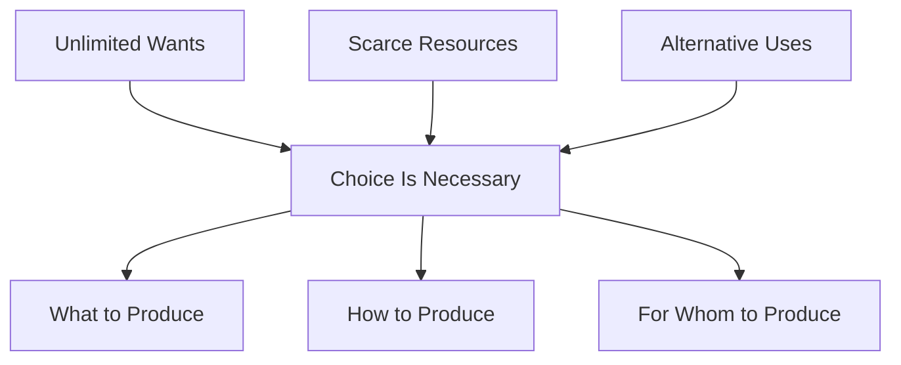
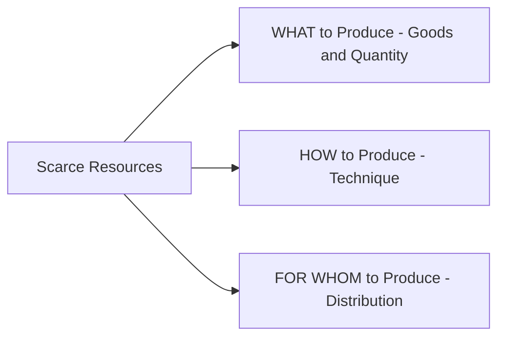
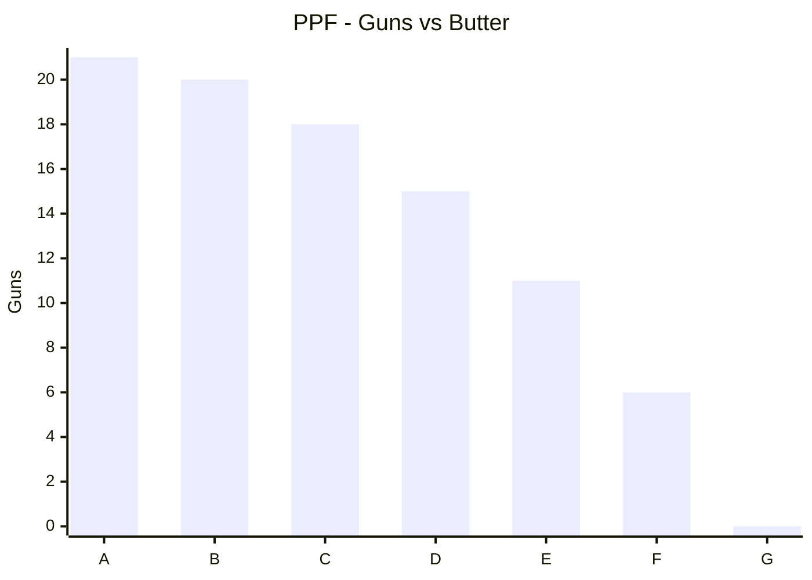
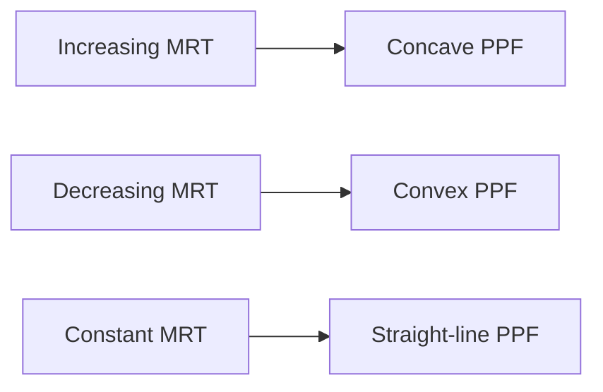
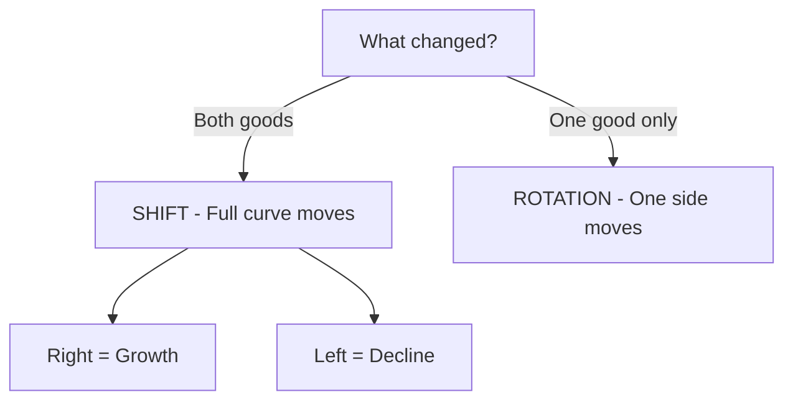

# Chapter 1 - Introduction to Microeconomics - STE Study Notes

> Reading rule: Read one section at a time. Do each CHECK. Then go to the next section.

## Key Terms - Read These First

| Term | Definition |
|------|------------|
| Economy | A system which provides people the means to work and earn a living |
| Scarcity | Limitation of supply in relation to demand for a commodity |
| Economic Problem | A problem of choice for satisfaction of unlimited wants from limited resources with alternative uses |
| Positive Economics | Study of things as they are. It answers What is, What was, What will be |
| Normative Economics | Study of things as they ought to be. It answers What should happen |
| Microeconomics | Study of behaviour of individual units of an economy. Other name: Price Theory |
| Macroeconomics | Study of behaviour of aggregates of the economy as a whole. Other name: Income and Employment Theory |
| Opportunity Cost | Cost of the next best alternative foregone |
| PPF | Graphical representation of possible combinations of two goods with given resources and technology |
| MOC / MRT | Units sacrificed to gain one additional unit of the other good |
| Ceteris Paribus | Keep all other factors constant. Change only one factor |

```mermaid
mindmap
 root((Chapter 1))
 Economy
 Work and earning
 Production
 Consumption
 Investment
 Scarcity
 Unlimited wants
 Limited resources
 Alternative uses
 Choice
 What to produce
 How to produce
 For whom to produce
 Tools
 Positive - What is
 Normative - What ought to be
 Micro - Individual unit
 Macro - Full economy
 PPF
 Downward slope
 Concave shape
 Shift - both goods
 Rotation - one good
```

---

## 1. Economy

**Definition:** An economy is a system. It gives people the means to work. It gives people the means to earn a living.

Do these three processes in every economy:

1. Production - Make goods and services.
2. Consumption - Use goods and services.
3. Investment - Keep resources for future production. Other name: Capital Formation.

Example: A farmer grows crops. A railway worker sells tickets. A driver drives a truck. Each person works. Each person earns.

CHECK: Say the definition of economy in one sentence. Name the three processes.

---

## 2. Scarcity

**Definition:** Scarcity is limitation of supply in relation to demand.

Study economics for one reason: scarcity.

Wants are unlimited. Resources are limited. This gap is scarcity.

Resources have alternative uses. Example: Petrol has many uses. Use it in cars. Use it in airplanes. Use it in machines. One use stops another use.

> Economics studies the way a society uses limited resources with alternative uses. It produces goods and services. It distributes goods and services among groups.

CHECK: Give one example of scarcity. Give one resource with two uses.

---

## 3. Economic Problem

**Definition:** Economic Problem is a problem of choice. Satisfy unlimited wants from limited resources with alternative uses.



Three causes create the problem:

1. Unlimited Human Wants - Wants never end. One want ends. A new want starts. Priorities differ.
2. Scarcity of Resources - Land is limited. Labour is limited. Capital is limited. Demand is more than supply. Scarcity applies to all persons and all countries.
3. Alternative Uses - One resource has many uses. Choice becomes necessary.

CHECK: Write the three causes from memory.

---

## 4. Positive Economics and Normative Economics

### 4.1 Positive Economics

Positive economics studies facts. It deals with things as they are. It asks What is. It asks What was. It asks What will be.

Rules for positive statements:

- Verify a statement with actual data.
- A statement can be true. A statement can be false.
- Give no value judgement. Stay neutral between ends.
- Give no suggestion. Describe the activity.

Examples:

- India is an overpopulated country.
- Prices are constantly rising.
- Minimum wage increase leads to higher unemployment among young workers.
- Rise in interest rates reduces consumer spending.

### 4.2 Normative Economics

Normative economics studies ideals. It deals with things as they ought to be. It asks What should happen.

Rules for normative statements:

- Do not verify a statement with data.
- Give a value judgement.
- Give a suggestion.
- Set an ideal.

Examples:

- India should control rising prices.
- Income inequalities should be reduced.
- Government should increase spending on healthcare.
- Taxes on the rich should increase to fund social programs.

| Basis | Positive | Normative |
|-------|----------|-----------|
| Meaning | Deals with how problems are actually solved | Deals with how problems should be solved |
| Verification | Verify with actual data | No verification with data |
| Purpose | Give real description | Set ideals |
| Nature | Based on facts. Gives no suggestion | Based on opinion. Gives suggestion |
| Value judgement | Gives none | Gives judgement |

CHECK: Classify each sentence. Mark P for Positive. Mark N for Normative.

- [ ] Prices rise in India.
- [ ] Prices should not rise in India.
- [ ] Higher taxes on cigarettes reduce smoking.
- [ ] Taxes on cigarettes should increase.

Answers: P, N, P, N.

---

## 5. Microeconomics and Macroeconomics

The word micro comes from Greek mikros. Mikros means small. The word macro comes from Greek makros. Makros means large.

Adam Smith is the founder of the field of microeconomics.

**Microeconomics:** It studies behaviour of individual units of an economy. Examples: individual income, individual output, price of a commodity. Main tools: Demand and Supply.

**Macroeconomics:** It studies behaviour of aggregates of the economy as a whole. Examples: national income, aggregate output, aggregate consumption. Main tools: Aggregate Demand and Aggregate Supply.

| Basis | Microeconomics | Macroeconomics |
|-------|----------------|----------------|
| Meaning | Studies individual units | Studies aggregates of full economy |
| Tools | Demand and Supply | Aggregate Demand and Aggregate Supply |
| Objective | Determine price of commodity or factor | Determine income and employment level |
| Aggregation | Limited degree. Example: market demand from individual demands | Highest degree. Example: aggregate demand for full economy |
| Assumption | Keep macro variables constant | Keep micro variables constant |
| Other name | Price Theory | Income and Employment Theory |

Ceteris Paribus: Keep other factors constant. Change only one factor. Example: Switch off all appliances. Run only the air conditioner. Measure its power use.

CHECK: Write tools of micro. Write tools of macro. Write other names.

---

## 6. Central Problems of an Economy

Allocation of resources creates three central problems. Assign scarce resources to fulfil maximum wants.



### 6.1 What to Produce

Select goods for production. Select quantity for each good.

Two decisions:

1. Decide the commodities. Example: consumer goods such as rice and clothes. Capital goods such as machines. Civil goods such as bread. War goods such as guns.
2. Decide the quantity. Example: More sugar means less of other goods. More war goods means less civil goods.

### 6.2 How to Produce

Select the technique for production. Technique means combination of inputs.

Two techniques:

- Labour Intensive Technique (LIT) - Use more labour. Use less capital.
- Capital Intensive Technique (CIT) - Use more capital. Use less labour.

Use LIT in India. Labour is abundant. Use CIT in USA and England. Labour is short. Capital is abundant.

Select the technique to raise living standards. Provide employment to all.

### 6.3 For Whom to Produce

Distribute produced goods among individuals. Production gives factor income. Income types: rent, wages, interest, profit.

Two types of distribution:

1. Personal Distribution - Distribute national income among groups of people.
2. Functional Distribution - Decide share of each factor in total national product.

CHECK: Name the three central problems. Name LIT and CIT with one example each.

---

## 7. Opportunity Cost

**Definition:** Opportunity Cost is the cost of the next best alternative foregone.

Use resources in one project. Lose output from another project. That loss is the cost.

Example 1: Work in a bank at 40000 per month. Get offer as executive at 30000. Get offer as journalist at 35000. Opportunity cost of bank job is 35000. 35000 is the next best alternative.

Example 2: Have 40000. Buy a laptop. Or buy an LED TV. Buy the laptop. Lose satisfaction from the TV. That loss is the opportunity cost.

> PPF is also called Opportunity Cost Curve. Slope of PPF at each point measures opportunity cost.

CHECK: You choose option A. You leave option B. What is the opportunity cost? Answer: value of option B.

---

## 8. Production Possibility Frontier (PPF)

**Definition:** PPF shows possible combinations of two goods. Produce these combinations with given resources and technology.

Use only two goods for simplicity. Apply the same method to any goods.

Other names for PPF. Use any name in exams:

1. Production Possibility Curve (PPC)
2. Production Possibility Boundary
3. Transformation Curve
4. Transformation Boundary
5. Transformation Frontier

### 8.1 Assumptions of PPF

Follow five assumptions:

1. Resources are fixed. Transfer resources from one use to another.
2. Produce only two goods.
3. Use resources fully and efficiently. Allow no waste.
4. Resources are not equally efficient in all goods. Productivity falls after transfer.
5. Technology stays constant.

### 8.2 PPF Schedule - Guns and Butter

| Possibility | Guns | Butter | Guns Sacrificed | Butter Gained | MRT |
|-------------|------|--------|-----------------|---------------|-----|
| A | 21 | 0 | - | - | - |
| B | 20 | 1 | 1 | 1 | 1 |
| C | 18 | 2 | 2 | 1 | 2 |
| D | 15 | 3 | 3 | 1 | 3 |
| E | 11 | 4 | 4 | 1 | 4 |
| F | 6 | 5 | 5 | 1 | 5 |
| G | 0 | 6 | 6 | 1 | 6 |

Read the schedule: At point A, make 21 guns and 0 butter. At point G, make 0 guns and 6 butter. Join points A to G. Get curve AG. AG shows maximum production limit.



### 8.3 MOC and MRT

**MOC:** Number of units sacrificed to gain one additional unit of another good.

**MRT:** Ratio of units sacrificed to units gained.

Formula:

```text
MRT = Units Sacrificed / Units Gained
```

Example: Move from B to C. Sacrifice 2 guns. Gain 1 butter. MRT = 2 / 1 = 2.

MRT increases from 1 to 6. Reason: Shift workers from guns to butter. Workers suit guns best. Workers suit butter less. Productivity falls. Cost rises.

### 8.4 Shape of PPF

Two properties:

1. PPF slopes downwards. More of one good needs less of the other good. Relation is inverse.
2. PPF is concave to the origin. MRT increases. Sacrifice more units for each additional unit.

| PPF Shape | MRT |
|-----------|-----|
| Concave to origin | Increasing MRT |
| Convex to origin | Decreasing MRT |
| Straight line | Constant MRT. All resources are equally efficient |



### 8.5 Attainable and Unattainable Combinations

| Location | Status | Meaning |
|----------|--------|---------|
| ON the PPF | Attainable and efficient | Use resources fully. Optimum utilisation. Example: points A, B, C, D |
| INSIDE the PPF | Attainable but inefficient | Waste resources. Underutilise resources. Unemployment lowers output |
| OUTSIDE the PPF | Unattainable | No capacity with present resources and technology. Reach it after growth |

Rules:

- Massive unemployment does not shift PPF left. It moves the economy inside PPF.
- Economy cannot operate outside PPF with given resources and technology.

### 8.6 Shift in PPF - Change in Both Goods

PPF assumes fixed resources. Resources change in real life. Technology changes in real life. Then PPF moves.

- Rightward shift: Technology improves for both goods. Resources grow for both goods. Produce more of both goods.
- Leftward shift: Technology degrades for both goods. Resources fall for both goods. Produce less of both goods.

Growth of resources means:

- Quantity rises: Find new natural resources. Receive foreign capital. Increase labour force.
- Quality rises: Develop skills through education. Improve hygiene through Clean India Mission.

Fall of resources means: Earthquake destroys resources. Flood destroys capacity. Outdated technology lowers output. Pandemic lowers capacity.

### 8.7 Rotation in PPF - Change in One Good

Change resources for one good only. Change technology for one good only. Then PPF rotates. One intercept moves. The other intercept stays fixed.

- Better technology for Good X: PPF rotates right on X-axis.
- Weaker technology for Good X: PPF rotates left on X-axis.
- Better technology for Good Y: PPF rotates up on Y-axis.
- Weaker technology for Good Y: PPF rotates down on Y-axis.

| Change | Movement |
|--------|----------|
| Both goods improve | Shift right |
| Both goods decline | Shift left |
| Only one good improves | Rotate out on that axis |
| Only one good declines | Rotate in on that axis |



CHECK: Draw PPF with points A to G. Mark one point inside. Mark one point outside. Label efficient and unattainable.

---

## 9. Fast Revision - One Page

1. Economy gives work and earning. Do production, consumption, investment.
2. Scarcity means limited supply against demand.
3. Economic Problem means choice with unlimited wants and alternative uses.
4. Positive states facts. Verify with data. Normative states ideals. No verification.
5. Micro studies individual units. Macro studies full economy.
6. Ask What, How, For Whom. Use LIT or CIT. Distribute income as rent, wages, interest, profit.
7. Opportunity Cost is next best alternative foregone.
8. PPF shows two-good combinations. Follow five assumptions.
9. MRT = Sacrificed / Gained. Values: 1, 2, 3, 4, 5, 6.
10. PPF slopes down. Concave shape means increasing MRT.
11. ON means efficient. INSIDE means inefficient. OUTSIDE means unattainable.
12. Both goods change = Shift. One good changes = Rotation.

---

## 10. Exam Questions With Answers

**Q1. Why does an economic problem arise?**
A: Wants are unlimited. Resources are scarce. Resources have alternative uses.

**Q2. What is the ideal shape of PPF?**
A: Concave towards the origin.

**Q3. Why does PPF slope downwards?**
A: Inverse relation exists. Increase one good. Decrease the other good.

**Q4. Why is PPF concave?**
A: MRT increases. Sacrifice more units for each additional unit.

**Q5. What is the effect of economic growth on PPF?**
A: PPF shifts outward to the right.

**Q6. Does massive unemployment shift PPF to the left?**
A: No. Economy operates inside PPF. PPF does not shift.

**Q7. A farmer feeds 188 goats and 64 cows. Then feeds 170 goats and 70 cows. What is the opportunity cost of 6 extra cows?**
A: 18 goats sacrificed. Cost per cow = 18 / 6 = 3 goats.

**Q8. State one true statement about outside PPF.**
A: Points outside PPF are unattainable with present resources and technology.

---

> Tip: Draw the diagram first. Write the definition next. Then give the example. Diagram plus explanation gives full marks.
