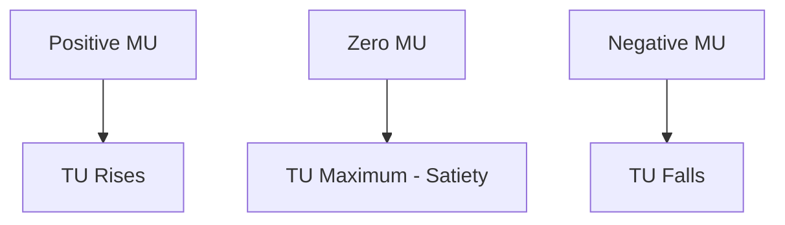
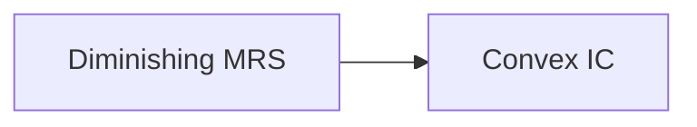
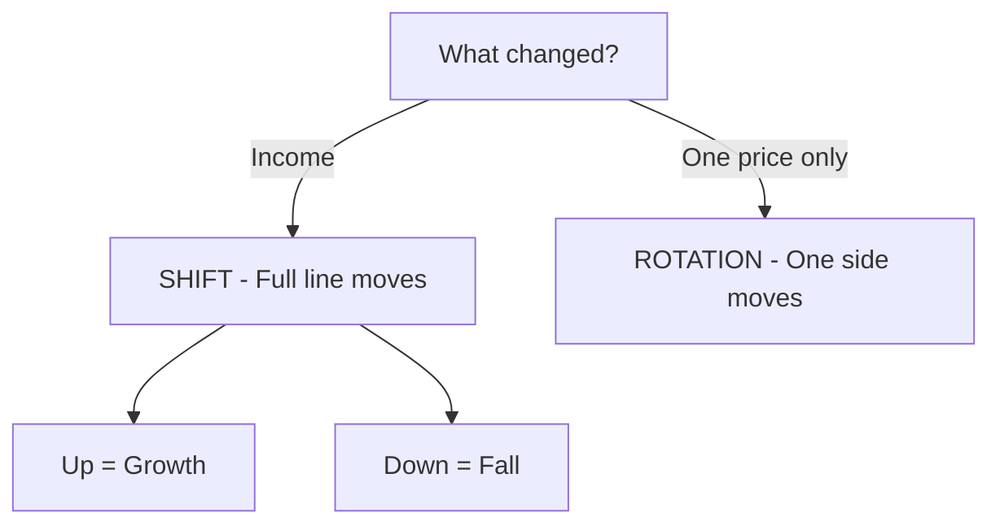

# Chapter 2 - Consumer Equilibrium - STE Study Notes

> Reading rule: Read one section at a time. Do each CHECK. Then go to the next section.

## Key Terms - Read These First

| Term | Definition |
|------|------------|
| Consumer | One who buys goods and services for satisfaction of wants |
| Utility | Want satisfying power of a commodity. Satisfaction from consumption |
| Util | Imaginary unit to measure utility in cardinal approach |
| TU | Total satisfaction from all units consumed |
| MU | Additional utility from one more unit consumed |
| Initial Utility | Utility from first unit consumed |
| Point of Satiety | TU is maximum. MU is zero. No desire for more |
| Law of DMU | More units consumed. MU from each successive unit falls |
| Consumer's Equilibrium | Maximum satisfaction with limited income. No tendency to change |
| MU of Money | Extra utility from spending one additional rupee on other goods |
| Law of Equi-Marginal Utility | Spend income so MU per rupee is equal for all goods |
| Indifference Curve | Graphical representation of bundles giving same satisfaction |
| Indifference Map | Family of indifference curves for all bundles of two goods |
| MRS | Units of Y sacrificed to gain one more unit of X with same satisfaction |
| Monotonic Preference | Rational consumer prefers more goods. More means higher satisfaction |
| Budget Line | Graphical representation of all bundles costing exactly money income |
| Budget Set | Set of all bundles costing less than or equal to money income |
| MRE | Market Rate of Exchange. Slope of budget line. Px / Py |

```mermaid
mindmap
 root((Chapter 2))
 Consumer
 Buys for satisfaction
 Aim is maximum satisfaction
 Utility
 TU - Total from all units
 MU - Extra from last unit
 Law of DMU
 MU falls with more units
 Gossen First Law
 Equilibrium Cardinal
 Single - MUx = Px
 Two - MUx/Px = MUy/Py
 Indifference Curve
 Same satisfaction bundles
 MRS falls
 Convex shape
 Budget Line
 PxX + PyY = M
 Shift - income changes
 Rotation - price changes
 Equilibrium Ordinal
 MRS = Px/Py
 IC convex
```

---

## 1. Consumer

**Definition:** A consumer is one who buys goods and services. A consumer buys for satisfaction of wants.

Aim of consumer: Get maximum satisfaction. Spend income on various goods and services.

A consumer means individual. A consumer means group of individuals. A consumer means institutions.

Two approaches to study consumer behaviour:

1. Cardinal Utility Approach. Other name: Marshall's Utility Analysis.
2. Ordinal Utility Approach. Other name: Indifference Curve Analysis. Other name: Hicksian Analysis.

CHECK: Say the definition of consumer in one sentence. Name the two approaches with founders in later sections.

---

## 2. Utility

**Definition:** Utility is want satisfying power of a commodity. It is satisfaction derived from consumption.

Points about utility:

1. Utility differs from person to person. Thirsty person gets more utility from water.
2. Utility differs from place to place.
3. Utility differs from time to time. Ice-cream gives high utility in summer. Low utility in winter.
4. Utility is not usefulness. Liquor harms health. Yet liquor has utility for an alcoholic.
5. Satisfaction is not pleasure. Treatment of broken arm gives satisfaction. It gives no pleasure. It only relieves pain.

How to measure utility:

- Classical economists assumed utility is measurable in numbers.
- Made imaginary unit called Util.
- Example: Assign 20 utils to ice-cream. Assign 10 utils to chocolate. Then ice-cream is liked twice as much.
- Utils vary from person to person. So Marshall suggested money measurement.
- Measure utility by price consumer is willing to pay.
- Example: Assume 1 util = 1 rupee. Then 20 utils = 20 rupees. 10 utils = 10 rupees.
- Advantage: Compare utility and price in same units.

CHECK: Give one example where utility differs by person. Give one example where utility is not usefulness.

---

## 3. Cardinal Utility and Ordinal Utility

**Cardinal Approach:** Utility is measurable in numbers. Examples: 1, 2, 3. Unit is Util or Money. Given by Alfred Marshall.

**Ordinal Approach:** Utility is not measurable. Consumer only ranks bundles. Example: Pizza is preferred to Burger. Given by J. R. Hicks and R. G. D. Allen.

| Basis | Cardinal | Ordinal |
|-------|----------|---------|
| Meaning | Measure utility in numbers | Rank utility in order |
| Unit | Utils and Money | No unit. Only ranks I, II, III |
| Tool | TU and MU curves | Indifference Curves |
| Realism | Less realistic | More realistic |
| Example | I get 20 utils from ice-cream | I prefer tea over coffee |

CHECK: Write founders of cardinal approach. Write founders of ordinal approach.

---

## 4. Total Utility and Marginal Utility

### 4.1 Total Utility

**Definition:** Total Utility is total satisfaction from consumption of all units of a commodity.

Formula:

```text
TUn = U1 + U2 + U3 + ... + Un
```

Points:

- Initial utility is utility from first unit. Example: 20 utils from first ice-cream.
- TU is zero at zero consumption.
- TU is summation of MU of all units.

### 4.2 Marginal Utility

**Definition:** Marginal Utility is additional utility from consumption of one more unit. It is utility from last unit purchased.

Formulas:

```text
MUn = TUn - TUn-1
MU = Change in TU / Change in Quantity = ΔTU / ΔQ
```

Example: TU from 2 ice-creams is 36 utils. TU from 3 ice-creams is 46 utils. MU of 3rd unit = 46 - 36 = 10 utils.

### 4.3 Relation of TU and MU

| Units | TU | MU | Status |
|-------|----|----|--------|
| 1 | 10 | 10 | Positive MU. TU rises |
| 2 | 18 | 8 | Positive MU. TU rises |
| 3 | 24 | 6 | Positive MU. TU rises |
| 4 | 28 | 4 | Positive MU. TU rises |
| 5 | 30 | 2 | Positive MU. TU rises |
| 6 | 30 | 0 | Zero MU. TU is maximum |
| 7 | 28 | -2 | Negative MU. TU falls |

Rules:

1. TU starts from origin. TU increases at diminishing rate. TU reaches top. TU starts falling.
2. MU starts from top. MU falls. MU becomes zero. MU becomes negative.
3. When TU is rising, MU is falling but positive.
4. When TU is at top, MU is zero. This point is point of satiety. This point is point of maximum satisfaction.
5. When TU is falling, MU is negative. Negative utility is disutility.



CHECK: TU is 30 at 5 units. TU is 30 at 6 units. What is MU of 6th unit? Answer: 0.

---

## 5. Law of Diminishing Marginal Utility

**Definition:** Law of Diminishing Marginal Utility states that as we consume more and more units of a commodity, utility derived from each successive unit goes on decreasing.

Given by German Economist H. H. Gossen. Other name: Gossen's First Law of Consumption.

Applies to all goods and services. People prefer variety for this reason. More of same good gives less extra satisfaction.

Example: Thirsty person drinks water. First glass gives very high utility. Second glass gives less. Third glass gives still less.

### 5.1 Assumptions of Law of DMU

Follow seven assumptions:

1. Cardinal measurement: Utility is measurable. Consumer expresses satisfaction as 1, 2, 3.
2. Monetary measurement: Utility is measurable in money. Need same units to compare MU and Price.
3. Reasonable quantity: Consume proper quantity. Compare glassful with glassful. Do not compare spoon with glass. Spoonful gives rising MU.
4. Continuous consumption: No time gap between units. Morning ice-cream and evening ice-cream break continuity.
5. No change in quality: Quality stays same. Topped ice-cream may give more utility than plain.
6. Rational consumer: Consumer calculates. Consumer compares utilities. Aim is maximum satisfaction.
7. Independent utilities: MU of one commodity has no relation with MU of another. One person's utility does not affect another person's utility.
8. MU of money remains constant: Spending reduces money left. Remaining money becomes dearer. MU of money should rise. Ignore this rise. Keep MU of money constant.
9. Fixed income and prices: Income of consumer stays constant. Prices of goods stay constant.

CHECK: Write any five assumptions from memory.

---

## 6. Consumer's Equilibrium - Meaning

**Definition:** Consumer's Equilibrium is a situation. Consumer gets maximum satisfaction with limited income. Consumer has no tendency to change his way of existing expenditure.

Meaning of equilibrium: State of rest. Position of no change.

Why change stops:

- Consumer pays a price for each unit.
- So consumer cannot consume unlimited quantity.
- As per Law of DMU, utility from each successive unit falls.
- At same time, income also decreases with purchase.
- Rational consumer balances expenditure. Goal is maximum satisfaction with minimum expenditure.
- After this point, no incentive exists to change quantity purchased.

Two situations:

1. Single Commodity: Spend entire income on one good.
2. Two Commodities: Spend entire income on two goods.

CHECK: Say the definition of consumer's equilibrium in one sentence.

---

## 7. Consumer Equilibrium - Single Commodity

Law of DMU explains equilibrium for single commodity. Take all assumptions of Law of DMU.

Two factors decide units to consume:

1. Price of given commodity.
2. Expected satisfaction (MU) from each successive unit.

Rule: Compare price paid with utility gained. Be at equilibrium when MU equals price paid.

MU is in utils. Price is in money. Convert MU into money terms to compare.

Formula:

```text
MU in terms of Money = MU in utils / MU of one rupee
```

Assume 1 util = 1 rupee for simplicity. Then MU of one rupee = 1.

Equilibrium condition:

```text
MUx = Px
```

Example: Good X is priced at 10 per unit.

| Units of X | MU in utils | MU in Rs (MU / 1) | Price Px | Difference |
|------------|-------------|-------------------|----------|------------|
| 1 | 40 | 40 | 10 | MU > P. Increase consumption |
| 2 | 30 | 30 | 10 | MU > P. Increase consumption |
| 3 | 20 | 20 | 10 | MU > P. Increase consumption |
| 4 | 10 | 10 | 10 | MU = P. Equilibrium |
| 5 | 5 | 5 | 10 | MU < P. Decrease consumption |
| 6 | 0 | 0 | 10 | MU < P. Decrease consumption |

Read the schedule: At 4 units, MU = Price. Consumer is at equilibrium at point E.

MU curve slopes downwards. Law of DMU operates. Price line is horizontal. Price is fixed at 10.

- Will not consume 5 units. MU of 5 is less than price paid.
- Will not stop at 3 units. MU of 3 is more than price paid. More purchase gives gain.

Condition can also be written as:

```text
MUx / MUm = Px
MUx / Px = MUm
```

Where MUm is MU of money.

CHECK: Price is 4. MU values are 10, 8, 6, 4, 2. Find equilibrium units. Answer: 4 units.

---

## 8. Consumer Equilibrium - Two Commodities

In real life, consumer consumes more than one commodity. Use Law of Equi-Marginal Utility for optimum allocation.

Other names:

1. Law of Substitution
2. Law of Maximum Satisfaction
3. Gossen's Second Law

Takes all assumptions of Law of DMU.

### 8.1 Conditions

Two conditions are necessary:

1. Ratio of MU to Price is same for both goods.
2. MU falls as consumption increases.

Derivation:

- Consumer of X alone is at equilibrium when MUx / MUm = Px.
- Consumer of Y alone is at equilibrium when MUy / MUm = Py.
- Equate both. Get MUx / Px = MUy / Py = MUm.

Equilibrium condition:

```text
MUx / Px = MUy / Py = MUm
```

Second condition: MU must fall with more consumption. If MU does not fall, consumer buys only one good. This is unrealistic. Equilibrium is never reached.

### 8.2 Example

Income is 5 rupees. Goods X and Y are priced at 1 rupee per unit. Buy maximum 5 units of X or 5 units of Y.

| Units | MUx | MUx / Px | MUy | MUy / Py |
|-------|-----|----------|-----|----------|
| 1 | 20 | 20 | 16 | 16 |
| 2 | 16 | 16 | 14 | 14 |
| 3 | 12 | 12 | 12 | 12 |
| 4 | 8 | 8 | 10 | 10 |
| 5 | 4 | 4 | 8 | 8 |

Process: Spend first rupee on X. MU/P is 20. Highest. Spend next rupee where MU/P is highest. Continue till MUx / Px = MUy / Py.

Final result: Buy 3 units of X and 2 units of Y. Or any combination where ratios equal at margin with full income spent.

CHECK: MUx / Px = 12. MUy / Py = 10. Should consumer buy more X or more Y? Answer: Buy more Y. MU per rupee of Y relation shifts with purchase.

---

## 9. Indifference Curve - Meaning and Schedule

Real elaboration by J. R. Hicks and R. G. D. Allen.

Opinion: Utility is impossible to measure in absolute terms. Consumer compares combinations in order of preference. Use ordinal numbers. Ordinal numbers show only ranking. This approach is more realistic.

**Definition:** Indifference Curve refers to graphical representation of alternative combinations of two goods. Consumer is indifferent between these bundles. Each bundle gives same satisfaction.

Other names: Equal Satisfaction Curve. Iso-utility Curve.

Take only two goods for simplicity.

### 9.1 Indifference Schedule

Consumer is indifferent between five combinations of apples (A) and bananas (B).

| Combination | Apples | Bananas | Satisfaction |
|-------------|--------|---------|--------------|
| P | 1 | 15 | 100 utils - Same |
| Q | 2 | 10 | 100 utils - Same |
| R | 3 | 6 | 100 utils - Same |
| S | 4 | 3 | 100 utils - Same |
| T | 5 | 1 | 100 utils - Same |

Plot P, Q, R, S, T. Join with smooth curve. Get indifference curve.

Key observation: Increase of one good needs decrease of other good. Move from P to Q. Apples rise by 1. Bananas fall by 5. Satisfaction stays same.

Reason: If apples rise without bananas falling, consumer gets more goods. Satisfaction rises. This breaks indifference assumption.

### 9.2 Indifference Map

**Definition:** Indifference Map refers to family of indifference curves. It represents consumer preferences over all bundles of two goods.

Draw infinite indifference curves. Each curve shows same satisfaction individually. Higher curve shows higher satisfaction.

Reason: Higher curve has larger bundle. Monotonic preference applies. More goods mean more utility. Higher IC also means higher income level.

CHECK: Draw IC with points P to T. Label axes Apples and Bananas.

---

## 10. Marginal Rate of Substitution

**Definition:** MRS refers to rate at which commodities are substituted with each other. Total satisfaction of consumer remains same.

Formula:

```text
MRSxy = Units of Bananas Sacrificed / Units of Apples Gained = ΔY / ΔX
```

Example:

| Move | Apples Gained | Bananas Sacrificed | MRS |
|------|---------------|--------------------|-----|
| P to Q | 1 | 5 | 5 |
| Q to R | 1 | 4 | 4 |
| R to S | 1 | 3 | 3 |
| S to T | 1 | 2 | 2 |

MRS falls from 5 to 2. Slope of IC continuously declines downwards. This gives convex shape to IC.

Why MRS diminishes:

- Law of DMU operates.
- At P, consumer has only 1 apple. Apple is more important. Willing to give up many bananas.
- As apples increase, MU from apples falls. Willing to give up fewer bananas.
- This gives convex shape.



CHECK: Apples rise by 1. Bananas fall from 10 to 6. What is MRS? Answer: 4.

---

## 11. Assumptions of Indifference Curve Analysis

Follow four assumptions:

1. Two commodities: Consumer has fixed money. Spend whole money on two goods. Prices are constant.
2. Non-satiety: Consumer has not reached saturation. Consumer prefers more of both goods. Choice is monotonic. Always move to higher IC for higher satisfaction.
3. Ordinal utility: Consumer ranks preferences. Consumer ranks each bundle by satisfaction.
4. Diminishing MRS: MRS falls. So IC is convex to origin.
5. Rational consumer: Consumer behaves rationally. Aim is maximum satisfaction.

CHECK: Write the four assumptions from memory.

---

## 12. Properties of Indifference Curve

### 12.1 Convex to Origin

IC is convex to origin because MRS diminishes. MRS declines due to Law of DMU. MRS shows slope of IC.

### 12.2 Slopes Downwards

IC slopes downwards from left to right. More of one good needs less of other good. Example: More apples need fewer bananas. Satisfaction stays same.

### 12.3 Higher IC Means Higher Satisfaction

Higher IC has larger bundle. Monotonic preference gives more utility. Example: Point A on IC1 has OR of X and OP of Y. Point B on IC2 has OS of X and OP of Y. OS is more than OR. Satisfaction at B is more.

### 12.4 Two ICs Never Intersect

Two ICs cannot show same satisfaction level. So they cannot intersect. Only one IC passes through a point.

Proof: IC1 and IC2 intersect at A. Take B on IC1. Take C on IC2. A = B in satisfaction. A = C in satisfaction. Then B = C. This is impossible. B and C are on different curves with different satisfaction.

### 12.5 Never Touches Axes

Analysis assumes two goods are always consumed.

- Touch Y-axis means X consumption is zero.
- Touch X-axis means Y consumption is zero.
- So IC never touches any axis.

| Property | Reason |
|----------|--------|
| Downward slope | Inverse relation to keep satisfaction same |
| Convex shape | Diminishing MRS |
| Higher IC higher satisfaction | Larger bundle with monotonic preference |
| No intersection | Same point cannot give two satisfaction levels |
| No axis touch | Both goods are consumed |

CHECK: Mark True or False. IC is concave to origin. Answer: False. Convex to origin.

---

## 13. Budget Line and Budget Set

### 13.1 Budget Line

**Definition:** Budget Line is graphical representation of all possible combinations of two goods. Consumer purchases these combinations with given income and prices. Each combination costs exactly money income.

Other names: Price Line. Opportunity Line. Price-Income Line. Budget Constraint Line.

Example: Income is 20. Goods X and Y are priced at 10 each. Options:

1. Buy 2 units of X and 0 of Y. Bundle (2, 0).
2. Buy 0 of X and 2 of Y. Bundle (0, 2).
3. Buy 1 of X and 1 of Y. Bundle (1, 1).

Join three bundles graphically. Get downward sloping straight line. This is budget line.

Algebraic expression:

```text
M = (Px x Qx) + (Py x Qy)
```

Where M is money income. Qx is quantity of X. Qy is quantity of Y. Px is price of X. Py is price of Y.

Slope of budget line:

```text
Slope = Px / Py
```

Slope is Market Rate of Exchange (MRE).

Properties:

1. Budget line slopes downwards. More of one good needs fewer units of other good.
2. Budget line is straight line. Price ratio is constant throughout.

### 13.2 Budget Set

**Definition:** Budget Set is set of all possible combinations of two goods. Consumer can afford these with given income and prices.

Includes bundles where income is fully spent. Includes bundles where income is underspent.

Example with income 20: Bundles (0,0), (0,1), (0,2), (1,0), (2,0), (1,1) are all in budget set.

| Bundle Type | Location | Meaning |
|-------------|----------|---------|
| Costs exactly income | ON budget line | Full spending. Example: (1,1) |
| Costs less than income | INSIDE budget line | Underspending. Example: point D |
| Costs more than income | OUTSIDE budget line | Unattainable. Example: point C |

Budget line is relevant for equilibrium. Assume consumer spends entire income.

| Basis | Budget Line | Budget Set |
|-------|-------------|------------|
| Meaning | Bundles costing exactly income | Bundles costing less than or equal to income |
| Location | Only on line | On or below line |
| Equation | M = PxQx + PyQy | M >= PxQx + PyQy |

CHECK: Income is 20. Px is 10. Py is 10. Is bundle (2,1) attainable? Answer: No. Costs 30.

---

## 14. Shift and Rotation in Budget Line

### 14.1 Effect of Change in Income

Assume no change in prices of apples and bananas. Change income only. Budget line shifts.

- Rightward shift: Income rises. Budget line moves from AB to A1B1. Buy more of both goods. Prices stay constant.
- Leftward shift: Income falls. Budget line moves from AB to A2B2. Buy less of both goods. Prices stay constant.

### 14.2 Effect of Change in Prices

Change price of one good. Other price and income stay constant. Budget line rotates. One intercept moves. Other intercept stays fixed.

- Price of Apples (X-axis) falls: Budget line rotates right from AB to A1B. Buy more apples.
- Price of Apples rises: Budget line rotates left from AB to A2B. Buy fewer apples.
- Price of Bananas (Y-axis) falls: Budget line rotates up from AB to AB1.
- Price of Bananas rises: Budget line rotates down from AB to AB2.

| Change | Movement |
|--------|----------|
| Income rises | Shift right |
| Income falls | Shift left |
| Price of X falls | Rotate out on X-axis |
| Price of X rises | Rotate in on X-axis |
| Price of Y falls | Rotate up on Y-axis |
| Price of Y rises | Rotate down on Y-axis |



CHECK: Income rises. Prices same. Shift or rotation? Answer: Shift right.

---

## 15. Consumer Equilibrium by Indifference Curve Analysis

Study indifference map and budget line together. Point of maximum satisfaction is equilibrium.

Conditions:

1. MRS = Ratio of Prices. MRSxy = Px / Py = MRE.
2. MRS continuously falls. IC is convex to origin.

Explanation:

- At tangency point E, budget line just touches IC2. This is highest IC reachable with income.
- Any point on IC1 cuts budget line. Satisfaction is lower. Consumer can reach higher IC.
- IC3 is beyond budget. Not attainable.
- So E is equilibrium.

CHECK: Budget line cuts IC1 at two points. Touches IC2 at one point. Which IC is equilibrium? Answer: IC2.

---

## 16. Fast Revision - One Page

1. Consumer buys for satisfaction. Aim is maximum satisfaction.
2. Utility is want satisfying power. Measure in utils or money.
3. Cardinal measures in numbers. Marshall gave it. Ordinal ranks only. Hicks and Allen gave it.
4. TU is total from all units. MU is extra from last unit. MU = TUn - TUn-1.
5. Positive MU means TU rises. Zero MU means TU maximum. Negative MU means TU falls.
6. Law of DMU means MU falls with more units. Other name: Gossen's First Law.
7. Equilibrium means maximum satisfaction. No tendency to change.
8. Single good equilibrium: MUx = Px.
9. Two goods equilibrium: MUx / Px = MUy / Py. Other name: Gossen's Second Law.
10. IC shows same satisfaction bundles. Map is family of ICs. Higher IC means higher satisfaction.
11. MRS = ΔY / ΔX. MRS falls. IC is convex.
12. IC slopes down. Never intersects. Never touches axes.
13. Budget line: M = PxQx + PyQy. Slope = Px / Py = MRE.
14. ON line means full spending. INSIDE means underspending. OUTSIDE means unattainable.
15. Income change = Shift. One price change = Rotation.
16. IC equilibrium: MRS = Px / Py. IC is convex.

---

## 17. Exam Questions With Answers

**Q1. Define utility.**
A: Utility is want satisfying power of a commodity.

**Q2. State Law of DMU.**
A: More units consumed. MU from each successive unit falls.

**Q3. State single commodity equilibrium condition.**
A: MUx = Px.

**Q4. State two commodity equilibrium condition.**
A: MUx / Px = MUy / Py = MUm. MU falls with consumption.

**Q5. Why is IC convex to origin?**
A: MRS diminishes due to Law of DMU.

**Q6. Why does IC slope downwards?**
A: More of one good needs less of other good to keep satisfaction same.

**Q7. Can two ICs intersect? Why?**
A: No. Same point cannot give two satisfaction levels.

**Q8. What is slope of budget line?**
A: Px / Py. Other name: Market Rate of Exchange.

**Q9. What is effect of rise in income on budget line?**
A: Budget line shifts right. Prices remain constant.

**Q10. State IC equilibrium conditions.**
A: MRSxy = Px / Py. MRS continuously falls.

**Q11. TU from 4 units is 28. TU from 5 units is 30. Find MU of 5th unit.**
A: MU = 30 - 28 = 2.

**Q12. Does zero MU mean maximum TU?**
A: Yes. This point is point of satiety.

---

> Tip: Draw the diagram first. Write the definition next. Then give the example. Diagram plus explanation gives full marks.
