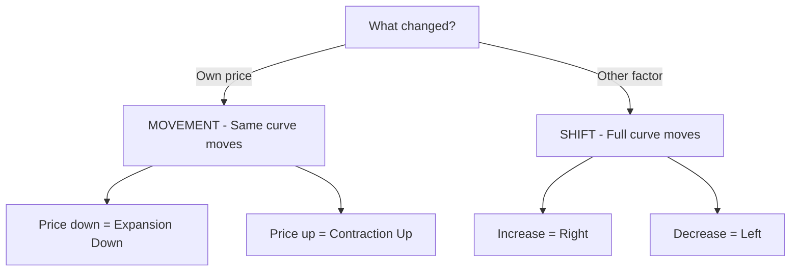

# Chapter 3 - Demand - STE Study Notes

> Reading rule: Read one section at a time. Do each CHECK. Then go to the next section.

## Key Terms - Read These First

| Term | Definition |
|------|------------|
| Demand | Quantity willing and able to buy at each price during a given time |
| Desire | Mere wish to have a commodity |
| Want | Desire backed by ability to satisfy it |
| Individual Demand | Quantity one consumer buys at each price during a given time |
| Market Demand | Quantity all consumers buy at each price during a given time |
| Demand Function | Relation between demand and factors affecting it |
| Demand Schedule | Table showing quantities demanded at various prices |
| Demand Curve | Graph of demand schedule. Slopes downwards |
| Law of Demand | Inverse relation between price and quantity demanded |
| Ceteris Paribus | Keep other factors constant. Change only price |
| Substitute Goods | Goods used in place of each other. Example: tea and coffee |
| Complementary Goods | Goods used together. Example: car and petrol |
| Normal Goods | Demand rises with rise in income |
| Inferior Goods | Demand falls with rise in income |
| Cross Demand | Relation between demand for X and price of related Y |
| Expansion | Rise in quantity demanded due to fall in price |
| Contraction | Fall in quantity demanded due to rise in price |
| Increase in Demand | Rise in demand at same price. Rightward shift |
| Decrease in Demand | Fall in demand at same price. Leftward shift |
| Giffen Goods | Special inferior goods. Demand rises with rise in price |

```mermaid
mindmap
 root((Chapter 3))
 Demand
 Willing and able
 Price reference
 Time reference
 Function
 Px - Own price
 Pr - Related goods
 Y - Income
 T - Taste
 E - Expectation
 Law
 P up D down
 P down D up
 Curve
 Downward slope
 Schedule table
 Movement - Price change
 Shift - Other factors
```

---

## 1. Meaning of Demand

**Definition:** Demand is the quantity of a commodity that a consumer is willing and able to buy, at each possible price during a given period of time.

Three words differ in meaning:

1. Desire - Mere wish to have a commodity. Example: Poor person desires a car with only 200 rupees in pocket.
2. Want - Desire backed by ability to satisfy it. Example: Same person wins a lottery. Now has money for the car. Desire becomes want.
3. Demand - Want backed by willingness. Always defined with price and time.

Two extra characteristics of demand:

1. Price reference - More is demanded at lower price. Less is demanded at higher price.
2. Time reference - Same price gives different demand in different periods. Example: Umbrellas have more demand in rainy season.

Five elements of demand:

1. Quantity of the commodity.
2. Ability to purchase.
3. Willingness to buy.
4. Price of the commodity.
5. Period of time.

Demand is a flow variable. It is measured per period.

CHECK: Say the definition of demand in one sentence. Name desire, want, demand with one example.

---

## 2. Individual Demand and Market Demand

**Individual Demand:** Quantity one consumer is willing and able to buy at each price during a given time.

**Market Demand:** Quantity all consumers are willing and able to buy at each price during a given time.

Market demand is the sum of all individual demands.

| Price | A | B | Market A + B |
|-------|---|---|--------------|
| 5 | 4 | 5 | 9 |
| 4 | 5 | 7 | 12 |
| 3 | 7 | 9 | 16 |

CHECK: Price is 4. A buys 5. B buys 7. What is market demand? Answer: 12.

---

## 3. Determinants of Demand - Individual Demand

Demand rises or falls due to many factors.

### 3.1 Price of the Given Commodity

General rule: Inverse relation exists.

- Price rises. Quantity demanded falls. Satisfaction level falls.
- Price falls. Quantity demanded rises.

### 3.2 Price of Related Goods

Related goods are goods where change in price of one good causes change in demand for the other good.

Two types:

1. Substitute Goods - Goods used in place of each other for one want. Examples: tea and coffee, Coke and Pepsi.
2. Complementary Goods - Goods used together for one want. Examples: car and petrol, tea and sugar.

### 3.3 Income of the Consumer

1. Normal Goods - Rise in income raises demand. Fall in income lowers demand. Example: TV.
2. Inferior Goods - Rise in income lowers demand. Fall in income raises demand. Example: black-and-white TV.

### 3.4 Tastes and Preferences

Taste directly influences demand.

- Commodity in fashion is preferred. Demand rises.
- Commodity out of fashion loses taste. Demand falls.

### 3.5 Expectation of Change in Price in Future

- Expect price to rise in future. Buy more now. Direct relation exists in current period.
- Expect price to fall in future. Buy less now.

CHECK: Name the five individual determinants. Give one example of substitute goods. Give one example of complementary goods.

---

## 4. Determinants of Market Demand

Market demand has all individual factors. It has three extra factors:

1. Size and Composition of Population - More population raises market demand. Less population lowers market demand.
2. Season and Weather - Raincoat has more demand in rainy season. Woollens have more demand in winter.
3. Distribution of Income - Equitable distribution raises market demand. Uneven distribution keeps market demand low.

CHECK: Name the three extra market determinants.

---

## 5. Demand Function

**Definition:** Demand function shows the relationship between quantity demanded and factors influencing it.

Individual demand function:

```text
Dx = f(Px, Pr, Y, T, E)
```

Where:
- Dx = Demand for commodity X
- Px = Price of given commodity X
- Pr = Prices of related goods
- Y = Income of consumer
- T = Tastes and preferences
- E = Expectation of change in price in future

Market demand function:

```text
Dx = f(Px, Pr, Y, T, E, Pop, D, S)
```

Extra symbols:
- Pop = Size and composition of population
- D = Distribution of income
- S = Season and weather

CHECK: Write the individual demand function with all symbols.

---

## 6. Substitute Goods and Complementary Goods

### 6.1 Meaning

| Basis | Substitute Goods | Complementary Goods |
|-------|------------------|---------------------|
| Meaning | Goods used in place of each other | Goods used together |
| Nature of demand | Competitive demand | Joint demand |
| Relation | Price of one has direct relation with demand for other | Price of one has inverse relation with demand for other |
| Examples | Tea and coffee. Coke and Pepsi | Tea and sugar. Car and petrol |

Unrelated goods have no effect. Example: Change in price of pen causes no change in demand for tea.

### 6.2 Cross Demand

**Definition:** Cross demand is the relationship between demand for a given commodity and price of a related commodity, other things remaining same.

Formula:

```text
Dx = f(Py)
```

Where Dx is demand for given commodity. Py is price of related commodity.

Two results:

- Positive cross demand in substitutes. Demand varies directly with price of substitute.
- Negative cross demand in complements. Demand varies inversely with price of complement.

### 6.3 Effect on Demand Curve

Substitute price rises. Demand curve of given good shifts right. Example: Coffee price rises from OP1 to OP2. Tea demand rises from OQ to OQ1 at same price OP.

Substitute price falls. Demand curve of given good shifts left.

Complement price rises. Demand curve of given good shifts left. Example: Sugar price rises from OP to OP1. Tea demand falls from OQ to OQ1 at same price.

Complement price falls. Demand curve of given good shifts right.

CHECK: Coffee price rises. What happens to tea demand? Answer: Rises. Rightward shift.

---

## 7. Normal Goods and Inferior Goods

| Basis | Normal Goods | Inferior Goods |
|-------|--------------|----------------|
| Meaning | Demand rises with rise in income | Demand falls with rise in income |
| Income effect | Positive | Negative |
| Relation | Direct relation between income and demand | Inverse relation between income and demand |
| Law of Demand | Always follows. Inverse price-demand relation holds | May fail. Inverse relation may not hold |
| Example | TV. Full cream milk | Black-and-white TV. Toned milk |

Effect on curve with income change:

- Normal good + rise in income = Rightward shift.
- Normal good + fall in income = Leftward shift.
- Inferior good + rise in income = Leftward shift.
- Inferior good + fall in income = Rightward shift.

CHECK: Income rises. What happens to normal good? What happens to inferior good? Answers: Normal rises. Inferior falls.

---

## 8. Demand Schedule

**Definition:** Demand schedule is a tabular statement. It shows various quantities demanded at various prices during a given time.

Two types:

1. Individual Demand Schedule - Table for one consumer.
2. Market Demand Schedule - Table for all consumers.

Market schedule is made by horizontal summation. Add individual demands at each price.

| Price | A | B | Market |
|-------|---|---|--------|
| 5 | 4 | 5 | 9 |
| 4 | 5 | 7 | 12 |
| 3 | 7 | 9 | 16 |

Read: At price 5, A buys 4 and B buys 5. Market buys 9.

CHECK: At price 3, A buys 7 and B buys 9. What is market demand? Answer: 16.

---

## 9. Demand Curve

**Definition:** Demand curve is graphical representation of demand schedule.

1. Individual Demand Curve - Graph of individual schedule.
2. Market Demand Curve - Graph of market schedule. Made by horizontal summation of individual curves.

Properties:

- X-axis shows quantity demanded. Y-axis shows price.
- Curve slopes downwards from left to right. Inverse relation holds.
- Market demand curve is flatter than individual curves.

Slope of demand curve:

```text
Slope = Change in Price / Change in Quantity = ΔP / ΔQ
```

CHECK: Draw individual demand curve. Label price on Y-axis. Label quantity on X-axis.

---

## 10. Law of Demand

**Definition:** Law of Demand states inverse relationship between price and quantity demanded, keeping other factors constant. Other name: First Law of Purchase.

In words:

```text
Price rises. Quantity demanded falls.
Price falls. Quantity demanded rises.
```

### 10.1 Assumptions - Ceteris Paribus

1. Prices of substitute goods do not change.
2. Prices of complementary goods remain constant.
3. Income of consumer remains same.
4. No expectation of change in price in future.
5. Tastes and preferences remain same.

### 10.2 Facts

- Relation is inverse.
- Relation is qualitative, not quantitative. Explains direction only. Explains no magnitude.
- Relation is one-sided. Explains price effect on demand. Explains no demand effect on price.

### 10.3 Reasons for Downward Slope

1. Law of DMU - More units give less extra utility. Consumer buys more only at lower price.
2. Income Effect - Price fall raises real income. Consumer can buy more.
3. Substitution Effect - Cheaper good replaces costlier substitute. Example: Tea becomes cheaper than coffee. Use tea in place of coffee.
4. Additional Customers - Price fall brings new buyers who could not buy earlier.
5. Different Uses - Milk and electricity have many uses. Lower price allows more uses.

CHECK: Write any three assumptions. Write any three reasons for the law.

---

## 11. Exceptions to Law of Demand

In special cases law fails. Rise in price raises demand.

1. Giffen Goods - Special inferior goods. Consumer spends large part of income on them. Demand rises with price rise. Demand falls with price fall. Named after Sir Robert Giffen. Example: bread and potatoes for poor families.
2. Status Symbol Goods - Prestige goods used as status symbols. Higher price means higher prestige. Demand rises with price. Example: diamonds and luxury cars.
3. Fashion-Related Goods - Goods in fashion break the law. Demand rises even with price rise.
4. Fear of Shortage - Expect shortage in future. Buy more now even at higher price.
5. Ignorance - Consumer is ignorant of market prices. Buys more at higher price.
6. Necessities of Life - Constant-use necessities are bought in same quantity despite price rise. Example: salt and medicines.
7. Change in Weather - Season changes demand despite no price change. Example: Demand for sweaters rises in winter.

CHECK: What are Giffen goods? Give one example.

---

## 12. Change in Quantity Demanded - Movement

**Definition:** Change in quantity demanded means change in demand due to change in own price. Other factors remain constant.

Result: Movement along the same demand curve.

Two types:

### 12.1 Expansion in Demand

Expansion means rise in quantity demanded due to fall in price.

- Other name: Extension in Demand. Other name: Increase in Quantity Demanded.
- Movement: Downward movement along same curve.

| Price | Quantity |
|-------|----------|
| 20 | 100 |
| 15 | 150 |

Read: Price falls from 20 to 15. Quantity rises from 100 to 150.

### 12.2 Contraction in Demand

Contraction means fall in quantity demanded due to rise in price.

- Other name: Decrease in Quantity Demanded.
- Movement: Upward movement along same curve.

| Price | Quantity |
|-------|----------|
| 20 | 100 |
| 25 | 70 |

Read: Price rises from 20 to 25. Quantity falls from 100 to 70.

CHECK: Price falls. Expansion or contraction? Answer: Expansion. Downward movement.

---

## 13. Change in Demand - Shift

**Definition:** Change in demand means change in demand due to factors other than own price. Price remains same.

Result: Shift in demand curve.

Two types:

### 13.1 Increase in Demand

Increase means rise in demand due to favourable change in other factors at same price.

Shift: Rightward shift from DD to D1D1.

Causes:

- Rise in price of substitute goods.
- Fall in price of complementary goods.
- Rise in income for normal goods.
- Fall in income for inferior goods.
- Taste in favour of commodity.
- Expectation of future price rise.
- Rise in population.

Example:

| Price | Income | Quantity |
|-------|--------|----------|
| 20 | 10000 | 100 |
| 20 | 20000 | 150 |

Price same at 20. Income rises. Quantity rises from 100 to 150.

### 13.2 Decrease in Demand

Decrease means fall in demand due to unfavourable change in other factors at same price.

Shift: Leftward shift from DD to D2D2.

Causes:

- Fall in price of substitute goods.
- Rise in price of complementary goods.
- Fall in income for normal goods.
- Rise in income for inferior goods.
- Taste not in favour.
- Expectation of future price fall.
- Fall in population.

Example:

| Price | Income | Quantity |
|-------|--------|----------|
| 20 | 10000 | 100 |
| 20 | 5000 | 70 |

Price same at 20. Income falls. Quantity falls from 100 to 70.

CHECK: Income rises for normal good. Price same. Increase or expansion? Answer: Increase. Rightward shift.

---

## 14. Movement vs Shift - Exam Tables

### 14.1 Expansion vs Increase

| Basis | Expansion in Demand | Increase in Demand |
|-------|---------------------|--------------------|
| Meaning | Rise in quantity due to fall in price | Rise in demand due to other factors than price |
| Price | Price falls from 12 to 10 | Price same at 12 |
| Schedule | 12 - 100. 10 - 150 | 12 - 100. 12 - 150 |
| Curve | Downward movement on same curve | Rightward shift of curve |
| Reason | Fall in price of given commodity | Favourable other factors |

### 14.2 Contraction vs Decrease

| Basis | Contraction in Demand | Decrease in Demand |
|-------|-----------------------|--------------------|
| Meaning | Fall in quantity due to rise in price | Fall in demand due to other factors than price |
| Price | Price rises from 10 to 12 | Price same at 10 |
| Schedule | 10 - 150. 12 - 100 | 10 - 150. 10 - 100 |
| Curve | Upward movement on same curve | Leftward shift of curve |
| Reason | Rise in price of given commodity | Unfavourable other factors |

### 14.3 Change in Quantity Demanded vs Change in Demand

| Basis | Change in Quantity Demanded | Change in Demand |
|-------|-----------------------------|------------------|
| Factors | Change in own price only | Change in other factors |
| Price effect | Price changes. Lower price means more demand | No price change. Same price gives more or less demand |
| Curve | No shift. Move along same curve | Curve shifts right or left |
| Types | Expansion and Contraction | Increase and Decrease |



CHECK: Price rises. Other factors same. Movement or shift? Answer: Movement. Contraction.

---

## 15. Kinds of Demand

1. Price Demand - Relation between price and demand, keeping other factors constant.
2. Income Demand - Relation between income and demand, keeping other factors constant.
3. Cross Demand - Relation between demand for X and price of related Y, keeping other things same.
4. Joint Demand - Two goods demanded together for one want. Example: milk and sugar for tea.
5. Composite Demand - One good put to many uses. Example: milk for paneer, cheese, butter, curd.
6. Derived Demand - Demand for input depends on demand for output. Example: Demand for labour depends on demand for goods.
7. Direct Demand - Good satisfies want directly. Example: food and clothes.
8. Alternative Demand - One want satisfied by different alternatives. Example: rice or wheat for food.
9. Competitive Demand - Two substitutes compete. More demand for one means less demand for other. Example: tea vs coffee.

CHECK: Milk used for paneer and butter. What kind of demand? Answer: Composite demand.

---

## 16. Fast Revision - One Page

1. Demand means willing and able to buy at each price during a given time.
2. Desire is mere wish. Want is desire plus ability. Demand adds willingness, price, time.
3. Individual demand is for one consumer. Market demand is sum of all individuals.
4. Individual factors: own price, related goods price, income, taste, future expectation.
5. Market extra factors: population, season and weather, income distribution.
6. Substitutes have direct relation. Complements have inverse relation.
7. Normal goods rise with income. Inferior goods fall with income.
8. Demand schedule is a table. Demand curve is its graph. Market curve uses horizontal summation.
9. Law of Demand means inverse price-demand relation with other factors constant.
10. Reasons: DMU, income effect, substitution effect, new customers, different uses.
11. Expansion is price fall. Contraction is price rise. Both are movements on same curve.
12. Increase is rightward shift. Decrease is leftward shift. Both occur at same price.
13. Giffen goods rise with price rise. Status goods rise with price for prestige.
14. Cross demand is positive for substitutes. Negative for complements.

---

## 17. Exam Questions With Answers

**Q1. Define demand. State its essential elements.**
A: Quantity willing and able to buy at each price during a given time. Elements: quantity, ability, willingness, price, time.

**Q2. Distinguish between desire and demand.**
A: Desire is mere wish. Demand is desire plus ability plus willingness with price and time reference.

**Q3. What is individual demand function?**
A: Dx = f(Px, Pr, Y, T, E). Symbols: own price, related goods price, income, taste, future expectation.

**Q4. State the Law of Demand.**
A: Inverse relation between price and quantity demanded, keeping other factors constant.

**Q5. Give two reasons for downward slope of demand curve.**
A: Income effect and substitution effect. Add DMU, new customers, different uses for full marks.

**Q6. What are substitute goods? Give an example.**
A: Goods used in place of each other. Example: tea and coffee. Price rise of one raises demand for other.

**Q7. What are complementary goods? Give an example.**
A: Goods used together. Example: car and petrol. Price rise of one lowers demand for other.

**Q8. Distinguish between normal and inferior goods.**
A: Normal demand rises with income. Inferior demand falls with income. Example: TV is normal. Black-and-white TV is inferior.

**Q9. What is expansion in demand?**
A: Rise in quantity demanded due to fall in price. Downward movement on same curve.

**Q10. What is increase in demand?**
A: Rise in demand at same price due to favourable other factors. Rightward shift.

**Q11. Price of coffee rises from 10 to 12. Demand for tea rises from 100 to 150 at same tea price. What is this?**
A: Increase in demand for tea due to rise in substitute price. Rightward shift.

**Q12. What are Giffen goods?**
A: Special inferior goods with no close substitutes. Demand rises with price rise. Named after Sir Robert Giffen.

---

> Tip: Draw the diagram first. Write the definition next. Then give the example. Diagram plus explanation gives full marks.
