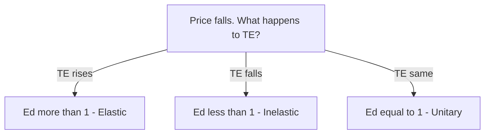

# Chapter 4 - Elasticity of Demand - STE Study Notes

> Reading rule: Read one section at a time. Do each CHECK. Then go to the next section.

## Key Terms - Read These First

| Term | Definition |
|------|------------|
| Elasticity of Demand | Percentage change in quantity demanded due to percentage change in a factor |
| Price Elasticity | Percentage change in demand due to percentage change in own price |
| Income Elasticity | Percentage change in demand due to percentage change in income |
| Cross Elasticity | Percentage change in demand for X due to percentage change in price of related Y |
| Elastic Demand | Large change in demand with price change. Example: X falls 20% for 10% price rise |
| Inelastic Demand | Small change in demand with price change. Example: Y falls 5% for 10% price rise |
| Ed | Coefficient of price elasticity of demand |
| Flux Method | Other name for percentage method. Other names: Proportionate Method, Mathematical Method |
| Total Expenditure | Price x Quantity. Other name: Total Outlay |
| Unit Free Measure | Pure number independent of price and quantity units |

```mermaid
mindmap
 root((Chapter 4))
 Law tells direction
 Elasticity tells magnitude
 Three types
 Price - Own price change
 Income - Income change
 Cross - Related price change
 Price Elasticity
 %Q change / %P change
 Percentage method
 Marshall Flux method
 Total outlay method
 TE same opposite constant
```

---

## 1. Introduction - Direction and Magnitude

**Definition:** Law of Demand explains only direction of change. Price change raises or lowers demand. Elasticity of Demand measures extent of change.

Points:

1. Law of Demand states inverse relation. It gives no magnitude.
2. Elasticity measures responsiveness of quantity demanded to price change.
3. Concept was developed by Alfred Marshall in Principles of Economics.
4. Elasticity is important in economic theory and applied economics.

CHECK: Law of Demand tells direction or magnitude? Answer: Direction only.

---

## 2. Concept of Elasticity of Demand

Demand changes due to several factors:

1. Change in own price.
2. Change in consumer income.
3. Change in prices of related goods.

**Definition:** Elasticity of Demand is percentage change in quantity demanded due to percentage change in any factor affecting demand.

Formula:

```text
Elasticity of Demand = Percentage Change in Demand for X / Percentage Change in Factor Affecting Demand for X
```

CHECK: Name three factors that change demand.

---

## 3. Three Dimensions of Elasticity

### 3.1 Price Elasticity of Demand

Price elasticity is percentage change in demand for a commodity with respect to percentage change in its own price.

### 3.2 Cross Elasticity of Demand

Cross elasticity is percentage change in demand for a commodity with respect to percentage change in price of a related good. Related good means substitute good or complementary good.

### 3.3 Income Elasticity of Demand

Income elasticity is percentage change in demand for a commodity with respect to percentage change in consumer income.

CHECK: Price of coffee changes. Demand for tea changes. Which elasticity? Answer: Cross elasticity.

---

## 4. Price Elasticity of Demand - Meaning

**Definition:** Price Elasticity of Demand measures degree of responsiveness of demand to change in price of the commodity.

Example: Price elasticity is 2. Then:

```text
1% fall in price = 2% rise in demand
1% rise in price = 2% fall in demand
```

### 4.1 Noteworthy Points

1. Shows quantitative relation between price and quantity. Keep other factors constant.
2. Higher numerical value means greater responsiveness.
3. Goods differ in responsiveness. Some show large change. These have elastic demand. Some show small change. These have inelastic demand.
4. Example: Price rises by 10%. Demand for X falls by 20%. Demand for Y falls by 5%. Then X is more elastic than Y.
5. Price is the most important factor. So price elasticity is often called Elasticity of Demand or Demand Elasticity. Unless stated otherwise, these terms mean price elasticity.

CHECK: Price rises 10%. X falls 20%. Y falls 5%. Which is more elastic? Answer: X.

---

## 5. Percentage Method - Formula

Most common method for measuring price elasticity. Introduced by Prof. Marshall. Other names: Flux Method, Proportionate Method, Mathematical Method.

Rule: Elasticity is ratio of percentage change in quantity demanded to percentage change in price.

```text
Ed = Percentage Change in Quantity Demanded / Percentage Change in Price
```

Steps:

1. Initial Quantity = Q. New Quantity = Q1.
2. Change in Quantity: ΔQ = Q1 - Q.
3. Percentage change in quantity = ΔQ / Q x 100.
4. Initial Price = P. New Price = P1.
5. Change in Price: ΔP = P1 - P.
6. Percentage change in price = ΔP / P x 100.

Short formula:

```text
Ed = ΔQ / ΔP x P / Q
```

CHECK: Write the short formula from memory.

---

## 6. Percentage Method - Solved Examples

### 6.1 Example 1 - Price Fall

Demand rises from 4 units to 5 units. Price falls from 10 to 8.

| Step | Calculation | Result |
|------|-------------|--------|
| ΔQ | 5 - 4 | 1 |
| %ΔQ | 1 / 4 x 100 | 25% |
| ΔP | 8 - 10 | -2 |
| %ΔP | -2 / 10 x 100 | -20% |
| Ed | 25% / -20% | -1.25 |

Absolute value is 1.25.

### 6.2 Example 2 - Price Rise

Price rises from 8 to 10. Demand falls from 5 units to 4 units.

| Step | Calculation | Result |
|------|-------------|--------|
| ΔQ | 4 - 5 | -1 |
| %ΔQ | -1 / 5 x 100 | -20% |
| ΔP | 10 - 8 | 2 |
| %ΔP | 2 / 8 x 100 | 25% |
| Ed | -20% / 25% | -0.8 |

Absolute value is 0.8.

### 6.3 Example 3 - Percentage Given

Price falls by 5%. Demand rises by 12%.

```text
Ed = 12% / -5% = -2.4
```

Absolute value is 2.4.

### 6.4 Example 4 - Find New Quantity

Price falls from 10 to 5. Original quantity is 40. Ed is 3 in absolute terms. Find new quantity.

```text
%ΔP = (5 - 10) / 10 x 100 = -50%
Ed = %ΔQ / %ΔP
3 = %ΔQ / 50% in absolute terms
%ΔQ = 150%
Rise in quantity = 150% of 40 = 60
New quantity = 40 + 60 = 100
```

CHECK: Price falls 20%. Quantity rises 40%. What is Ed in absolute terms? Answer: 2.

---

## 7. Important Observations

### 7.1 Use Absolute Values

Measure and compare elasticity in absolute terms. Ignore the negative sign.

Example: Ed of X is -3. Ed of Y is -4. Then Y is more elastic. 1% price change causes 4% demand change in Y and only 3% demand change in X.

### 7.2 Elasticity Depends on Percentage Change

Ed is unaffected by absolute change. Ed is influenced by percentage change.

Proof: Change in quantity is 1 unit in Example 1 and Example 2. Change in price is 2 in both examples. Yet Ed differs. Example 1 gives -1.25. Example 2 gives -0.8.

Reason: Example 1 has 25% quantity change and 20% price change. Example 2 has 20% quantity change and 25% price change.

### 7.3 Elasticity Is Unit Free

Coefficient of price elasticity is a pure number. It is independent of price and quantity units.

Result: Quantity in kilograms or tonnes gives same Ed. Price in rupees or dollars gives same Ed. Compare price sensitivity of needle and gold easily.

CHECK: Ed values are -2 and -5. Which is more elastic? Answer: -5. Absolute value is 5.

---

## 8. Total Expenditure Method - Meaning

**Definition:** Total Expenditure Method examines relation between price change and total expenditure to determine elasticity. Other name: Total Outlay Method.

Formula:

```text
Total Expenditure = Price x Quantity
```

Price and demand move in opposite directions. Elasticity decides the effect on expenditure.

Three cases:

| Case | Ed | Price and TE Relation |
|------|----|-----------------------|
| Elastic | Ed > 1 | Move in opposite directions |
| Inelastic | Ed < 1 | Move in same direction |
| Unitary | Ed = 1 | TE remains unchanged |

CHECK: Write the total expenditure formula in one line.

---

## 9. Total Expenditure Method - Three Cases

### 9.1 Ed More Than One - Elastic

Rule: Fall in price raises total expenditure. Rise in price lowers total expenditure. Price and TE move in opposite directions.

| Price | Quantity | Total Expenditure |
|-------|----------|-------------------|
| 5 | 100 | 500 |
| 4 | 140 | 560 |

Read: Price falls from 5 to 4. Quantity rises from 100 to 140. TE rises from 500 to 560.

### 9.2 Ed Less Than One - Inelastic

Rule: Fall in price lowers total expenditure. Rise in price raises total expenditure. Price and TE move in same direction.

| Price | Quantity | Total Expenditure |
|-------|----------|-------------------|
| 5 | 100 | 500 |
| 4 | 120 | 480 |

Read: Price falls from 5 to 4. Quantity rises from 100 to 120. TE falls from 500 to 480.

### 9.3 Ed Equal to One - Unitary

Rule: Fall or rise in price causes no change in total expenditure. TE remains unchanged.

| Price | Quantity | Total Expenditure |
|-------|----------|-------------------|
| 5 | 100 | 500 |
| 4 | 125 | 500 |

Read: Price falls from 5 to 4. Quantity rises from 100 to 125. TE stays at 500.



CHECK: Price falls. TE rises from 500 to 560. What is Ed? Answer: Ed more than 1.

---

## 10. Fast Revision - One Page

1. Law shows direction. Elasticity shows magnitude. Given by Marshall.
2. Elasticity = % change in demand / % change in factor.
3. Three types: price, income, cross.
4. Price elasticity example: Ed is 2. Then 1% price fall means 2% demand rise.
5. X falls 20% and Y falls 5% for same 10% price rise. X is more elastic.
6. Percentage method: Ed = ΔQ / ΔP x P / Q. Other name: Flux Method.
7. Example 1: 4 to 5 units, 10 to 8 price. Ed = -1.25. Absolute value is 1.25.
8. Example 2: 8 to 10 price, 5 to 4 units. Ed = -0.8. Absolute value is 0.8.
9. Compare absolute values. Ignore negative sign. -4 is more elastic than -3.
10. Same absolute change gives different Ed. Percentage base differs.
11. Ed is unit free. Pure number. Compare needle and gold easily.
12. TE = P x Q. Ed more than 1 means opposite directions. Ed less than 1 means same direction. Ed equal to 1 means TE unchanged.

---

## 11. Exam Questions With Answers

**Q1. What does Law of Demand explain? What does elasticity explain?**
A: Law explains direction of change. Elasticity explains extent of change.

**Q2. Define elasticity of demand.**
A: Percentage change in quantity demanded due to percentage change in any factor affecting demand.

**Q3. Name the three types of elasticity.**
A: Price elasticity, income elasticity, cross elasticity.

**Q4. State the percentage method formula.**
A: Ed = Percentage change in quantity / Percentage change in price = ΔQ / ΔP x P / Q.

**Q5. Who gave the percentage method? Give its other names.**
A: Prof. Marshall. Other names: Flux Method, Proportionate Method, Mathematical Method.

**Q6. Demand rises from 4 to 5 units. Price falls from 10 to 8. Find Ed.**
A: %ΔQ is 25%. %ΔP is -20%. Ed is -1.25. Absolute value is 1.25.

**Q7. Price rises from 8 to 10. Demand falls from 5 to 4. Find Ed.**
A: %ΔQ is -20%. %ΔP is 25%. Ed is -0.8. Absolute value is 0.8.

**Q8. Price falls by 5%. Demand rises by 12%. Find Ed.**
A: Ed = 12% / -5% = -2.4. Absolute value is 2.4.

**Q9. Ed values are -3 and -4. Which good is more elastic?**
A: Good with -4. Compare absolute values. Ignore negative sign.

**Q10. Why is elasticity called unit free?**
A: Coefficient is a pure number. It is independent of price and quantity units.

**Q11. Price falls from 5 to 4. TE rises from 500 to 560. What is Ed?**
A: Price and TE move in opposite directions. Ed is more than 1.

**Q12. Price falls from 5 to 4. TE falls from 500 to 480. What is Ed?**
A: Price and TE move in same direction. Ed is less than 1.

**Q13. Price falls from 5 to 4. Quantity rises from 100 to 125. TE stays at 500. What is Ed?**
A: TE remains unchanged. Ed is equal to 1.

---

> Tip: Draw the diagram first. Write the definition next. Then give the example. Diagram plus explanation gives full marks.
