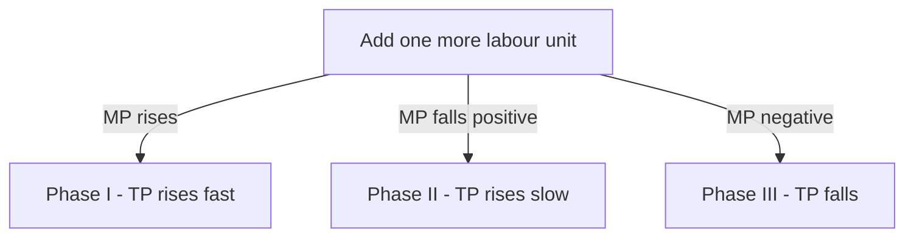

# Chapter 5 - Production Function - STE Study Notes

> Reading rule: Read one section at a time. Do each CHECK. Then go to the next section.

## Key Terms - Read These First

| Term | Definition |
|------|------------|
| Production | Transformation of inputs into output |
| Production Function | Technological relation between physical inputs and output |
| Short Run | Output changes by changing only variable factors |
| Long Run | Output changes by changing all factors |
| Variable Factors | Factors changed in short run. Example: labour |
| Fixed Factors | Factors not changed in short run. Example: land |
| Total Product | Total quantity produced with given inputs |
| Average Product | Output per unit of variable input |
| Marginal Product | Addition to TP from one more variable unit |
| Returns to a Factor | Behaviour of output with one variable factor |
| Law of Variable Proportions | TP rises at increasing rate then decreasing rate then falls |
| Phase I | Increasing returns to a factor. MP rises |
| Phase II | Diminishing returns to a factor. MP falls but positive |
| Phase III | Negative returns to a factor. MP negative |
| Point of Inflexion | Point where TP curvature changes. Phase I ends |
| Law of Diminishing Returns | MP of variable factor must fall |
| Optimum Combination | Factor mix where TP is maximum |
| Rational Producer | Producer operating in Phase II only |

```mermaid
mindmap
 root((Chapter 5))
 Production
 Inputs to output
 Wheat to atta
 Function
 Qx = f inputs
 Short vs Long
 Short - One variable
 Long - All variable
 Product
 TP - Total output
 AP - TP / n
 MP - Extra from last unit
 Law LVP
 Phase I - MP rises
 Phase II - MP falls positive
 Phase III - MP negative
```

---

## 1. Production - Meaning

**Definition:** Production refers to transformation of inputs into output.

Points:

1. Convert raw material into finished goods.
2. Inputs are land, labour, capital, raw material.
3. Output is finished good.
4. Examples: Wheat to atta. Sugarcane to sugar. Steel to cars.

CHECK: Say the definition of production in one sentence. Give two examples.

---

## 2. Production Function

**Definition:** Production Function is an expression of technological relation between physical inputs and output of a good.

Formula:

```text
Qx = f(i1, i2, i3, ..... in)
```

Where:
- Qx = Quantity of output of Good X
- f = Function. Shows relationship
- i1, i2, i3 = Inputs. Land, labour, capital, raw material

Point:

1. Shows physical relation only. Shows no prices.
2. Producer side function. Demand function is consumer side.
3. Input rises. Output rises as per law.

| Function | Who | Shows Relation Between |
|----------|-----|------------------------|
| Demand Function Dx = f(P, Pr, Y, T, E) | Consumer | Demand and its determinants |
| Production Function Qx = f(L, K) | Producer | Output and inputs |

CHECK: Write the production function formula with all symbols.

---

## 3. Short Run and Long Run

**Short Run:** Short run refers to a period in which output can be changed by changing only variable factors.

**Long Run:** Long run refers to a period in which output can be changed by changing all factors of production.

Points:

1. Short run has fixed and variable factors.
2. Long run has all variable factors.
3. Plant capacity varies only in long run.
4. Example: T-shirt factory raises 250 to 500 shirts in short run with more labour. Cannot add machinery.
5. Example: Gift packs one week before Diwali fall in short period. Add material and labour only. Cannot add plant.

| Basis | Short Run | Long Run |
|-------|-----------|----------|
| Meaning | Change output with only variable factors | Change output with all factors |
| Classification | Factors split as fixed and variable | All factors are variable |
| Price determination | Demand is more active. Supply cannot rise fast | Demand and supply play equal role |

CHECK: Gift packs rise for one week. Short run or long run? Answer: Short run.

---

## 4. Variable Factors and Fixed Factors

**Variable Factors:** Variable factors refer to those factors which can be changed in the short run.

**Fixed Factors:** Fixed factors refer to those factors which cannot be changed in the short run.

Examples:

1. Variable factors: raw material, casual labour, power, fuel.
2. Fixed factors: land, building, plant and machinery, permanent staff.

| Basis | Variable Factors | Fixed Factors |
|-------|------------------|---------------|
| Meaning | Can be changed in short run | Cannot be changed in short run |
| Relation with output | Vary directly with output | Do not vary directly with output |
| Example | Raw material and casual labour | Building and machinery |
| Need at zero output | Not required at zero output | Required even at zero output |

CHECK: Name two variable factors. Name two fixed factors.

---

## 5. Concept of Product - TP, AP, MP

**Definition:** Product or output refers to volume of goods produced by a firm during a specified period of time.

Three concepts:

### 5.1 Total Product

**Definition:** Total Product refers to total quantity of goods produced by a firm during a given period with given number of inputs.

Formula:

```text
TP = AP x Units of Variable Factor
```

### 5.2 Average Product

**Definition:** Average Product refers to output per unit of variable input.

Formula:

```text
AP = TP / Units of Variable Factor
```

### 5.3 Marginal Product

**Definition:** Marginal Product refers to addition to total product when one more unit of variable factor is employed.

Formula:

```text
MP = TPn - TPn-1
```

Where:
- MPn = Marginal Product of nth unit
- TPn = Total Product of n units
- TPn-1 = Total Product of n-1 units
- n = Number of units of variable factor

| Concept | Meaning | Formula |
|---------|---------|---------|
| TP | Total quantity produced | TP = AP x n |
| AP | Output per unit | AP = TP / n |
| MP | Extra from one more unit | MP = TPn - TPn-1 |

CHECK: Write all three formulas from memory.

---

## 6. Numericals - TP, AP, MP

Rule: TP = Sum of MPs. AP = TP / n. MP = TPn - TPn-1.

### 6.1 Find AP and MP from TP

| Labour | TP | MP | AP |
|--------|----|----|----|
| 1 | 8 | 8 | 8 |
| 2 | 20 | 12 | 10 |
| 3 | 30 | 10 | 10 |
| 4 | 36 | 6 | 9 |
| 5 | 40 | 4 | 8 |
| 6 | 42 | 2 | 7 |

Read: At 2 units, TP is 20. MP is 20 - 8 = 12. AP is 20 / 2 = 10.

### 6.2 Find TP and AP from MP

| Labour | MP | TP | AP |
|--------|----|----|----|
| 1 | 10 | 10 | 10 |
| 2 | 12 | 22 | 11 |
| 3 | 14 | 36 | 12 |
| 4 | 12 | 48 | 12 |
| 5 | 7 | 55 | 11 |
| 6 | 5 | 60 | 10 |

Read: At 2 units, TP is 10 + 12 = 22. AP is 22 / 2 = 11.

### 6.3 Firm Data with 10 Unit Steps

| Labour | TP | AP = TP / L | MP = TPn - TPn-1 |
|--------|----|-------------|------------------|
| 10 | 100 | 10 | - |
| 20 | 220 | 11 | 120 |
| 30 | 360 | 12 | 140 |
| 40 | 460 | 11.5 | 100 |
| 50 | 500 | 10 | 40 |

Read: At 30 labour, AP is 360 / 30 = 12. MP is 360 - 220 = 140.

CHECK: Labour is 4. TP is 36. What is AP? Answer: 9.

---

## 7. Returns to a Factor and Law of Variable Proportions

**Returns to a Factor:** Returns to a factor refers to behaviour of output when only one variable factor is increased in short run and fixed factors remain constant.

**Definition:** Law of Variable Proportions states that as we increase quantity of only one input keeping other inputs fixed, total product initially increases at an increasing rate then at a decreasing rate and finally at a negative rate.

Other names:

1. Law of Variable Proportions.
2. Returns to a Factor. Short run law.
3. Law of Diminishing Returns covers its falling part only.

CHECK: Say the statement of Law of Variable Proportions in one sentence.

---

## 8. Assumptions of Law of Variable Proportions

Follow five assumptions:

1. Fixed Technology - Technology remains constant during production.
2. Variable Input - Only one input is variable. Others remain fixed.
3. Short Run - Law operates in short run. At least one factor is fixed.
4. Homogeneous Input - All units of variable factor are identical.
5. Divisible Inputs - Inputs can be divided into smaller units.

CHECK: Write any three assumptions from memory.

---

## 9. Three Phases - Schedule

Fixed factor is 1 acre land. Variable factor is labour.

| Fixed Factor | Labour | TP | MP | Phase |
|--------------|--------|----|----|-------|
| 1 | 1 | 10 | 10 | Phase I - Increasing Returns |
| 1 | 2 | 30 | 20 | Phase I - Increasing Returns |
| 1 | 3 | 45 | 15 | Phase II - Diminishing Returns |
| 1 | 4 | 52 | 7 | Phase II - Diminishing Returns |
| 1 | 5 | 52 | 0 | Phase II ends. MP zero |
| 1 | 6 | 48 | -4 | Phase III - Negative Returns |

Read: At 2 labour, TP is 30. MP is 30 - 10 = 20.

Three phases:

1. Phase I between O to Q. TP rises at increasing rate. MP also rises.
2. Phase II between Q to M. TP rises at decreasing rate. MP falls but stays positive. Ends when MP is zero and TP is maximum.
3. Phase III beyond M. TP starts falling. MP becomes negative.



CHECK: Labour is 5. TP is 52. MP is 0. Which phase ends? Answer: Phase II.

---

## 10. Point of Inflexion

**Definition:** Point Q is known as point of inflexion as curvature of TP curve changes at this point.

Points:

1. Phase I ends at Q. Phase II starts at Q.
2. TP shifts from increasing rate to decreasing rate.
3. MP is maximum at Q.
4. TP maximum point is M. MP is zero at M.

| Phase | TP Behaviour | MP Behaviour | MP Sign |
|-------|--------------|--------------|---------|
| I - Increasing Returns | Increases at increasing rate | Increases to maximum | Positive |
| II - Diminishing Returns | Increases at decreasing rate | Falls but stays positive | Positive to zero |
| III - Negative Returns | Starts falling | Falls and turns negative | Negative |

CHECK: Where is MP maximum? Answer: At point of inflexion Q.

---

## 11. Reasons for Three Phases

### 11.1 Reasons for Increasing Returns - Phase I

1. Better Utilisation of Fixed Factor - Fixed factor is underused at start.
2. Increased Efficiency of Variable Factor - Division of labour raises skill.
3. Indivisibility of Fixed Factor - Machinery cannot be split into small units.

### 11.2 Reasons for Diminishing Returns - Phase II

1. Optimum Combination of Factors - Best mix gives maximum TP. Further units lower MP.
2. Over-utilisation of Fixed Factor - Pressure rises on fixed factor.
3. Imperfect Substitutes - Factors are not perfect substitutes of each other.

### 11.3 Reasons for Negative Returns - Phase III

1. Limitation of Fixed Factors - Fixed capacity is exhausted.
2. Poor Coordination - Coordination breaks between variable and fixed factors.
3. Decrease in Efficiency - Efficiency of variable factor falls.

CHECK: Give two reasons for Phase I. Give two reasons for Phase II.

---

## 12. Relationship Between TP and MP

Rules:

1. As long as TP increases at increasing rate, MP also increases.
2. When TP increases at diminishing rate, MP decreases but stays positive.
3. When TP reaches its maximum point, MP becomes zero.
4. When TP starts decreasing, MP becomes negative.

| TP Behaviour | MP Behaviour |
|--------------|--------------|
| TP rises at increasing rate | MP rises |
| TP rises at diminishing rate | MP falls but positive |
| TP at maximum | MP = 0 |
| TP falls | MP negative |

Point: TP increases even when MP decreases. MP is addition to TP. Addition falls. Total still rises. TP falls only when MP turns negative.

CHECK: TP is maximum. What is MP? Answer: Zero.

---

## 13. Relationship Between AP and MP

Rules:

1. As long as MP is more than AP, AP rises.
2. When MP is equal to AP, AP is at its maximum.
3. When MP is less than AP, AP falls.
4. Both AP and MP fall after maximum. MP turns negative. AP stays positive.
5. MP falls at faster rate than AP.
6. AP may rise even when MP falls. MP stays above AP.

| Condition | Effect on AP |
|-----------|--------------|
| MP more than AP | AP rises |
| MP equal to AP | AP maximum. MP cuts AP |
| MP less than AP | AP falls |
| MP zero or negative | AP stays positive |

Point: MP curve cuts AP curve at its maximum point. When AP rises, MP stays above. When AP falls, MP stays below. Only at maximum are they equal.

Curves: Both AP and MP curves are generally inversely U-shaped. AP curve is inverse U in input-output plane.

Point: AP can never be zero. AP = TP / n. TP and n stay positive. MP can be zero or negative.

CHECK: MP is more than AP. What happens to AP? Answer: AP rises.

---

## 14. Law of Diminishing Returns

**Definition:** Law of Diminishing Returns states that when more and more units of a variable factor are employed with a fixed factor, then marginal product of the variable factor must fall.

Other name: Law of Diminishing Marginal Product.

Points:

1. Considers only falling phases of MP. Ignores rising MP phase.
2. Law of Variable Proportions is its extension. LVP covers all three phases.
3. Operates in short run. Change variable factors only.

Schedule:

| Fixed Factor | Labour | TP | MP |
|--------------|--------|----|----|
| 1 | 1 | 12 | 12 |
| 1 | 2 | 22 | 10 |
| 1 | 3 | 30 | 8 |
| 1 | 4 | 36 | 6 |
| 1 | 5 | 40 | 4 |

Read: MP falls from 12 to 4. TP rises at diminishing rate.

Law of Diminishing Marginal Product in words: MP first increases, reaches maximum, then falls when more variable units apply on fixed factors.

Rational producer operates in Phase II only. Phase I leaves fixed factor underused. Phase III gives falling TP.

CHECK: Does this law cover rising MP? Answer: No. Only falling MP.

---

## 15. Fast Revision - One Page

1. Production means transformation of inputs into output. Wheat to atta.
2. Qx = f(i1, i2, in). Shows physical input-output relation.
3. Short run changes only variable factors. Long run changes all factors.
4. Variable factors vary with output. Fixed factors stay same.
5. TP is total output. AP = TP / n. MP = TPn - TPn-1.
6. LVP: TP rises fast then slow then falls with one variable input.
7. Five assumptions: fixed technology, one variable input, short run, homogeneous units, divisible inputs.
8. Phase I O to Q: TP rises fast. MP rises. Phase II Q to M: TP rises slow. MP falls positive. Phase III beyond M: TP falls. MP negative.
9. Q is point of inflexion. M is TP maximum. MP zero at M.
10. Phase I reasons: better fixed use, labour efficiency, indivisibility.
11. Phase II reasons: optimum mix crossed, overuse of fixed factor, imperfect substitutes.
12. Phase III reasons: fixed limit, poor coordination, labour efficiency falls.
13. TP max means MP zero. TP falls means MP negative.
14. MP more than AP means AP rises. MP equal AP means AP maximum. MP less than AP means AP falls.
15. Diminishing returns means MP must fall. Covers only falling MP.
16. Rational producer stays in Phase II.

---

## 16. Exam Questions With Answers

**Q1. Define production.**
A: Transformation of inputs into output.

**Q2. Define production function. Give formula.**
A: Technological relation between physical inputs and output. Qx = f(i1, i2, in).

**Q3. Define short run and long run.**
A: Short run changes only variable factors. Long run changes all factors.

**Q4. Give two examples each of variable and fixed factors.**
A: Variable: raw material, casual labour. Fixed: land, machinery.

**Q5. Define TP, AP, MP with formulas.**
A: TP is total output. TP = AP x n. AP is output per unit. AP = TP / n. MP is extra from one more unit. MP = TPn - TPn-1.

**Q6. Labour is 4. TP is 36. Find AP.**
A: AP = 36 / 4 = 9.

**Q7. State Law of Variable Proportions.**
A: With only one input rising and others fixed, TP first rises at increasing rate then at decreasing rate then falls.

**Q8. Name the three phases with MP sign.**
A: Phase I MP rises positive. Phase II MP falls positive to zero. Phase III MP negative.

**Q9. What is point of inflexion?**
A: Point Q where TP curvature changes from increasing rate to decreasing rate.

**Q10. TP is 10, 30, 45, 52, 52, 48. Find MP.**
A: MP is 10, 20, 15, 7, 0, -4.

**Q11. TP rises when MP falls. Agree?**
A: Yes. MP is addition to TP. Falling MP still adds. TP falls only when MP turns negative.

**Q12. State relation between AP and MP.**
A: MP more than AP means AP rises. MP equal AP means AP maximum. MP less than AP means AP falls. AP stays positive when MP is zero or negative.

**Q13. Why does MP cut AP at maximum?**
A: AP rises only when MP stays above. AP falls only when MP stays below. Equality holds only at maximum.

**Q14. State Law of Diminishing Returns.**
A: With more variable units on fixed factor, MP of variable factor must fall.

**Q15. In which phase does a rational producer operate? Why?**
A: Phase II. Phase I wastes fixed capacity. Phase III lowers TP.

**Q16. Production function is 5L + 2K. L is 2. K is 10. Find output.**
A: Q = 5 x 2 + 2 x 10 = 30 units.

---

> Tip: Draw the diagram first. Write the definition next. Then give the example. Diagram plus explanation gives full marks.
