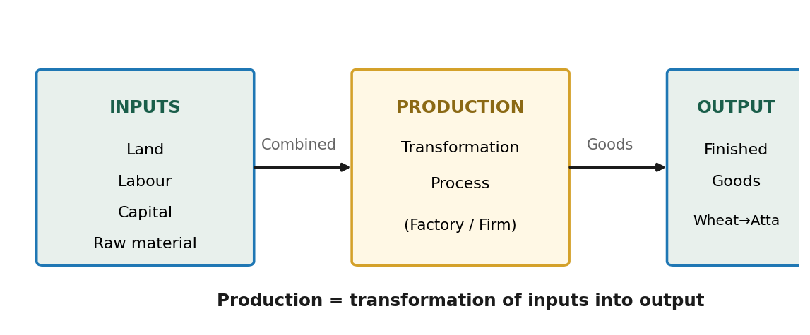
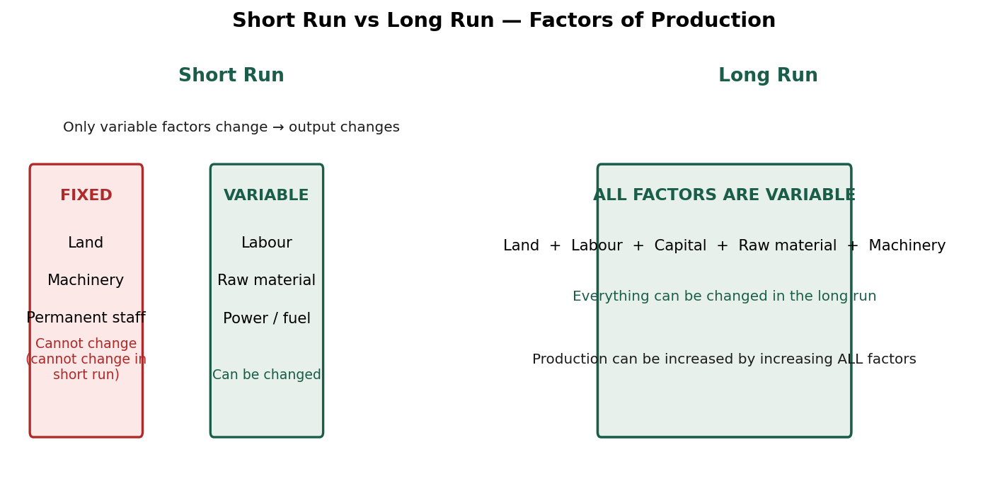
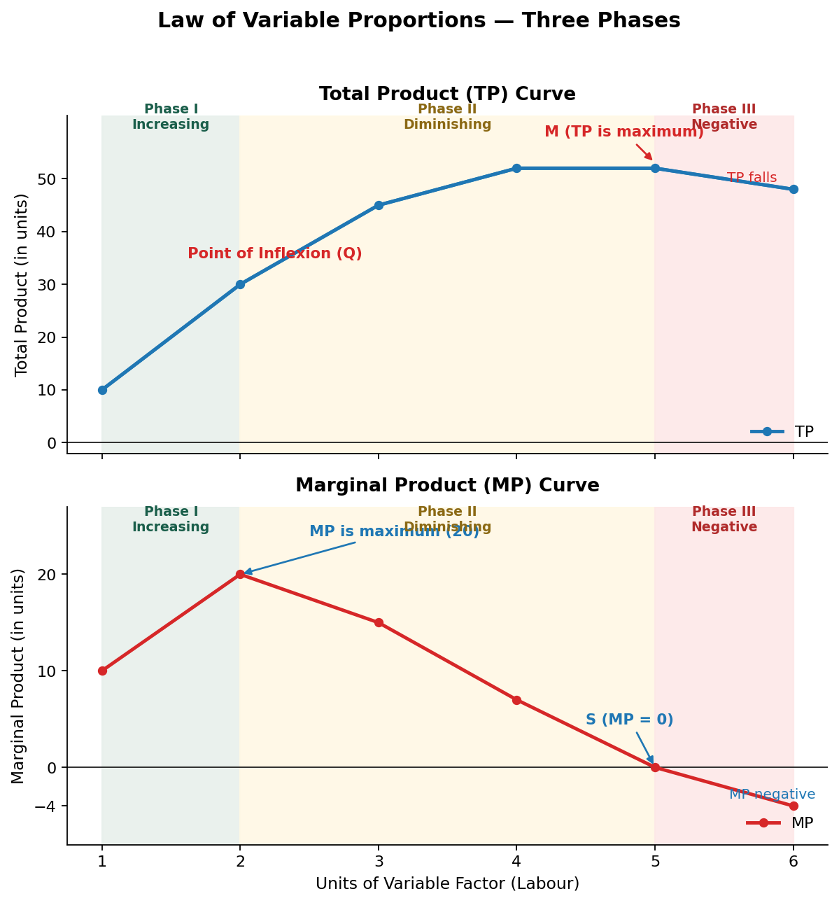
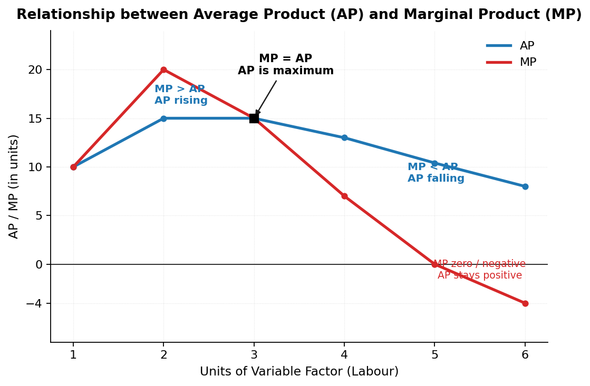
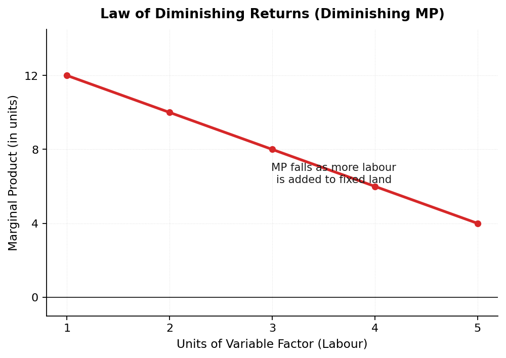

# Class 11 Economics – Chapter 5: Production Function

---

## 1. Introduction — What is Production?

### The Big Idea:

> Ab tak humne **consumer** (kharidne wala) ki taraf se padha hai — **Demand, Utility, Elasticity**. Ab hum **producer** (banane wala) ki taraf badhenge.
>
> **Production** refers to the **transformation of inputs into output** — raw material ko finished goods mein convert karna.

### Simple Example (From Lecture):

| Input (Raw Material) | Production Process | Output (Finished Good) |
|----------------------|--------------------|------------------------|
| Wheat (गेहूँ) | Milling / Grinding | Atta (आटा) |
| Sugar cane (गन्ना) | Crushing & refining | Sugar (चीनी) |
| Steel (स्टील) | Manufacturing | Cars (गाड़ियाँ) |

### Flow Diagram of Production:



> **Key Point:** Production = **Inputs + Transformation Process → Output**
>
> Inputs are **Land, Labour, Capital, Raw material** and Output is the **Finished Good**.

---

## 2. Production Function

### Definition:

> **Production Function** is an expression of the **technological relation between physical inputs and output** of a good.

### Formula:

```
Qx = f (i1, i2, i3, ..... in)

Where:
Qx = Quantity of output of Good X
f  = Function (relationship)
i1, i2, i3 = Inputs (Land, Labour, Capital, Raw material)
```

### Production Function vs Demand Function (Memory Trick):

| Function | Who? | Shows Relation Between |
|----------|------|------------------------|
| **Demand Function** Dx = f(P, Pr, Y, T, E) | Consumer | Demand & its determinants |
| **Production Function** Qx = f(L, K, ...) | Producer | Output & inputs |

> **Lecture Tip:** Jis tarah demand function consumer ka tha, usi tarah **production function producer ka** hai. Yahan input badhao → output badhta hai, par **law ke mutabik** hamesha nahi!

---

## 3. Short Run & Long Run

### Short Run:

> **Short Run** refers to a period in which output can be changed by changing **only variable factors** (labour, raw material). Fixed factors (land, machinery) **cannot** be changed.

### Long Run:

> **Long Run** refers to a period in which output can be changed by changing **all factors** of production. **Every factor is variable** in the long run.

### Example (From Lecture):

> T-Shirt factory: Short run mein sirf **labour + raw material** badha ke production 250 se 500 T-shirts kar sakte ho. Par **machinery ya building** nahi badal sakte.
>
> Long run mein sab kuch badal sakte ho — **machinery, land, building, sab!**



### Difference Between Short Run & Long Run:

| Basis | Short Run | Long Run |
|-------|-----------|----------|
| **Meaning** | Output changes by changing only **variable factors** | Output changes by changing **all factors** |
| **Classification of factors** | Factors are classified as **variable and fixed** | **All factors are variable** |
| **Price determination** | **Demand is more active** — supply cannot be increased immediately | **Both demand and supply** play equal role — both can be increased |

---

## 4. Variable Factors & Fixed Factors

### Definitions:

> **Variable Factors** refer to those factors which **can be changed** in the short run.
>
> **Fixed Factors** refer to those factors which **cannot be changed** in the short run.

### Examples:

| Variable Factors | Fixed Factors |
|------------------|---------------|
| Labour (casual) | Land |
| Raw material | Building |
| Power / Fuel | Plant & Machinery |
| | Permanent staff |

### Difference Between Variable & Fixed Factors:

| Basis | Variable Factors | Fixed Factors |
|-------|-----------------|---------------|
| **Meaning** | Can be changed in the short run | Cannot be changed in the short run |
| **Relation with output** | **Vary directly** with output | Do **not vary directly** with output |
| **Example** | Raw materials, casual labour, power, fuel | Building, plant & machinery, permanent staff |

> **Exam Point:** Variable factors change ke saath output badhta hai (proportion mein). Fixed factors hamesha same rehte hain — chahe output 0 ho ya maximum!

---

## 5. Concept of Product — TP, AP, MP

> **Product or Output** refers to the **volume of goods produced** by a firm or an industry during a **specified period of time**.

There are **three concepts** of product:

### A) Total Product (TP)

> **Total Product** refers to the **total quantity of goods produced** by a firm during a given period of time with given number of inputs.

```
TP = AP × Units of Variable Factor
```

### B) Average Product (AP)

> **Average Product** refers to **output per unit of variable input**.

```
AP = TP / Units of Variable Factor
```

### C) Marginal Product (MP)

> **Marginal Product** refers to the **addition to total product** when **one more unit of variable factor** is employed.

```
MP = TPn − TPn−1

Where:
MPn    = Marginal Product of nth unit of variable factor
TPn    = Total Product of n units of variable factor
TPn−1  = Total Product of (n−1) units of variable factor
n      = Number of units of variable factor
```

### Quick Memory Trick:

| Concept | Meaning | Formula |
|---------|---------|---------|
| **TP** | Total quantity produced | TP = AP × n |
| **AP** | Output per unit of input | AP = TP ÷ n |
| **MP** | Extra output from one more unit | MP = TPn − TPn−1 |

---

## 6. Numericals (From Lecture)

### Question 1: Calculate AP and MP

| Variable Factor (units) | TP (units) | MP (units) | AP (units) |
|:---:|:---:|:---:|:---:|
| 1 | 8 | 8 | 8 |
| 2 | 16 | 8 | 8 |
| 3 | 24 | 8 | 8 |
| 4 | 24 | 0 | 6 |
| 5 | 29 | 5 | 5.8 |
| 6 | 25 | −4 | 4.17 |

### Question 2: Calculate TP and AP from MP

| Variable Factor (units) | MP (units) | TP (units) | AP (units) |
|:---:|:---:|:---:|:---:|
| 1 | 10 | 10 | 10 |
| 2 | 12 | 22 | 11 |
| 3 | 14 | 36 | 12 |
| 4 | 12 | 48 | 12 |
| 5 | 7 | 55 | 11 |
| 6 | 5 | 60 | 10 |

### Question 3: Find the missing values

| Variable Factor (units) | TP (units) | AP (units) | MP (units) |
|:---:|:---:|:---:|:---:|
| 0 | 0 | — | — |
| 1 | 4 | 4 | 4 |
| 2 | 10 | 5 | 6 |
| 3 | 18 | 6 | 8 |
| 4 | 24 | 6 | 6 |
| 5 | 25 | 5 | 1 |

> **How to Solve:** TP = Sum of MPs, AP = TP ÷ n, MP = TPn − TPn−1. Ek value doosri se nikal sakte ho — **flow chart memory!**

---

## 7. Law of Variable Proportions (LVP)

### Also Called:

- **Law of Variable Proportions**
- **Law of Diminishing Returns (partially)**
- **Returns to a Factor** (short run)

### Statement:

> **Law of Variable Proportions (LVP)** states that as we increase the quantity of **only one input** keeping other inputs **fixed**, total product (TP) initially increases at an **increasing rate**, then at a **decreasing rate**, and finally at a **negative rate**.

### Assumptions of LVP:

1. **Fixed Technology** — Technology remains constant during production
2. **Variable Input** — Only one input is variable, others remain fixed
3. **Short Run** — At least one factor is fixed
4. **Homogeneous Input** — All units of the variable factor are identical
5. **Divisible Inputs** — Inputs can be divided into smaller units

### The Three Phases (Schedule):

| Fixed Factor (Land in acres) | Variable Factor (Labour) | TP (units) | MP (units) | Phase |
|:---:|:---:|:---:|:---:|---|
| 1 | 1 | 10 | 10 | **Phase I:** Increasing Returns |
| 1 | 2 | 30 | 20 | **Phase I:** Increasing Returns |
| 1 | 3 | 45 | 15 | **Phase II:** Diminishing Returns |
| 1 | 4 | 52 | 7 | **Phase II:** Diminishing Returns |
| 1 | 5 | 52 | 0 | **Phase II ends** (MP = 0) |
| 1 | 6 | 48 | −4 | **Phase III:** Negative Returns |

### The Three Phases Explained:

> **Phase I (Between O to Q):** TP increases at an **increasing rate** and MP **also increases**. (MP maximum yahan aata hai)
>
> **Phase II (Between Q to M):** TP increases at a **decreasing rate** and **MP falls** but remains **positive**. This phase ends when MP becomes **zero** and TP reaches its **maximum**.
>
> **Phase III (Beyond point M):** TP **starts decreasing** and MP not only falls but becomes **negative**.

### Diagram — TP & MP Curves:



### Point of Inflexion:

> Point **'Q'** is known as the **Point of Inflexion** because the **curvature of the TP curve changes** at this point — TP increases at increasing rate se decreasing rate pe shift ho jata hai.

### Quick Summary Table:

| Phase | TP Behaviour | MP Behaviour | MP Sign |
|-------|--------------|--------------|---------|
| **I — Increasing Returns** | Increases at increasing rate | Increases (up to maximum) | Positive |
| **II — Diminishing Returns** | Increases at decreasing rate | Falls but stays positive | Positive (till 0) |
| **III — Negative Returns** | Starts falling | Falls and becomes negative | Negative |

---

## 8. Reasons for the Three Phases

### Reasons for Increasing Returns (Phase I):

1. **Better Utilisation of the Fixed Factor** — Fixed factor initially kam hai, isliye use better use karte hain
2. **Increased Efficiency of Variable Factor** — Division of labour se skill improve hoti hai
3. **Indivisibility of Fixed Factor** — Fixed factors (machinery) ko smaller units mein todna possible nahi, isliye initially output zyada badhta hai

### Reasons for Diminishing Returns (Phase II):

1. **Optimum Combination of Factors** — Ek best combination hota hai jahan TP maximum hota hai; uske baad MP girna shuru hota hai
2. **Over-utilisation of Fixed Factor** — Fixed factor pe pressure badh jaata hai
3. **Imperfect Substitutes** — Factors of production ek doosre ke perfect substitutes nahi hain

### Reasons for Negative Returns (Phase III):

1. **Limitation of Fixed Factors** — Fixed factors ka capacity khatam ho jaata hai
2. **Poor Coordination** — Variable aur fixed factors ke beech coordination toot jaati hai
3. **Decrease in Efficiency of Variable Factor** — Labour ki efficiency negative ho jaati hai

---

## 9. Relationship between TP & MP

### Rules:

> 1. **As long as TP increases at an increasing rate, MP also increases.**
> 2. **When TP increases at a diminishing rate, MP decreases** (but remains positive).
> 3. **When TP reaches its maximum point, MP becomes zero.**
> 4. **When TP starts decreasing, MP becomes negative.**

### Relationship Table:

| TP Behaviour | MP Behaviour |
|--------------|--------------|
| TP ↑ at increasing rate | MP ↑ |
| TP ↑ at diminishing rate | MP ↓ (but positive) |
| TP at maximum | **MP = 0** |
| TP ↓ | MP negative |

> **Lecture Memory Trick:** TP ko gaadi maano, MP ko accelerator. Jab tak accelerator press hota hai (positive MP), gaadi (TP) aage badhti hai. Accelerator zero → gaadi ruk jaati hai (TP maximum). Accelerator negative → gaadi pichhe jaati hai (TP falls)!

---

## 10. Relationship between AP & MP

### Rules:

> 1. **As long as MP is more than AP, AP rises.**
> 2. **When MP is equal to AP, AP is at its maximum.**
> 3. **When MP is less than AP, AP falls.**
> 4. Thereafter, **both AP and MP fall**, but MP becomes negative whereas **AP remains positive**.
> 5. **MP falls at a faster rate** in comparison to the fall in AP.

### Diagram — AP & MP Curves:



### Relationship Table:

| Condition | Effect on AP |
|-----------|--------------|
| **MP > AP** | AP **rises** |
| **MP = AP** | AP is **maximum** (MP curve cuts AP curve) |
| **MP < AP** | AP **falls** |
| MP zero / negative | AP **stays positive** |

> **Exam Point:** **MP curve cuts AP curve at its maximum point** — kyunki AP tabhi max hota hai jab MP = AP.

---

## 11. Law of Diminishing Returns

### Statement:

> **Law of Diminishing Returns** states that when more and more units of a **variable factor** are employed with a **fixed factor**, then the **marginal product of the variable factor must fall**.

### Also Known As:

- **Law of Diminishing Marginal Product**

### Important Points:

> - This law considers **only the falling phases of MP** and ignores the phase of increasing MP.
> - It works in the **short run** — firm can change output by changing variable factors only.

### Schedule:

| Fixed Factor (Land in acres) | Variable Factor (Labour) | TP (units) | MP (units) |
|:---:|:---:|:---:|:---:|
| 1 | 1 | 12 | 12 |
| 1 | 2 | 22 | 10 |
| 1 | 3 | 30 | 8 |
| 1 | 4 | 36 | 6 |
| 1 | 5 | 40 | 4 |

### Diagram:



> **Note:** LVP ke Phase II aur III mein bhi MP girti hai, par **Law of Diminishing Returns** only MP ke **falling part** ko hi manta hai. Isliye ise LVP ka **extension** nahi kehte — LVP iska extension hai!

---

## 12. MCQs (From Lecture)

1. **Which of the following statements accurately describe the relationship between AP and MP?**
   - (a) AP rises when MP is above it and falls when MP is below it ✔
   - (b) AP and MP are always parallel to each other
   - (c) MP intersects AP at its minimum point
   - (d) AP is always rising when MP is falling and vice-versa

2. **When MP is zero, what can you say about TP?**
   - (a) TP is increasing
   - (b) TP is maximum ✔
   - (c) TP is falling
   - (d) None of the above

3. **Marginal Product refers to addition to total output when one more:**
   - (a) Unit is produced
   - (b) Unit is sold
   - (c) Unit is consumed
   - (d) Unit of variable factor is employed ✔

4. **The period of time in which the plant capacity can be varied is known as:**
   - (a) Short run
   - (b) Long run ✔
   - (c) Both (a) and (b)
   - (d) Neither (a) nor (b)

5. **The maximum possible output for a firm with two units of labour (L) and ten units of capital (K), if its production function is given as: 5L + 2K**
   - (a) 0 units
   - (b) 30 units ✔
   - (c) 200 units
   - (d) 50 units

   **Solution:** Q = 5L + 2K = 5(2) + 2(10) = 10 + 20 = **30 units**

6. **According to Law of Variable Proportions, there are ___ phases.**
   - (a) 1
   - (b) 3 ✔
   - (c) 2
   - (d) 4

7. **A rational producer always aims to operate in ___ of Law of Variable Proportions.**
   - (a) 1st Phase (Increasing returns to a factor)
   - (b) 2nd Phase (Diminishing returns to a factor) ✔
   - (c) 3rd Phase (Negative returns to a factor)
   - (d) Either 1st Phase or 2nd Phase

8. **Both AP and MP curves are generally:**
   - (a) U-shaped
   - (b) Inversely U-shaped ✔
   - (c) Rising
   - (d) Falling

9. **Which of the following is correct statement showing the relationship between AP and MP?**
   - (a) When MP > AP, AP increases
   - (b) When MP = AP, AP is constant
   - (c) When MP < AP, AP falls
   - (d) All of these ✔

10. **When marginal product rises, total product:**
    - (a) Falls
    - (b) Rises ✔
    - (c) Can rise or can fall
    - (d) Remains constant

11. **The average product curve in the input-output plane will be:**
    - (a) An 'S' shaped curve
    - (b) An inverse 'S' shaped curve
    - (c) A 'U' shaped curve
    - (d) An inverse 'U' shaped curve ✔

12. **Assertion (A): Variable Factors can be changed in the short run.**
    **Reason (R): Variable Factors are not required in case of zero output.**
    - (a) Both (A) and (R) are True and (R) is the correct explanation of (A)
    - (b) Both (A) and (R) are True and (R) is not the correct explanation of (A) ✔
    - (c) (A) is True but (R) is False
    - (d) (A) is False but (R) is True

13. **Assertion (A): In the long run, production is done only by using the variable factors.**
    **Reason (R): All factors are variable in the long run.**
    - (a) Both (A) and (R) are True and (R) is the correct explanation of (A) ✔
    - (b) Both (A) and (R) are True and (R) is not the correct explanation of (A)
    - (c) (A) is True but (R) is False
    - (d) (A) is False but (R) is True

14. **Statement 1: Law of Variable Proportions is an extension to Law of Diminishing Returns.**
    **Statement 2: Law of Diminishing Returns considers only the rising phases of MP and ignores the phase of falling MP.**
    - (a) Both the statements are true
    - (b) Both the statements are false
    - (c) Statement 1 is true and Statement 2 is false ✔
    - (d) Statement 2 is true and Statement 1 is false

---

## 13. Questions & Answers (From Lecture)

**Q1. Do you agree with the view that TP increases even when MP is decreasing?**

> **Yes**, TP increases even when MP is decreasing, because MP is an **addition to TP**. Jab MP decreasing hota hai, to sirf **addition to TP** kam ho raha hai — matlab TP **increasing rate par** badhna band karke **diminishing rate par** badhta hai. TP tabhi girna shuru hota hai jab **MP negative** ho jaata hai.

**Q2. Explain the relationship between AP and MP.**

> (i) AP increases when MP is **greater than** AP.
> (ii) AP is **maximum** when both MP and AP are **equal**.
> (iii) AP decreases when MP is **less than** AP.
> (iv) AP continues to be **positive** even when MP is zero or negative.
> (v) AP may **rise even when MP falls** but lies above AP.

**Q3. Production of gift packs one week before Diwali falls in which period?**

> **Short period** — kyunki Diwali ka season sirf ek hafte ka hota hai. Is time mein only **variable factors** (material, labour) badha sakte hain. **Fixed factors** like plant & machinery nahi badal sakte. Isliye yeh **short period** hai.

**Q4. "Average product can never be zero while marginal product can be." Comment.**

> **MP** zero ho sakta hai jab production mein koi addition na ho (TP constant). Par **AP** kabhi zero nahi ho sakta kyunki AP = TP ÷ n — aur **na TP zero hai na variable units zero**. Dono positive hain, isliye AP hamesha positive rahega.

**Q5. What is meant by returns to a factor? State the law of diminishing returns to a factor.**

> **Returns to a Factor:** Behaviour of output when **only one variable factor** is increased in the short run and fixed factors remain constant.
>
> **Law of Diminishing Returns to a Factor:** Total output increases at a **diminishing rate** when more and more variable factor is combined with the fixed factor — **marginal product of the variable factor must diminish**.

**Q6. What is the law of diminishing marginal product?**

> The law of diminishing marginal product states that the **marginal product first increases, reaches its maximum and eventually falls** when more and more units of a variable factor are applied to a given quantity of fixed factors.

**Q7. Complete the following data:**

| Units of Labour | TP (units) (AP × L) | AP (units) (TP/L) | MP (units) (TPn − TPn−1) |
|:---:|:---:|:---:|:---:|
| 1 | 8 | 8 | 8 |
| 2 | 20 | 10 | 12 |
| 3 | 30 | 10 | 10 |
| 4 | 36 | 9 | 6 |
| 5 | 40 | 8 | 4 |
| 6 | 42 | 7 | 2 |

**Q8. From the following information about a firm, calculate average product and marginal product.**

| Units of Labour (L) | Total Product (TP) | Average Product (TP/L) | Marginal Product (TPn − TPn−1) |
|:---:|:---:|:---:|:---:|
| 10 | 100 | 10 | — |
| 20 | 220 | 11 | 120 |
| 30 | 360 | 12 | 140 |
| 40 | 460 | 11.5 | 100 |
| 50 | 500 | 10 | 40 |

**Q9. What is short run?**

> Short run refers to a period in which output can be changed by changing **only variable factors**.

**Q10. What is long run?**

> Long run refers to a period in which output can be changed by changing **all the factors of production**.

**Q11. In which period, some factors of production are fixed and others variable?**

> **Short run.**

**Q12. What type of changes take place in TP and MP when there are (a) increasing returns to a factor, (b) diminishing returns to a factor? Why do these changes take place?**

> **(a) Increasing returns:** TP increases at an **increasing rate** and MP also **rises**. Reasons:
> 1. Better utilisation of the fixed factor
> 2. Increased efficiency of variable factor
>
> **(b) Diminishing returns:** TP increases at a **decreasing rate** and MP starts **declining**. This phase ends when MP is **zero** and TP is **maximum**. Reasons:
> 1. Beyond the **optimum combination** of factors, MP begins to fall
> 2. Factors of production are **imperfect substitutes** of each other

**Q13. Why does MP curve cut AP curve at its maximum point?**

> Jab AP **rises** hota hai, MP > AP. Jab AP **falls** hota hai, MP < AP. Isliye AP sirf tab constant/maximum hota hai jab **MP = AP**. Isliye MP curve AP curve ko uske **maximum point** par cut karti hai.

**Q14. State the behaviour of marginal product in the Law of Variable Proportions. Explain the causes of this behaviour.**

> **MP rises:** Variable input badhane se fixed inputs ka efficient utilisation hota hai (specialisation), jisse variable input ki efficiency badhti hai.
>
> **MP falls but is positive:** Ek point ke baad zyada variable input fixed inputs pe **pressure** daalta hai.
>
> **MP continues to fall and is negative:** Itna zyada pressure ki **total product hi girna shuru** ho jaata hai.

**Q15. What are the different phases in the Law of Variable Proportions in terms of Total Product? Give reasons behind each phase. Use diagram.**

> **Phase I:** TP rises at **increasing rate** (upto point A)
> **Phase II:** TP rises at **decreasing rate** (between A and B)
> **Phase III:** TP **falls** (after point B)
>
> **Reasons:**
> - **Phase I:** Initially variable input fixed input ke comparison mein **bahut kam** hai. Production shuru hote hi fixed inputs ka efficient use hota hai aur division of labour se productivity badhti hai.
> - **Phase II:** Optimum combination ke baad fixed factors **over-utilised** ho jaate hain.
> - **Phase III:** Variable input ka pressure itna zyada ki **TP girna shuru** ho jaata hai.

---

## 14. Key Terms Glossary

| Term | Meaning |
|------|---------|
| **Production** | Transformation of inputs into output |
| **Production Function** | Technological relation between physical inputs and output |
| **Short Run** | Period in which output changes by changing only variable factors |
| **Long Run** | Period in which output changes by changing all factors |
| **Variable Factors** | Factors that can be changed in the short run (labour, raw material) |
| **Fixed Factors** | Factors that cannot be changed in the short run (land, machinery) |
| **Total Product (TP)** | Total quantity of goods produced with given inputs |
| **Average Product (AP)** | Output per unit of variable input (TP ÷ n) |
| **Marginal Product (MP)** | Addition to TP when one more unit of variable factor is employed |
| **Law of Variable Proportions** | TP increases at increasing rate → decreasing rate → negative rate |
| **Point of Inflexion** | Point where curvature of TP curve changes (Phase I → II) |
| **Law of Diminishing Returns** | MP of variable factor must fall when more units are employed with fixed factor |
