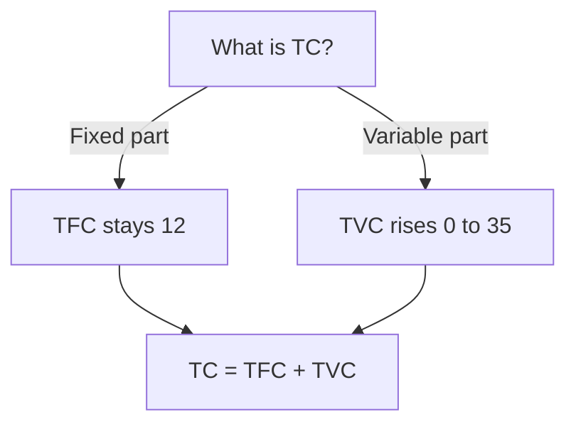

# Chapter 6 - Cost - STE Study Notes

> Reading rule: Read one section at a time. Do each CHECK. Then go to the next section.

## Key Terms - Read These First

| Term | Definition |
|------|------------|
| Cost | Money value of inputs used in production |
| Explicit Cost | Actual money paid to outsiders for inputs |
| Implicit Cost | Estimated value of owner supplied inputs |
| Cost Function | Relation between cost and output. C = f(q) |
| Opportunity Cost | Cost of next best alternative foregone |
| TFC | Costs not varying with output. Never zero |
| TVC | Costs varying directly with output. Zero at zero output |
| TC | Total expenditure on factors. TC = TFC + TVC |
| AFC | Per unit fixed cost. AFC = TFC / Q |
| AVC | Per unit variable cost. AVC = TVC / Q |
| AC | Per unit total cost. AC = TC / Q |
| ATC | Other name for AC. Average Total Cost |
| MC | Addition to TC from one more unit |
| Rectangular Hyperbola | Shape of AFC curve. Area stays constant |
| U-shaped Curves | AVC, AC, MC shapes due to LVP |
| Inversely S-shaped | Shape of TVC and TC curves |

```mermaid
mindmap
 root((Chapter 6))
 Cost
 Explicit plus Implicit
 Function
 C = f(q)
 Totals
 TFC - Fixed flat
 TVC - Varies S-shape
 TC - Sum S-shape
 Averages
 AFC - Falls hyperbola
 AVC - U-shape
 AC - U-shape
 Marginal
 MC - U-shape
 Cuts AVC AC minimum
```

---

## 1. Meaning of Cost

**Definition:** Cost in economics includes actual expenditure on inputs and imputed value of owner supplied inputs.

Points:

1. Explicit cost is actual payment to outsiders.
2. Implicit cost is estimated value of own inputs.
3. Implicit cost includes normal profit.
4. Formula: Cost = Explicit Cost + Implicit Cost.

CHECK: Say the definition of cost in one sentence. Name its two parts.

---

## 2. Explicit Cost and Implicit Cost

**Explicit Cost:** Explicit cost is actual money expenditure on inputs or payment made to outsiders for factor services.

**Implicit Cost:** Implicit cost is estimated value of inputs supplied by owners including normal profit.

Examples:

1. Explicit: wages 10000. Raw material 200000. Insurance premium.
2. Implicit: rent of own land 50000. Interest on own capital. Own labour.

| Basis | Explicit Cost | Implicit Cost |
|-------|---------------|---------------|
| Meaning | Payment to outsiders for factor services | Cost of self supplied factors |
| Money Payment | Involves actual money payment | Involves imputed value. No money paid |
| Example | Wages, rent, insurance premium | Interest on capital, rent of own land |

Point: Owner withdrawing 10000 from bank to buy machinery gives explicit cost 10000. Interest foregone on bank amount is implicit cost.

CHECK: Wages paid 10000. Rent of own shop 50000. Which is explicit? Answer: Wages 10000.

---

## 3. Cost Function

**Definition:** Cost function refers to functional relation between cost and output.

Formula:

```text
C = f(q)
```

Where:
- C = Cost of production
- q = Quantity of output
- f = Functional relationship

Point: Output rises. Cost rises. Rate differs as per law.

CHECK: Write the cost function formula with all symbols.

---

## 4. Opportunity Cost

**Definition:** Opportunity cost is cost of next best alternative foregone.

Points:

1. Choice between wheat and rice on same land.
2. Choose wheat. Leave rice. Rice value is cost.
3. Every decision leaves something. That loss is cost.

CHECK: Choose wheat. Leave rice. What is opportunity cost? Answer: Value of rice.

---

## 5. Total Fixed Cost

**Definition:** Fixed costs refer to those costs which do not vary directly with level of output.

Schedule with TFC 12:

| Output | 0 | 1 | 2 | 3 | 4 | 5 |
|--------|---|---|---|---|---|---|
| TFC | 12 | 12 | 12 | 12 | 12 | 12 |

Read: Output rises from 0 to 5. TFC stays at 12.

Points:

1. TFC curve is horizontal straight line parallel to X-axis.
2. TFC stays same at all output levels.
3. TFC is never zero even at zero output.
4. Examples: factory rent, interest on capital, permanent staff salary, building rent.

CHECK: Output is zero. What is TFC? Answer: 12.

---

## 6. Total Variable Cost

**Definition:** Variable costs refer to those costs which vary directly with level of output.

Schedule:

| Output | 0 | 1 | 2 | 3 | 4 | 5 |
|--------|---|---|---|---|---|---|
| TVC | 0 | 6 | 10 | 15 | 24 | 35 |

Read: Output rises from 0 to 5. TVC rises from 0 to 35.

Points:

1. TVC curve is inversely S-shaped.
2. TVC first rises at decreasing rate. Later rises at increasing rate.
3. TVC is zero at zero output.
4. Examples: casual labour wages, raw material, fuel.

CHECK: Output is zero. What is TVC? Answer: 0.

---

## 7. Difference Between TVC and TFC

| Basis | Total Variable Cost | Total Fixed Cost |
|-------|---------------------|------------------|
| Meaning | Costs varying directly with output | Costs not varying directly with output |
| Time Period | Can be changed in short run | Cannot be changed in short run |
| Cost at zero output | Zero with no production | Never zero even with no production |
| Factors | Incurred on variable factors | Incurred on fixed factors |
| Shape | Inversely S-shaped curve | Horizontal line parallel to X-axis |
| Example | Casual wages, raw material | Permanent salary, building rent, licence fee |

CHECK: Name the shape of TVC. Name the shape of TFC.

---

## 8. Total Cost

**Definition:** Total Cost is total expenditure incurred by a firm on factors required for production.

Formula:

```text
TC = TFC + TVC
```

Schedule with TFC 12:

| Output | TFC | TVC | TC = TFC + TVC |
|--------|-----|-----|----------------|
| 0 | 12 | 0 | 12 |
| 1 | 12 | 6 | 18 |
| 2 | 12 | 10 | 22 |
| 3 | 12 | 15 | 27 |
| 4 | 12 | 24 | 36 |
| 5 | 12 | 35 | 47 |

Read: At 2 output, TC is 12 + 10 = 22.

Points:

1. TC curve is inversely S-shaped. Derives shape from TVC.
2. TC equals TFC at zero output. TC is 12 at zero.
3. TC and TVC curves stay parallel. Vertical distance is TFC 12.
4. TC is always greater than or equal to TFC.



CHECK: TFC is 12. TVC is 15. What is TC? Answer: 27.

---

## 9. Average Fixed Cost

**Definition:** Average Fixed Cost refers to per unit fixed cost of production.

Formula:

```text
AFC = TFC / Q
```

Schedule with TFC 12:

| Output | TFC | AFC = TFC / Q |
|--------|-----|---------------|
| 1 | 12 | 12 / 1 = 12 |
| 2 | 12 | 12 / 2 = 6 |
| 3 | 12 | 12 / 3 = 4 |
| 4 | 12 | 12 / 4 = 3 |
| 5 | 12 | 12 / 5 = 2.40 |

Read: Output rises from 1 to 5. AFC falls from 12 to 2.40.

Four properties:

1. AFC slopes downwards. AFC falls with more output.
2. AFC is rectangular hyperbola. Area AFC x Q stays same.
3. AFC never touches X-axis. TFC never becomes zero.
4. AFC never touches Y-axis. At zero output value is infinite.

Reason for fall: Same TFC divided by more units gives less AFC.

CHECK: TFC is 12. Output is 4. What is AFC? Answer: 3.

---

## 10. Average Variable Cost

**Definition:** Average Variable Cost refers to per unit variable cost of production.

Formula:

```text
AVC = TVC / Q
```

Schedule:

| Output | TVC | AVC = TVC / Q |
|--------|-----|---------------|
| 1 | 6 | 6 / 1 = 6 |
| 2 | 10 | 10 / 2 = 5 |
| 3 | 15 | 15 / 3 = 5 |
| 4 | 24 | 24 / 4 = 6 |
| 5 | 35 | 35 / 5 = 7 |

Read: AVC falls from 6 to 5. Then rises from 5 to 7.

Point: AVC curve is U-shaped due to Law of Variable Proportions.

CHECK: TVC is 24. Output is 4. What is AVC? Answer: 6.

---

## 11. Average Cost

**Definition:** Average Cost refers to per unit total cost of production. Other name: Average Total Cost.

Formulas:

```text
AC = TC / Q
AC = AFC + AVC
```

Schedule with TFC 12:

| Output | TVC | AVC | AFC | AC = AFC + AVC |
|--------|-----|-----|-----|----------------|
| 1 | 6 | 6 | 12 | 12 + 6 = 18 |
| 2 | 10 | 5 | 6 | 6 + 5 = 11 |
| 3 | 15 | 5 | 4 | 4 + 5 = 9 |
| 4 | 24 | 6 | 3 | 3 + 6 = 9 |
| 5 | 35 | 7 | 2.40 | 2.40 + 7 = 9.40 |

Read: At 2 output, AC is 6 + 5 = 11.

Point: AC curve is U-shaped due to Law of Variable Proportions.

CHECK: AFC is 4. AVC is 5. What is AC? Answer: 9.

---

## 12. Relation Between AC, AVC and AFC

Rules:

1. AC always lies above AVC. AC includes AFC plus AVC.
2. Gap between AC and AVC equals AFC. Gap falls with output.
3. AC and AVC never meet. AFC never becomes zero.
4. AVC minimum comes first. AC minimum comes later.
5. Both AC and AVC are U-shaped due to Law of Variable Proportions.

Reason for late AC minimum: AC keeps falling due to falling AFC even after AVC starts rising.

| Property | Result |
|----------|--------|
| AC vs AVC position | AC stays above AVC |
| Gap between AC and AVC | Equals AFC. Falls with output |
| Do AC and AVC meet | Never. AFC never zero |
| Minimum point order | AVC minimum first. AC minimum right |

CHECK: Gap between AC and AVC is 3. What is AFC? Answer: 3.

---

## 13. Marginal Cost

**Definition:** Marginal Cost refers to addition to total cost when one more unit of output is produced.

Formulas:

```text
MC = TCn - TCn-1
MC = Change in TC / Change in Q = ΔTC / ΔQ
```

Where:
- MCn = Marginal Cost of nth unit
- TCn = Total Cost of n units
- TCn-1 = Total Cost of n-1 units

Schedule with TFC 12:

| Output | TFC | TVC | TC | MC = TCn - TCn-1 |
|--------|-----|-----|----|------------------|
| 0 | 12 | 0 | 12 | - |
| 1 | 12 | 6 | 18 | 18 - 12 = 6 |
| 2 | 12 | 10 | 22 | 22 - 18 = 4 |
| 3 | 12 | 15 | 27 | 27 - 22 = 5 |
| 4 | 12 | 24 | 36 | 36 - 27 = 9 |
| 5 | 12 | 35 | 47 | 47 - 36 = 11 |

Read: At 2 output, MC is 22 - 18 = 4.

Points:

1. MC curve is U-shaped due to Law of Variable Proportions.
2. MC is not affected by fixed costs. Only TVC changes MC.
3. MC can be derived from TVC. MCn = TVCn - TVCn-1.

CHECK: TC is 27 at 3 units. TC is 22 at 2 units. What is MC? Answer: 5.

---

## 14. Relation Between MC and AC

Rules:

1. When MC is less than AC, AC falls.
2. When MC equals AC, AC is at minimum point.
3. When MC is more than AC, AC rises.
4. MC cuts AC at its minimum point.

Schedule:

| Output | TC | AC | MC | Phase |
|--------|----|----|----|-------|
| 0 | 12 | - | - | - |
| 1 | 18 | 18 | 6 | MC less than AC. AC falls |
| 2 | 22 | 11 | 4 | MC less than AC. AC falls |
| 3 | 27 | 9 | 5 | MC less than AC. AC falls |
| 4 | 36 | 9 | 9 | MC equal AC. AC minimum |
| 5 | 47 | 9.40 | 11 | MC more than AC. AC rises |

Read: At 4 output, MC equals AC at 9. AC is minimum.

Point: AVC can fall even when MC rises. Condition is MC less than AVC.

CHECK: MC is 4. AC is 11. Is AC falling or rising? Answer: Falling.

---

## 15. Relation Between MC, AC and AVC

Rules:

1. MC cuts AVC at its minimum point. MC cuts AC at its minimum point.
2. AC minimum lies right of AVC minimum. AC falls longer due to AFC.
3. AC exceeds AVC by AFC. Gap falls with output.
4. AC and AVC never intersect. AFC never zero.
5. All three are U-shaped due to Law of Variable Proportions.

| Condition | Effect |
|-----------|--------|
| MC less than AVC | AVC falls |
| MC equal AVC | AVC minimum. MC cuts AVC |
| MC more than AVC | AVC rises |
| MC less than AC | AC falls |
| MC equal AC | AC minimum. MC cuts AC |
| MC more than AC | AC rises |

Order: MC cuts AVC first. Then MC cuts AC later.

CHECK: Which minimum comes first? Answer: AVC minimum. Then AC minimum.

---

## 16. Relation of MC with TC and TVC

### 16.1 TC and MC

1. When MC falls, TC rises at diminishing rate.
2. When MC is minimum, TC stops rising at decreasing rate.
3. When MC rises, TC rises at increasing rate.
4. When MC is constant, TC rises at constant rate.
5. Formula: MCn = TCn - TCn-1.

| TC Behaviour | MC Behaviour |
|--------------|--------------|
| TC rises at diminishing rate | MC falls |
| End of diminishing rise | MC minimum |
| TC rises at increasing rate | MC rises |
| TC rises at constant rate | MC constant |

### 16.2 TVC and MC

1. MC is addition to TVC from one more unit.
2. Area under MC curve equals TVC with divisible output.
3. MC is independent of TFC. Only TVC affects MC.

CHECK: TC rises at diminishing rate. What does MC do? Answer: MC falls.

---

## 17. All Curves at a Glance

| Curve | Formula | Shape |
|-------|---------|-------|
| TFC | TFC = TC - TVC | Horizontal line parallel to X-axis |
| TVC | TVC = TC - TFC | Inversely S-shaped. Zero at zero output |
| TC | TC = TFC + TVC | Inversely S-shaped. Starts at TFC |
| AFC | AFC = TFC / Q | Downward hyperbola. Never touches axes |
| AVC | AVC = TVC / Q | U-shaped due to LVP |
| AC | AC = TC / Q = AFC + AVC | U-shaped due to LVP |
| MC | MC = TCn - TCn-1 | U-shaped. Cuts AVC and AC at minimum |

Points:

1. U-shaped average and marginal curves are AVC, AC, MC. TVC and TC are inversely S-shaped. TFC is horizontal.
2. Inversely S-shaped curves are TVC and TC.
3. TFC and TC start from same Y-axis point. TC equals TFC at zero.
4. Incorrect formula for TC is TC = sum of MC. Misses TFC. Correct is TC = sum of MC + TFC.

CHECK: Name three U-shaped curves. Name two inversely S-shaped curves.

---

## 18. Numericals - Solved Tables

### 18.1 Find AVC and MC from TVC

| Output | TVC | AVC = TVC / Q | MC = TVCn - TVCn-1 |
|--------|-----|---------------|--------------------|
| 1 | 10 | 10 | 10 |
| 2 | 16 | 8 | 6 |
| 3 | 27 | 9 | 11 |
| 4 | 40 | 10 | 13 |

Read: At 2 output, MC is 16 - 10 = 6. AVC is 16 / 2 = 8.

Formulas: TVC = sum of MC = AVC x Output. AVC = TVC / Output. MCn = TVCn - TVCn-1.

### 18.2 Find TFC, TVC, ATC, AFC, AVC, MC from TC

TFC is 60. TC at zero output is 60.

| Output | TC | TFC | TVC = TC - TFC | ATC = TC / Q | AFC = TFC / Q | AVC = TVC / Q | MC = TCn - TCn-1 |
|--------|----|-----|----------------|--------------|---------------|---------------|------------------|
| 0 | 60 | 60 | 0 | - | - | - | - |
| 1 | 80 | 60 | 20 | 80 | 60 | 20 | 20 |
| 2 | 100 | 60 | 40 | 50 | 30 | 20 | 20 |
| 3 | 111 | 60 | 51 | 37 | 20 | 17 | 11 |
| 4 | 116 | 60 | 56 | 29 | 15 | 14 | 5 |
| 5 | 130 | 60 | 70 | 26 | 12 | 14 | 14 |
| 6 | 150 | 60 | 90 | 25 | 10 | 15 | 20 |

Read: At 3 output, TVC is 111 - 60 = 51. MC is 111 - 100 = 11.

### 18.3 Find TC from TVC with TFC 60

Gap between TVC and TC is 60 at all outputs.

| Output | TVC | TFC | TC = TFC + TVC |
|--------|-----|-----|----------------|
| 0 | 0 | 60 | 60 |
| 1 | 30 | 60 | 90 |
| 2 | 40 | 60 | 100 |
| 3 | 45 | 60 | 105 |
| 4 | 55 | 60 | 115 |
| 5 | 75 | 60 | 135 |
| 6 | 120 | 60 | 180 |

### 18.4 Find Missing TVC from TC with TFC 60

| Output | TC | TFC | TVC = TC - TFC |
|--------|----|-----|----------------|
| 0 | 60 | 60 | 0 |
| 1 | 80 | 60 | 20 |
| 2 | 100 | 60 | 40 |
| 3 | 111 | 60 | 51 |
| 4 | 116 | 60 | 56 |
| 5 | 130 | 60 | 70 |
| 6 | 150 | 60 | 90 |

### 18.5 Find TFC and TVC from TC with TFC 80

TFC is 80. TC at zero output is 80.

| Output | TC | TFC | TVC = TC - TFC |
|--------|----|-----|----------------|
| 0 | 80 | 80 | 0 |
| 1 | 102 | 80 | 22 |
| 2 | 122 | 80 | 42 |
| 3 | 140 | 80 | 60 |
| 4 | 156 | 80 | 76 |

CHECK: TC is 100. TFC is 60. What is TVC? Answer: 40.

---

## 19. Fast Revision - One Page

1. Cost = Explicit + Implicit. Explicit pays outsiders. Implicit values own inputs.
2. Cost function is C = f(q). Opportunity cost is next best left.
3. TFC stays 12 at all outputs. Horizontal line. Never zero.
4. TVC rises 0, 6, 10, 15, 24, 35. Inversely S-shape. Zero at zero.
5. TC = TFC + TVC. Values 12, 18, 22, 27, 36, 47. Parallel to TVC.
6. AFC = TFC / Q. Values 12, 6, 4, 3, 2.40. Rectangular hyperbola.
7. AVC = TVC / Q. Values 6, 5, 5, 6, 7. U-shaped.
8. AC = AFC + AVC. Values 18, 11, 9, 9, 9.40. U-shaped.
9. MC = TCn - TCn-1. Values -, 6, 4, 5, 9, 11. U-shaped.
10. AC stays above AVC. Gap is AFC. Never meet.
11. AVC minimum comes first. AC minimum comes right.
12. MC less than AC means AC falls. MC equal AC means AC minimum. MC more means AC rises.
13. MC cuts AVC first. Then cuts AC. Both at minimum.
14. TC diminishing rise means MC falls. TC increasing rise means MC rises.
15. Area under MC equals TVC. MC ignores TFC.
16. U-shaped are AVC, AC, MC. S-shaped are TVC, TC.

---

## 20. Exam Questions With Answers

**Q1. Define explicit cost and implicit cost.**
A: Explicit is actual payment to outsiders. Implicit is estimated value of owner inputs.

**Q2. Define cost function. Give formula.**
A: Functional relation between cost and output. C = f(q).

**Q3. Define opportunity cost.**
A: Cost of next best alternative foregone.

**Q4. TFC is 12. TVC is 15. Find TC.**
A: TC = 12 + 15 = 27.

**Q5. TFC is 12. Output is 3. Find AFC.**
A: AFC = 12 / 3 = 4.

**Q6. TVC is 24. Output is 4. Find AVC.**
A: AVC = 24 / 4 = 6.

**Q7. AFC is 4. AVC is 5. Find AC.**
A: AC = 4 + 5 = 9.

**Q8. TC is 27 at 3 units. TC is 22 at 2 units. Find MC.**
A: MC = 27 - 22 = 5.

**Q9. Why is AFC called rectangular hyperbola?**
A: TFC stays constant. Area AFC x Q stays same at all points.

**Q10. Why are AC, AVC, MC U-shaped?**
A: Due to Law of Variable Proportions. Increasing returns lower cost. Diminishing returns raise cost.

**Q11. State relation between MC and AC.**
A: MC less than AC means AC falls. MC equal AC means AC minimum. MC more than AC means AC rises.

**Q12. Why does AC minimum lie right of AVC minimum?**
A: AC keeps falling due to falling AFC even after AVC starts rising.

**Q13. Why do AC and AVC never meet?**
A: Gap is AFC. AFC never becomes zero.

**Q14. How is MC related to TFC?**
A: MC is independent of TFC. Only TVC changes MC.

**Q15. What does area under MC show?**
A: Total variable cost.

**Q16. Which curves start from same Y-axis point?**
A: TFC and TC. TC equals TFC at zero output.

**Q17. Which formula for TC is incorrect?**
A: TC = sum of MC. Misses TFC. Correct is TC = sum of MC + TFC.

**Q18. TFC curve is vertical parallel to Y-axis. True or false?**
A: False. TFC is horizontal parallel to X-axis.

**Q19. TC is 100. TFC is 60. Find TVC.**
A: TVC = 100 - 60 = 40.

**Q20. State true or false with reasons.**
A: AP rises only when MP rises is False. AP can rise even when MP falls if MP stays above AP. AFC falls to zero with output is False. AFC falls but never becomes zero. TP rises till MP is zero under diminishing returns is True.

**Q21. Owner withdraws 10000 from bank to buy machinery. Identify explicit and implicit cost.**
A: Explicit is 10000 paid for machinery. Implicit is interest foregone on bank amount.

**Q22. Why does AFC fall with output?**
A: Same TFC divided by more output gives less AFC. Inverse relation holds.

**Q23. When AC is rising, what is MC?**
A: MC is more than AC.

**Q24. AVC can fall even when MC rises. Condition?**
A: MC is less than AVC. Then AVC still falls.

**Q25. Which cost curve is inversely S-shaped?**
A: Total Variable Cost curve. TC is also inversely S-shaped.

**Q26. MC is derived from which cost?**
A: TVC. MCn = TVCn - TVCn-1. MC ignores TFC.

**Q27. All curves except which are U-shaped?**
A: Average Fixed Cost curve. AVC, AC, MC are U-shaped.

---

> Tip: Draw the diagram first. Write the definition next. Then give the example. Diagram plus explanation gives full marks.
