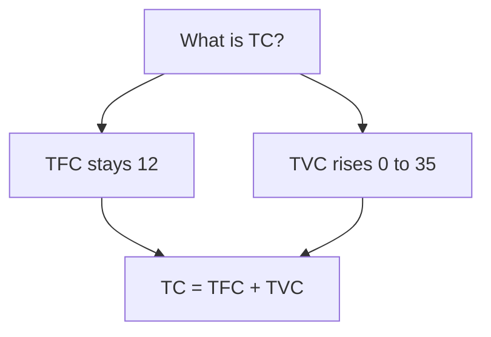

# Chapter 6 - Cost - STE100 Easy Notes

> Reading rule: Read one section at a time. Do each CHECK. Then go to the next section.

## Key Terms - Read These First

| Term | Definition |
|------|------------|
| Cost | Cost is Explicit Cost plus Implicit Cost |
| Explicit Cost | Explicit Cost is payment to outsiders |
| Implicit Cost | Implicit Cost is value of owner inputs. It includes normal profit |
| Cost Function | Cost Function is relation between cost and output. C = f(q) |
| Opportunity Cost | Opportunity Cost is cost of the next best option |
| TFC | TFC is cost that does not change with Q. It is never zero |
| TVC | TVC is cost that changes with Q. It is zero at zero Q |
| TC | TC is total cost of all inputs. TC = TFC + TVC |
| AFC | AFC is TFC divided by Q. AFC = TFC / Q |
| AVC | AVC is TVC divided by Q. AVC = TVC / Q |
| AC | AC is TC divided by Q. AC = AFC + AVC |
| MC | MC is cost of one more unit. MC = TCn - TCn-1 |
| Rectangular Hyperbola | Rectangular Hyperbola is shape of AFC curve. AFC x Q stays same |
| U-shaped | U-shaped is shape of AVC, AC, MC. Cause is Law of Variable Proportions |
| Inversely S-shaped | Inversely S-shaped is shape of TVC and TC |

```mermaid
mindmap
 root((Chapter 6))
 Cost
 Explicit plus Implicit
 Function
 C = f(q)
 Totals
 TFC - Fixed flat
 TVC - Varies S-shape
 TC - Sum S-shape
 Averages
 AFC - Falls hyperbola
 AVC - U-shape
 AC - U-shape
 Marginal
 MC - U-shape
 Cuts AVC AC minimum
```

---

## 1. What is Cost

**Definition:** Cost is Explicit Cost plus Implicit Cost.

Points:

1. Explicit Cost is payment to outsiders.
2. Implicit Cost is value of owner inputs.
3. Implicit Cost includes normal profit.
4. Use this formula: Cost = Explicit Cost + Implicit Cost.

CHECK: Say the definition of Cost in one sentence.

---

## 2. Explicit Cost and Implicit Cost

**Definition:** Explicit Cost is payment to outsiders for inputs.

**Definition:** Implicit Cost is value of owner inputs. It includes normal profit.

Examples:

1. Explicit Cost is wages 10000.
2. Explicit Cost is raw material 200000.
3. Explicit Cost is insurance premium.
4. Implicit Cost is rent of own land 50000.
5. Implicit Cost is interest on own capital.
6. Implicit Cost is work by owner.

| Basis | Explicit Cost | Implicit Cost |
|-------|---------------|---------------|
| Meaning | Payment to outsiders | Value of owner inputs |
| Money Payment | You pay money | You pay no money. You estimate value |
| Example | Wages, rent, insurance premium | Interest on capital, rent of own land |

Point: Owner pays 10000 for machinery. That is Explicit Cost. Owner loses bank interest. That is Implicit Cost.

CHECK: Wages are 10000. Rent of own shop is 50000. Which is Explicit Cost? Answer: Wages 10000.

---

## 3. Cost Function

**Definition:** Cost Function is relation between cost and output.

Formula:

```text
C = f(q)
```

Where:

- C is cost of production
- q is quantity of output
- f is relation between cost and output

Point: Q rises. Cost rises. Rate changes with Q.

CHECK: Write the formula C = f(q). Name each symbol.

---

## 4. Opportunity Cost

**Definition:** Opportunity Cost is cost of the next best option.

Points:

1. You have one land. You can grow wheat or rice.
2. You choose wheat. You leave rice.
3. Value of rice is Opportunity Cost.

CHECK: You choose wheat. You leave rice. What is Opportunity Cost? Answer: Value of rice.

---

## 5. TFC

**Definition:** TFC is cost that does not change with Q.

Schedule with TFC 12:

| Q | 0 | 1 | 2 | 3 | 4 | 5 |
|---|---|---|---|---|---|---|
| TFC | 12 | 12 | 12 | 12 | 12 | 12 |

Read: Q rises from 0 to 5. TFC stays at 12.

Points:

1. TFC curve is horizontal line parallel to X-axis.
2. TFC stays same at all Q.
3. TFC is never zero. TFC is 12 at zero Q.
4. Examples are factory rent and interest on capital.
5. Examples are salary of permanent staff and building rent.

CHECK: Q is zero. What is TFC? Answer: 12.

---

## 6. TVC

**Definition:** TVC is cost that changes with Q.

Schedule:

| Q | 0 | 1 | 2 | 3 | 4 | 5 |
|---|---|---|---|---|---|---|
| TVC | 0 | 6 | 10 | 15 | 24 | 35 |

Read: Q rises from 0 to 5. TVC rises from 0 to 35.

Points:

1. TVC curve is inversely S-shaped.
2. TVC first rises slowly. Then TVC rises fast.
3. TVC is zero at zero Q.
4. Examples are wages of casual labour and raw material.
5. Examples are fuel and power.

CHECK: Q is zero. What is TVC? Answer: 0.

---

## 7. Difference Between TVC and TFC

| Basis | TVC | TFC |
|-------|-----|-----|
| Meaning | Cost that changes with Q | Cost that does not change with Q |
| Time Period | You can change it in short run | You cannot change it in short run |
| Cost at zero Q | It is zero | It is never zero |
| Factors | It uses variable factors | It uses fixed factors |
| Shape | It is inversely S-shaped | It is horizontal line parallel to X-axis |
| Example | Casual wages, raw material | Permanent salary, building rent |

CHECK: Name shape of TVC. Name shape of TFC.

---

## 8. TC

**Definition:** TC is total cost of all inputs.

Formula:

```text
TC = TFC + TVC
```

Schedule with TFC 12:

| Q | TFC | TVC | TC = TFC + TVC |
|---|---|-----|----------------|
| 0 | 12 | 0 | 12 |
| 1 | 12 | 6 | 18 |
| 2 | 12 | 10 | 22 |
| 3 | 12 | 15 | 27 |
| 4 | 12 | 24 | 36 |
| 5 | 12 | 35 | 47 |

Read: At Q 2, TC is 12 + 10 = 22.

Points:

1. TC curve is inversely S-shaped.
2. TVC gives TC its shape.
3. TC equals TFC at zero Q. TC is 12 at zero Q.
4. TC and TVC stay parallel. Distance between them is TFC 12.
5. TC is always equal to TFC or more than TFC.



CHECK: TFC is 12. TVC is 15. What is TC? Answer: 27.

---

## 9. AFC

**Definition:** AFC is TFC divided by Q.

Formula:

```text
AFC = TFC / Q
```

Schedule with TFC 12:

| Q | TFC | AFC = TFC / Q |
|---|-----|----------------|
| 1 | 12 | 12 / 1 = 12 |
| 2 | 12 | 12 / 2 = 6 |
| 3 | 12 | 12 / 3 = 4 |
| 4 | 12 | 12 / 4 = 3 |
| 5 | 12 | 12 / 5 = 2.40 |

Read: Q rises from 1 to 5. AFC falls from 12 to 2.40.

Points:

1. AFC falls with more Q.
2. AFC curve is rectangular hyperbola.
3. AFC x Q stays same at all points.
4. AFC never touches X-axis. TFC never becomes zero.
5. AFC never touches Y-axis. Value at zero Q is infinite.

Reason: Divide same TFC by more Q. Result becomes less.

CHECK: TFC is 12. Q is 4. What is AFC? Answer: 3.

---

## 10. AVC

**Definition:** AVC is TVC divided by Q.

Formula:

```text
AVC = TVC / Q
```

Schedule:

| Q | TVC | AVC = TVC / Q |
|---|-----|----------------|
| 1 | 6 | 6 / 1 = 6 |
| 2 | 10 | 10 / 2 = 5 |
| 3 | 15 | 15 / 3 = 5 |
| 4 | 24 | 24 / 4 = 6 |
| 5 | 35 | 35 / 5 = 7 |

Read: AVC falls from 6 to 5. Then AVC rises from 5 to 7.

Point: AVC curve is U-shaped. Cause is Law of Variable Proportions.

CHECK: TVC is 24. Q is 4. What is AVC? Answer: 6.

---

## 11. AC

**Definition:** AC is TC divided by Q.

Formulas:

```text
AC = TC / Q
AC = AFC + AVC
```

Schedule with TFC 12:

| Q | TVC | AVC | AFC | AC = AFC + AVC |
|---|-----|-----|-----|----------------|
| 1 | 6 | 6 | 12 | 12 + 6 = 18 |
| 2 | 10 | 5 | 6 | 6 + 5 = 11 |
| 3 | 15 | 5 | 4 | 4 + 5 = 9 |
| 4 | 24 | 6 | 3 | 3 + 6 = 9 |
| 5 | 35 | 7 | 2.40 | 2.40 + 7 = 9.40 |

Read: At Q 2, AC is 6 + 5 = 11.

Point: AC curve is U-shaped. Cause is Law of Variable Proportions.

CHECK: AFC is 4. AVC is 5. What is AC? Answer: 9.

---

## 12. Relation Between AC, AVC and AFC

Rules:

1. AC always stays above AVC.
2. AC includes AFC plus AVC.
3. Gap between AC and AVC is AFC.
4. Gap falls with more Q.
5. AC and AVC never meet. AFC never becomes zero.
6. AVC minimum comes first.
7. AC minimum comes later to the right.

Reason: AFC still falls. So AC still falls after AVC starts to rise.

| Property | Result |
|----------|--------|
| AC position | AC stays above AVC |
| Gap | Gap is AFC. Gap falls with Q |
| Do AC and AVC meet | Never. AFC never becomes zero |
| Minimum order | AVC minimum first. AC minimum later |

CHECK: Gap between AC and AVC is 3. What is AFC? Answer: 3.

---

## 13. MC

**Definition:** MC is cost of one more unit.

Formulas:

```text
MC = TCn - TCn-1
MC = Change in TC / Change in Q
```

Where:

- MCn is cost of nth unit
- TCn is total cost of n units
- TCn-1 is total cost of n-1 units

Schedule with TFC 12:

| Q | TFC | TVC | TC | MC = TCn - TCn-1 |
|---|-----|-----|----|------------------|
| 0 | 12 | 0 | 12 | - |
| 1 | 12 | 6 | 18 | 18 - 12 = 6 |
| 2 | 12 | 10 | 22 | 22 - 18 = 4 |
| 3 | 12 | 15 | 27 | 27 - 22 = 5 |
| 4 | 12 | 24 | 36 | 36 - 27 = 9 |
| 5 | 12 | 35 | 47 | 47 - 36 = 11 |

Read: At Q 2, MC is 22 - 18 = 4.

Points:

1. MC curve is U-shaped. Cause is Law of Variable Proportions.
2. Only TVC changes MC. TFC does not change MC.
3. Calculate MC from TVC. MCn = TVCn - TVCn-1.

CHECK: TC is 27 at 3 units. TC is 22 at 2 units. What is MC? Answer: 5.

---

## 14. Relation Between MC and AC

Rules:

1. When MC is less than AC, AC falls.
2. When MC equals AC, AC is minimum.
3. When MC is more than AC, AC rises.
4. MC cuts AC at its minimum point.

Schedule:

| Q | TC | AC | MC | Phase |
|---|----|----|----|-------|
| 0 | 12 | - | - | - |
| 1 | 18 | 18 | 6 | MC is less. AC falls |
| 2 | 22 | 11 | 4 | MC is less. AC falls |
| 3 | 27 | 9 | 5 | MC is less. AC falls |
| 4 | 36 | 9 | 9 | MC equals AC. AC is minimum |
| 5 | 47 | 9.40 | 11 | MC is more. AC rises |

Read: At Q 4, MC equals AC at 9. AC is minimum.

Point: AVC can still fall when MC rises. Condition is MC is less than AVC.

CHECK: MC is 4. AC is 11. Does AC fall or rise? Answer: AC falls.

---

## 15. Relation Between MC, AC and AVC

Rules:

1. MC cuts AVC at its minimum point.
2. MC cuts AC at its minimum point.
3. AC minimum stays right of AVC minimum.
4. AC is more than AVC by AFC.
5. Gap falls with more Q.
6. AC and AVC never meet. AFC never becomes zero.
7. AVC is U-shaped. AC is U-shaped. MC is U-shaped.
8. Cause is Law of Variable Proportions.

| Condition | Effect |
|-----------|--------|
| MC is less than AVC | AVC falls |
| MC equals AVC | AVC is minimum. MC cuts AVC |
| MC is more than AVC | AVC rises |
| MC is less than AC | AC falls |
| MC equals AC | AC is minimum. MC cuts AC |
| MC is more than AC | AC rises |

Order: MC cuts AVC first. Then MC cuts AC.

CHECK: Which minimum comes first? Answer: AVC minimum. Then AC minimum.

---

## 16. Relation of MC with TC and TVC

### 16.1 TC and MC

1. When MC falls, TC rises slowly.
2. When MC is minimum, TC stops rising slowly.
3. When MC rises, TC rises fast.
4. When MC stays same, TC rises at same rate.
5. Use formula MCn = TCn - TCn-1.

| TC Behaviour | MC Behaviour |
|--------------|--------------|
| TC rises slowly | MC falls |
| TC stops rising slowly | MC is minimum |
| TC rises fast | MC rises |
| TC rises at same rate | MC stays same |

### 16.2 TVC and MC

1. MC is addition to TVC from one more unit.
2. Add all MC values. Sum equals TVC.
3. Only TVC changes MC. TFC does not change MC.

CHECK: TC rises slowly. What does MC do? Answer: MC falls.

---

## 17. All Curves at a Glance

| Curve | Formula | Shape |
|-------|---------|-------|
| TFC | TFC = TC - TVC | Horizontal line parallel to X-axis |
| TVC | TVC = TC - TFC | Inversely S-shaped. Zero at zero Q |
| TC | TC = TFC + TVC | Inversely S-shaped. Starts at TFC |
| AFC | AFC = TFC / Q | Rectangular hyperbola. Never touches axes |
| AVC | AVC = TVC / Q | U-shaped. Cause is LVP |
| AC | AC = TC / Q = AFC + AVC | U-shaped. Cause is LVP |
| MC | MC = TCn - TCn-1 | U-shaped. Cuts AVC and AC at minimum |

Points:

1. AVC is U-shaped. AC is U-shaped. MC is U-shaped.
2. TVC is inversely S-shaped. TC is inversely S-shaped.
3. TFC is horizontal line.
4. TFC and TC start from same point on Y-axis.
5. TC = sum of MC is wrong. It leaves TFC out.
6. Correct formula is TC = sum of MC + TFC.

CHECK: Name three U-shaped curves. Answer: AVC, AC, MC.

---

## 18. Numericals - Solved Tables

### 18.1 Find AVC and MC from TVC

| Q | TVC | AVC = TVC / Q | MC = TVCn - TVCn-1 |
|---|-----|----------------|--------------------|
| 1 | 10 | 10 | 10 |
| 2 | 16 | 8 | 6 |
| 3 | 27 | 9 | 11 |
| 4 | 40 | 10 | 13 |

Read: At Q 2, MC is 16 - 10 = 6. AVC is 16 / 2 = 8.

Steps:

1. Calculate AVC. Divide TVC by Q.
2. Calculate MC. Subtract last TVC from current TVC.

### 18.2 Find TFC, TVC, ATC, AFC, AVC, MC from TC

TFC is 60. TC at zero Q is 60.

| Q | TC | TFC | TVC = TC - TFC | ATC = TC / Q | AFC = TFC / Q | AVC = TVC / Q | MC = TCn - TCn-1 |
|---|----|-----|----------------|--------------|---------------|---------------|------------------|
| 0 | 60 | 60 | 0 | - | - | - | - |
| 1 | 80 | 60 | 20 | 80 | 60 | 20 | 20 |
| 2 | 100 | 60 | 40 | 50 | 30 | 20 | 20 |
| 3 | 111 | 60 | 51 | 37 | 20 | 17 | 11 |
| 4 | 116 | 60 | 56 | 29 | 15 | 14 | 5 |
| 5 | 130 | 60 | 70 | 26 | 12 | 14 | 14 |
| 6 | 150 | 60 | 90 | 25 | 10 | 15 | 20 |

Read: At Q 3, TVC is 111 - 60 = 51. MC is 111 - 100 = 11.

### 18.3 Find TC from TVC with TFC 60

Gap between TVC and TC is 60 at all Q.

| Q | TVC | TFC | TC = TFC + TVC |
|---|-----|-----|----------------|
| 0 | 0 | 60 | 60 |
| 1 | 30 | 60 | 90 |
| 2 | 40 | 60 | 100 |
| 3 | 45 | 60 | 105 |
| 4 | 55 | 60 | 115 |
| 5 | 75 | 60 | 135 |
| 6 | 120 | 60 | 180 |

### 18.4 Find Missing TVC from TC with TFC 60

| Q | TC | TFC | TVC = TC - TFC |
|---|----|-----|----------------|
| 0 | 60 | 60 | 0 |
| 1 | 80 | 60 | 20 |
| 2 | 100 | 60 | 40 |
| 3 | 111 | 60 | 51 |
| 4 | 116 | 60 | 56 |
| 5 | 130 | 60 | 70 |
| 6 | 150 | 60 | 90 |

### 18.5 Find TFC and TVC from TC with TFC 80

TFC is 80. TC at zero Q is 80.

| Q | TC | TFC | TVC = TC - TFC |
|---|----|-----|----------------|
| 0 | 80 | 80 | 0 |
| 1 | 102 | 80 | 22 |
| 2 | 122 | 80 | 42 |
| 3 | 140 | 80 | 60 |
| 4 | 156 | 80 | 76 |

CHECK: TC is 100. TFC is 60. What is TVC? Answer: 40.

---

## 19. Fast Revision - One Page

1. Cost is Explicit Cost plus Implicit Cost.
2. Cost Function is C = f(q). Opportunity Cost is next best option.
3. TFC stays 12 at all Q. It is horizontal line. It is never zero.
4. TVC rises 0, 6, 10, 15, 24, 35. It is inversely S-shaped. It is zero at zero Q.
5. TC = TFC + TVC. Values are 12, 18, 22, 27, 36, 47.
6. AFC = TFC / Q. Values are 12, 6, 4, 3, 2.40. It is rectangular hyperbola.
7. AVC = TVC / Q. Values are 6, 5, 5, 6, 7. It is U-shaped.
8. AC = AFC + AVC. Values are 18, 11, 9, 9, 9.40. It is U-shaped.
9. MC = TCn - TCn-1. Values are -, 6, 4, 5, 9, 11. It is U-shaped.
10. AC stays above AVC. Gap is AFC. They never meet.
11. AVC minimum comes first. AC minimum comes later.
12. MC less than AC means AC falls. MC equals AC means AC is minimum. MC more than AC means AC rises.
13. MC cuts AVC first. Then MC cuts AC. Both cuts are at minimum.
14. TC rises slowly means MC falls. TC rises fast means MC rises.
15. Add all MC values. Sum equals TVC. Only TVC changes MC.
16. U-shaped curves are AVC, AC, MC. S-shaped curves are TVC, TC.

---

## 20. Exam Questions With Answers

**Q1. Define Explicit Cost and Implicit Cost.**
A: Explicit Cost is payment to outsiders. Implicit Cost is value of owner inputs.

**Q2. Define Cost Function. Give formula.**
A: Cost Function is relation between cost and output. C = f(q).

**Q3. Define Opportunity Cost.**
A: Opportunity Cost is cost of the next best option.

**Q4. TFC is 12. TVC is 15. Find TC.**
A: TC = 12 + 15 = 27.

**Q5. TFC is 12. Q is 3. Find AFC.**
A: AFC = 12 / 3 = 4.

**Q6. TVC is 24. Q is 4. Find AVC.**
A: AVC = 24 / 4 = 6.

**Q7. AFC is 4. AVC is 5. Find AC.**
A: AC = 4 + 5 = 9.

**Q8. TC is 27 at 3 units. TC is 22 at 2 units. Find MC.**
A: MC = 27 - 22 = 5.

**Q9. Why is AFC called rectangular hyperbola?**
A: TFC stays same. Area AFC x Q stays same at all points.

**Q10. Why are AC, AVC, MC U-shaped?**
A: Cause is Law of Variable Proportions. Early rise in output lowers cost. Later rise raises cost.

**Q11. State relation between MC and AC.**
A: MC less than AC means AC falls. MC equals AC means AC is minimum. MC more than AC means AC rises.

**Q12. Why does AC minimum stay right of AVC minimum?**
A: AFC still falls. So AC still falls after AVC starts to rise.

**Q13. Why do AC and AVC never meet?**
A: Gap is AFC. AFC never becomes zero.

**Q14. How is MC related to TFC?**
A: Only TVC changes MC. TFC does not change MC.

**Q15. What does area under MC show?**
A: It shows TVC.

**Q16. Which curves start from same point on Y-axis?**
A: TFC and TC. TC equals TFC at zero Q.

**Q17. Which formula for TC is wrong?**
A: TC = sum of MC is wrong. It leaves TFC out. Correct is TC = sum of MC + TFC.

**Q18. TFC curve is vertical parallel to Y-axis. True or false?**
A: False. TFC is horizontal parallel to X-axis.

**Q19. TC is 100. TFC is 60. Find TVC.**
A: TVC = 100 - 60 = 40.

**Q20. AP rises only when MP rises. True or false?**
A: False. AP can still rise when MP falls. Condition is MP stays above AP.

**Q21. AFC falls to zero with more Q. True or false?**
A: False. AFC falls but never becomes zero.

**Q22. TP rises till MP becomes zero under diminishing returns. True or false?**
A: True. TP rises while MP stays positive. TP is maximum when MP is zero.

**Q23. Owner pays 10000 for machinery from bank withdrawal. Identify costs.**
A: Explicit Cost is 10000 for machinery. Implicit Cost is lost bank interest.

**Q24. Why does AFC fall with Q?**
A: Divide same TFC by more Q. Result becomes less.

**Q25. When AC rises, what is MC?**
A: MC is more than AC.

**Q26. AVC can fall even when MC rises. Condition?**
A: MC is less than AVC. Then AVC still falls.

**Q27. Which cost curve is inversely S-shaped?**
A: TVC curve is inversely S-shaped. TC curve is also inversely S-shaped.

**Q28. Calculate MC from which cost?**
A: Calculate MC from TVC. MCn = TVCn - TVCn-1.

**Q29. All curves except which are U-shaped?**
A: Except AFC curve. AVC, AC, MC are U-shaped.

---

> Tip: Draw diagram first. Write definition next. Give example last.
