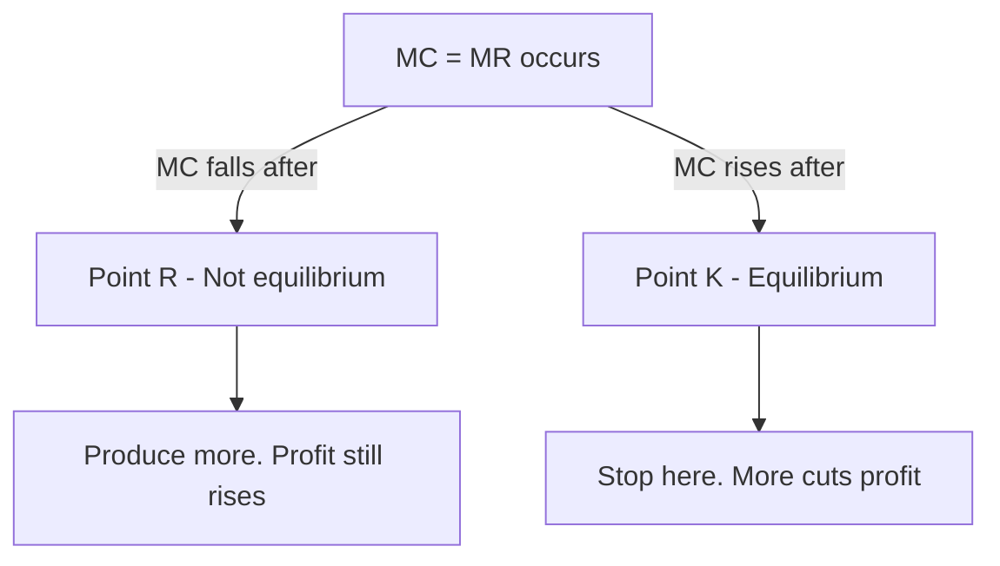

# Chapter 8 - Producer Equilibrium - STE Study Notes

> Reading rule: Read one section at a time. Do each CHECK. Then go to the next section.

## Key Terms - Read These First

| Term | Definition |
|------|------------|
| Profit | Excess of sale receipts over production expenditure |
| Producer Equilibrium | Price and output giving maximum profit. Profit declines after |
| TR-TC Approach | Equilibrium by total revenue minus total cost |
| MR-MC Approach | Equilibrium by marginal revenue and marginal cost |
| MR | Addition to TR from sale of one more unit |
| MC | Addition to TC for one more unit produced |
| Perfect Competition | Price remains constant. Firm accepts industry price |
| Imperfect Competition | Price falls with rise in output |
| MC = MR | First condition for equilibrium |
| Cut From Below | MC cuts MR from below. MC rises after |
| MC More Than MR | Second condition after equilibrium output |
| Point K | Equilibrium point with both conditions met |
| Point R | MC = MR point with only first condition met |
| Price = MC | Result at equilibrium when price is constant |
| Price More Than MC | Result at equilibrium when price falls |

```mermaid
mindmap
 root((Chapter 8))
 Profit
 TR minus TC
 Equilibrium
 Max profit point
 Two methods
 TR-TC total
 MR-MC marginal
 Two markets
 Constant price
 Falling price
 Conditions
 MC = MR
 MC rises after
```

---

## 1. Profit - Meaning

**Definition:** Profit refers to excess of receipts from sale of goods over expenditure incurred on producing them.

Formula:

```text
Profit = TR - TC
```

Points:

1. Receipts mean revenue from sale.
2. Expenditure means cost of production.
3. Profit is TR minus TC.
4. Producer aims to maximise profit.

CHECK: Write the profit formula from memory.

---

## 2. Producer Equilibrium - Meaning

**Definition:** Producer Equilibrium refers to that price and output combination which brings maximum profit to the producer and profit declines as more is produced.

Points:

1. Producer reaches maximum profit point.
2. No gain from producing more.
3. More output after equilibrium lowers profit.
4. Producer has no tendency to change output.

CHECK: Say the definition of producer equilibrium in one sentence.

---

## 3. Two Methods of Equilibrium

There are two methods for determination of producer equilibrium:

1. Total Revenue and Total Cost Approach. Short name: TR-TC Approach.
2. Marginal Revenue and Marginal Cost Approach. Short name: MR-MC Approach.

| Basis | TR-TC Approach | MR-MC Approach |
|-------|----------------|----------------|
| Tool | Total revenue and total cost | Marginal revenue and marginal cost |
| Condition | TR minus TC is maximum | MC equals MR |
| Second check | Profits fall after this output | MC rises after this output |

CHECK: Name the two methods of producer equilibrium.

---

## 4. Two Market Situations

Producer attains equilibrium under two situations:

### 4.1 When Price Remains Constant

1. Happens under perfect competition.
2. Firm accepts same price as industry fixes.
3. Any quantity can be sold at that price.

### 4.2 When Price Falls With Rise in Output

1. Happens under imperfect competition.
2. Firm follows its own pricing policy.
3. Sales rise only by reducing price.

| Basis | Price Constant | Price Falls |
|-------|---------------|-------------|
| Market | Perfect competition | Imperfect competition |
| Price | Same at all outputs | Falls with more output |
| Firm role | Accepts industry price | Sets own price |
| Sales rule | Any quantity at same price | More sales need lower price |

CHECK: Price is fixed by industry. Which market? Answer: Perfect competition.

---

## 5. MR-MC Approach - Conditions

Two conditions are needed for producer equilibrium:

1. MC = MR.
2. MC is greater than MR after MC = MR output level.

Meaning of conditions:

1. MR is addition to TR from one more unit.
2. MC is addition to TC from one more unit.
3. Profits rise as long as MR exceeds MC.
4. Profits fall if MR is less than MC.

Why both conditions matter:

1. MC = MR is necessary but not sufficient.
2. MC = MR can occur at more than one output.
3. Only output with MC rising after qualifies.
4. If MC stays below MR after, more production still adds profit.
5. If MC exceeds MR after, more production cuts profit.

General rule:

```text
(i) MC = MR
(ii) MC cuts MR from below. MC is rising.
```

CHECK: Write both conditions from memory.

---

## 6. Equilibrium When Price Is Constant - Schedule

Price is 12 at all outputs. Firm is under perfect competition.

| Output | Price | TR = Q x P | TC | MR = TRn - TRn-1 | MC = TCn - TCn-1 | Profit = TR - TC |
|--------|-------|------------|----|------------------|------------------|------------------|
| 1 | 12 | 12 | 13 | 12 | 13 | -1 |
| 2 | 12 | 24 | 25 | 12 | 12 | -1 |
| 3 | 12 | 36 | 34 | 12 | 9 | 2 |
| 4 | 12 | 48 | 42 | 12 | 8 | 6 |
| 5 | 12 | 60 | 54 | 12 | 12 | 6 |
| 6 | 12 | 72 | 68 | 12 | 14 | 4 |

Read: At 5 output, TR is 60. TC is 54. Profit is 6.

Points:

1. MR stays 12 at all outputs.
2. MC values are 13, 12, 9, 8, 12, 14.
3. MC = MR occurs at output 2 and output 5.
4. Equilibrium output is 5. MC rises to 14 after.
5. Output 2 is not equilibrium. MC falls to 9 after.

CHECK: At which two outputs does MC equal MR? Answer: 2 and 5.

---

## 7. Equilibrium When Price Is Constant - Diagram Points

Producer equilibrium is at OQ output at point K.

Conditions at point K:

1. MC = MR.
2. MC is greater than MR after this output.

Why point R is not equilibrium:

1. MC = MR also holds at point R.
2. Point R meets only first condition.
3. MC falls after point R.
4. More production still adds profit after R.
5. Producer moves ahead to point K.



CHECK: MC = MR holds at R and K. Which is equilibrium? Answer: K.

---

## 8. Equilibrium When Price Falls - Schedule

Price falls with more output. Firm is under imperfect competition.

| Output | Price | TR = Q x P | TC | MR = TRn - TRn-1 | MC = TCn - TCn-1 | Profit = TR - TC |
|--------|-------|------------|----|------------------|------------------|------------------|
| 1 | 8 | 8 | 6 | 8 | 6 | 2 |
| 2 | 7 | 14 | 11 | 6 | 5 | 3 |
| 3 | 6 | 18 | 15 | 4 | 4 | 3 |
| 4 | 5 | 20 | 20 | 2 | 5 | 0 |
| 5 | 4 | 20 | 26 | 0 | 6 | -6 |

Read: At 3 output, TR is 18. TC is 15. Profit is 3.

Points:

1. Equilibrium output is 3. MC = MR = 4 at output 3.
2. MC exceeds MR after. MC is 5. MR is 2.
3. MR curve slopes downwards. No fixed price exists.
4. MC cuts MR from below at equilibrium.

Producer equilibrium is at OM output at point E.

Conditions at point E:

1. MC = MR.
2. MC is greater than MR after this output.
3. MR curve slopes downwards with falling price.
4. MC cuts MR from below at E.

CHECK: Equilibrium output is 3. What are MC and MR? Answer: Both 4.

---

## 9. Price Versus MC at Equilibrium

### 9.1 When Price Remains Constant

1. Price = AR = MR at all outputs.
2. Equilibrium needs MC = MR.
3. Thus Price = MC at equilibrium.
4. Statement that Price exceeds MC here is False.

### 9.2 When Price Falls With Output

1. More output sells only by lower price.
2. Thus Price or AR stays above MR.
3. Equilibrium needs MC = MR.
4. Thus Price stays above MC at equilibrium.

| Situation | Price and MR | Price and MC at equilibrium |
|-----------|--------------|-----------------------------|
| Price constant | Price = MR | Price = MC |
| Price falls | Price more than MR | Price more than MC |

CHECK: Price falls with output. Is Price equal to MC? Answer: No. Price is more.

---

## 10. Numerical - Find Equilibrium Output

Data: TR is 6, 12, 18, 24, 30. TC is 7, 13, 17, 23, 31.

| Output | TR | TC | MR = TRn - TRn-1 | MC = TCn - TCn-1 | Profit = TR - TC |
|--------|----|----|------------------|------------------|------------------|
| 1 | 6 | 7 | 6 | 7 | -1 |
| 2 | 12 | 13 | 6 | 6 | -1 |
| 3 | 18 | 17 | 6 | 4 | 1 |
| 4 | 24 | 23 | 6 | 6 | 1 |
| 5 | 30 | 31 | 6 | 8 | -1 |

Read: At 4 output, MR is 6. MC is 6. Profit is 1.

Answer:

1. Equilibrium output is 4. Profit is 1.
2. MC = MR occurs at output 2 and output 4.
3. Output 2 fails second condition. MC falls to 4 after.
4. Output 4 meets both conditions. MC rises to 8 after.

CHECK: Why is output 2 not equilibrium? Answer: MC stays below MR after.

---

## 11. TR-TC Approach - Conditions

**Definition:** Under TR-TC approach, producer is in equilibrium when difference between TR and TC is maximum and total profits fall after this output.

Two conditions:

1. Difference between TR and TC is maximum.
2. Total profits fall after this level of output.

Points:

1. Check total profit at each output.
2. Select output with highest TR minus TC.
3. Confirm profit declines after that output.
4. That output is equilibrium output.

CHECK: State both TR-TC conditions from memory.

---

## 12. Fast Revision - One Page

1. Profit = TR - TC. Excess of receipts over cost.
2. Equilibrium gives maximum profit. More output lowers profit.
3. Two methods: TR-TC approach and MR-MC approach.
4. Two markets: price constant and price falling.
5. MR-MC needs MC = MR plus MC rises after.
6. Price constant schedule: Price 12. Equilibrium at 5. MC 12. Profit 6.
7. Point K is equilibrium. Point R meets only first condition.
8. Price falling schedule: Equilibrium at 3. MC = MR = 4. Profit 3.
9. Price constant means Price = MC. Price falling means Price more than MC.
10. Numerical TR 6 to 30: Equilibrium at 4. Profit 1. Output 2 rejected.
11. TR-TC needs maximum TR minus TC plus falling profits after.
12. MC cuts MR from below. MC rising at equilibrium.

---

## 13. Exam Questions With Answers

**Q1. Define profit. Give formula.**
A: Excess of sale receipts over production expenditure. Profit = TR - TC.

**Q2. Define producer equilibrium.**
A: Price and output combination giving maximum profit with profit declining after.

**Q3. Name two approaches of producer equilibrium.**
A: TR-TC approach and MR-MC approach.

**Q4. State general profit maximising condition under MR-MC.**
A: MC = MR. MC cuts MR from below. MC is rising.

**Q5. Price is 12. Output is 5. TR is 60. TC is 54. Find profit.**
A: Profit = 60 - 54 = 6.

**Q6. MC = MR at outputs 2 and 5. Which is equilibrium? Why?**
A: Output 5. MC rises to 14 after. Output 2 has MC falling to 9 after.

**Q7. Price falls schedule: output 3 has MC 4 and MR 4. Is it equilibrium?**
A: Yes. MC = MR. MC rises to 5 after with MR 2.

**Q8. When price is constant, what is relation of Price and MC?**
A: Price = MC. Price = AR = MR and MC = MR.

**Q9. When price falls, what is relation of Price and MC?**
A: Price is more than MC. Price exceeds MR and MC equals MR.

**Q10. TR is 24 at 4 units. TC is 23. Find profit. Is it equilibrium?**
A: Profit = 1. Yes if MC = MR = 6 and MC rises after.

**Q11. In perfect competition firm is in equilibrium when?**
A: All of these. MC = MR. MC cuts MR from below. MC is rising.

**Q12. For equilibrium output MC curve should?**
A: Cut MR curve from below.

**Q13. Producer is in equilibrium when he wishes to expand output. Profit is revenue minus cost. True or false?**
A: Statement 1 False. Statement 2 True.

**Q14. Price same at all outputs means Price exceeds MC. MC above MR cuts profit. True or false?**
A: Assertion False. Reason True.

**Q15. State TR-TC equilibrium conditions.**
A: TR minus TC is maximum. Profits fall after this output.

---

> Tip: Draw the diagram first. Write the definition next. Then give the example. Diagram plus explanation gives full marks.
