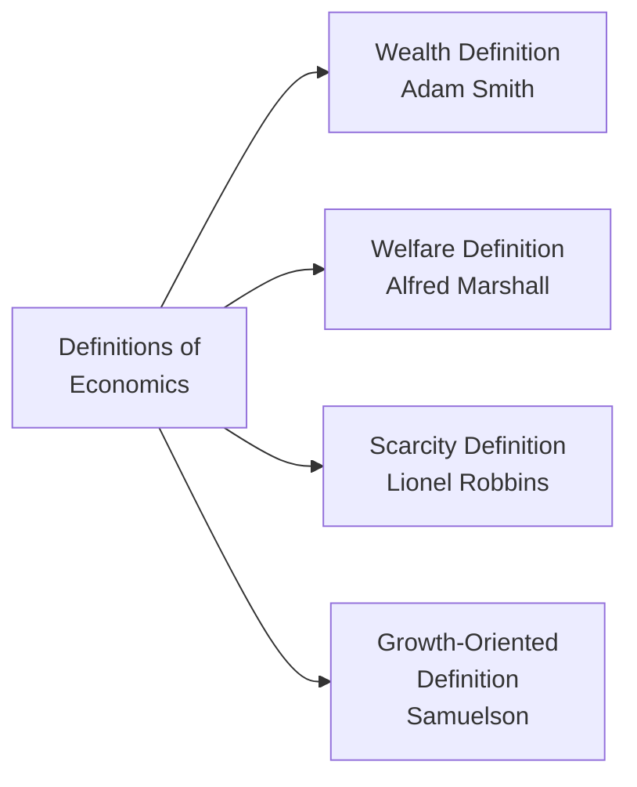
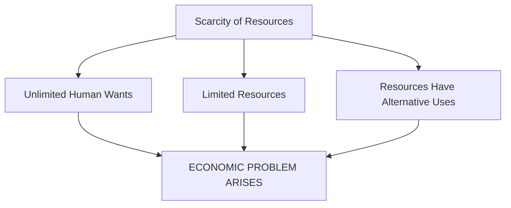
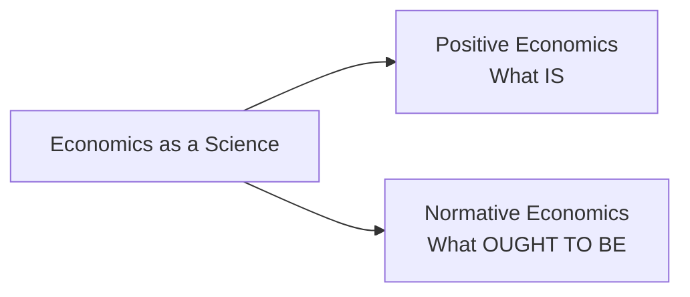
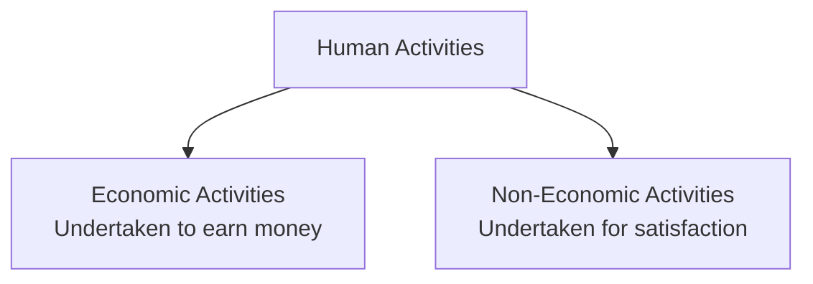

# Chapter 1: Introduction to Economics — Complete Revision Notes

> **Subject:** Statistics for Economics | **Class 11**

---

## 1. Introduction

The word **'Economics'** has been derived from two Greek words — **'Oikos'** (a house) and **'Nemein'** (to manage). Thus, the literal meaning of economics is **Household Management**. Earlier, it used to be called **Political Economy**.

As a subject, there is no single universally accepted definition of economics. Different economists have defined it in different ways, which has led to a lot of disputes and misconceptions. However, economics is fundamentally the study of how people and society choose to use scarce resources to satisfy their unlimited wants.

```txt
Unlimited Wants → Scarce Resources → Choice → Economic Problem
```

---

## 2. Definitions of Economics

Over time, four major definitions of economics have emerged:



---

### 2.1 Wealth Definition — Adam Smith (1723–1790)

**Definition:** According to Adam Smith, *"Economics is the science of wealth."*

**Key points:**
- Adam Smith is known as the **Father of Economics** — his book *'An Inquiry into the Nature and Causes of the Wealth of Nations'* was published in 1776
- He believed economics is concerned with the problems arising from **wealth-getting** and **wealth-using** activities of people
- In economics, 'wealth' refers only to those goods which **satisfy human wants** — not just money
- The main focus was on studying how the wealth of all nations could be increased

| Merits | Demerits |
|--------|----------|
| First systematic definition of economics | Gave too much importance to material wealth |
| Established economics as a separate subject | Ignored human welfare and moral values |
| Focused on practical wealth creation | Narrow and materialistic view of human life |
| | Overlooked the role of services (teachers, doctors, etc.) |

> **Criticism:** This definition was criticised for its excessive focus on wealth. Critics argued that wealth is only a **means** to an end, not the end itself. Human welfare should be the ultimate goal.

---

### 2.2 Welfare Definition — Alfred Marshall (1842–1924)

**Definition:** According to Alfred Marshall, *"Economics is a study of man in the ordinary business of life. It enquires how he gets his income and how he uses it."*

**Key points:**
- Marshall shifted the emphasis from **wealth to welfare**
- He was the first economist to deny the wealth-related definitions of Adam Smith
- His books: *'Principles of Economics'* (1890) and *'Economics of Industry'*
- According to Marshall: **Wealth is for man, not man for wealth** — wealth is not the end, but only a means to attain welfare
- He emphasised the promotion of **material welfare** as the primary objective of economics

| Merits | Demerits |
|--------|----------|
| Focused on human welfare instead of just wealth | Artificial distinction between economic and non-economic activities |
| Made economics more humane and practical | Ignores services (teachers, doctors, etc.) — only focuses on material goods |
| Broadened the scope of economics | Subject to personal value judgements |

> **Criticism:** Robbins criticised Marshall for making an artificial distinction between economic and non-economic activities. He also argued that economics studies both material goods **and** services (like those of a teacher or a doctor).

---

### 2.3 Scarcity Definition — Lionel Robbins (1898–1984)

**Definition:** According to Prof. Lionel Robbins, *"Economics is the science which studies human behaviour as a relationship between ends and scarce means which have alternative uses."*

**Key points:**
- Given in his book *'An Essay on the Nature and Significance of Economic Science'* (1932)
- Based on three fundamental characteristics that give rise to the economic problem:

| Feature | Explanation |
|---------|-------------|
| **Unlimited Wants** | Human wants are unlimited — no sooner is one want satisfied, a new one emerges |
| **Scarce Resources** | Resources are limited in supply relative to demand — scarcity is universal |
| **Alternative Uses** | Resources can be put to multiple uses — making choice among them more important |

| Merits | Demerits |
|--------|----------|
| Scientific and objective approach | Too narrow — ignores growth and development |
| Universally applicable to all economies | Does not explain what should be produced |
| Logical — based on the fundamental problem of scarcity | Ignores welfare aspects |
| No distinction between material and non-material goods | |

> **Key Insight:** Robbins' definition establishes that **scarcity is the root cause of all economic problems**. Without scarcity, there would be no need for economics.

---

### 2.4 Growth-Oriented Definition — Paul Samuelson (1915–2009)

**Definition:** According to Prof. Samuelson, *"Economics is the study of how man and society choose, with or without the use of money, to employ scarce productive resources, which could have alternative uses, to produce various commodities over time and distribute them for consumption now and in the future among various people and groups of society."*

**Key points:**
- It is a **modified version** of Robbins' scarcity definition
- Adds the dimension of **time** and **growth** — production over time and distribution for present and future
- Emphasises that economics is a **social science** concerned with how society employs limited resources
- Covers three central problems of an economy:
  1. **What to produce?** — Which goods and in what quantities?
  2. **How to produce?** — Which technique/method to use?
  3. **For whom to produce?** — How to distribute output?

| Merits | Demerits |
|--------|----------|
| Most comprehensive definition — covers production, distribution, and growth | Complex and lengthy |
| Includes the dimension of time (present vs future consumption) | Difficult for beginners to grasp |
| Focus on both efficiency and equity | |
| Applicable to all types of economies | |

---

### 2.5 Quick Comparison — Definitions of Economics

| Basis | Wealth Definition | Welfare Definition | Scarcity Definition | Growth Definition |
|-------|-------------------|-------------------|---------------------|-------------------|
| **Economist** | Adam Smith | Alfred Marshall | Lionel Robbins | Paul Samuelson |
| **Period** | 1776 | 1890 | 1932 | 1948 |
| **Main Focus** | Wealth | Human Welfare | Scarcity & Choice | Growth & Distribution |
| **Nature** | Materialistic | Welfare-oriented | Scientific | Comprehensive |
| **Key Book** | Wealth of Nations | Principles of Economics | An Essay on the Nature and Significance of Economic Science | Economics |

---

## 3. Scarcity — The Root of All Economic Problems

**Scarcity** refers to a situation where resources are not enough to satisfy all the wants of the people. It is **pervasive** — a fact of economic life for every individual, organisation, and country.

### 3.1 Why Scarcity Exists



### 3.2 Examples of Scarcity in Daily Life

| Example | Explanation |
|---------|-------------|
| Long queues at railway reservation counters | More people want tickets than seats available |
| Crowded buses and trains | Transport capacity is limited relative to demand |
| Rising prices of petrol, vegetables, pulses | Demand exceeds supply |
| Shortage of essential commodities | Production is limited by scarce resources |

> **Key Insight:** There would be **no economic problem** if resources were not scarce. Scarcity makes choice necessary, and choice is the essence of economics.

### 3.3 Scarcity vs Poverty

| Concept | Scarcity | Poverty |
|---------|----------|---------|
| **Meaning** | Limited resources relative to unlimited wants | Lack of basic necessities of life |
| **Nature** | Universal — affects everyone (rich and poor) | Specific — affects only certain sections |
| **Can it be eliminated?** | No — it is a permanent feature of human existence | Yes — through economic development |
| **Example** | A billionaire still has limited time and money to satisfy all desires | A person unable to afford food and shelter |

---

## 4. Nature of Economics

There has been a long-standing controversy among economists about the nature of economics — whether it is a **science** or an **art**.

### 4.1 Economics as a Science

**Science** is a systematised body of knowledge that analyses cause-and-effect relationships and whose principles have universal validity.

| Basis | Natural Sciences (Physics, Chemistry) | Economics |
|-------|--------------------------------------|-----------|
| **Systematic knowledge** | Yes | Yes |
| **Cause-effect relationship** | Yes | Yes |
| **Universal validity** | Laws are precise and absolute | Laws are generally true but not as precise |
| **Experimentation** | Possible in laboratories | Not possible — deals with human behaviour |

**Conclusion:** Economics is a **Social Science** — it is scientific in its approach but cannot match the precision of natural sciences because it deals with unpredictable human behaviour.

### 4.2 Positive vs Normative Economics



| Basis | Positive Economics | Normative Economics |
|-------|--------------------|---------------------|
| **Deals with** | What are the economic problems and how they are actually solved | What ought to be or how problems should be solved |
| **Nature** | Descriptive — based on facts | Prescriptive — based on value judgements |
| **Example** | "India is an overpopulated country" | "India should control its population" |
| | "Prices are constantly rising" | "Prices should not rise" |
| **Verification** | Can be tested against facts | Cannot be tested — based on opinions |
| **Objective** | To describe economic reality | To determine economic ideals |

### 4.3 Economics as an Art

**Art** refers to the skilful and personal application of systematic knowledge to bring desired results. It can be acquired through study, observation, and experience.

- Economics requires **human imagination** for the practical application of laws, principles, and theories
- Economic theories are used to solve real-world problems — e.g., using the law of demand to set prices
- Therefore, economics is **both a science and an art**:
  - **Science** — it has a systematic body of knowledge and laws
  - **Art** — it applies this knowledge to solve practical problems

---

## 5. Economic and Non-Economic Activities

All human beings are engaged in some activity or the other to satisfy their wants and desires. These activities can be broadly divided into two categories:



### 5.1 Economic Activities

**Definition:** Activities undertaken to earn a living or to create wealth and money.

**Key characteristics:**
- Concerned with the **production, consumption, and distribution** of goods and services
- Involve monetary reward or income
- Every economy must undertake three main economic activities:

#### (A) Consumption

Consumption is an economic activity that deals with the **use of goods and services** for the satisfaction of human wants.

- **Examples:** Eating bread, drinking milk, wearing a watch, listening to music
- **What we study:** Wants — their origin, nature, characteristics, and the laws governing them

#### (B) Production

Production is the process of **converting raw materials into finished products** to enhance their utility.

- **Examples:** Activities of a farmer, carpenter, trader, teacher, doctor, shopkeeper
- **Factors of Production:**
  1. **Land** — natural resources
  2. **Labour** — human effort
  3. **Capital** — manufactured resources (machinery, tools)
  4. **Entrepreneur** — organises the other three factors
- **What we study:** Means of production, their features, and the laws governing production
- **Key decisions:** What to produce and how to produce (choice of technique)

#### (C) Distribution

Distribution studies how the **income generated from production** is shared among the four factors of production.

| Factor of Production | Reward for Contribution |
|---------------------|------------------------|
| Land | Rent |
| Labour | Wages |
| Capital | Interest |
| Entrepreneur | Profit |

The total income arising from the production process is known as **Gross Domestic Product (GDP)** , and it is distributed as rent, wages, interest, and profit.

### 5.2 Non-Economic Activities

**Definition:** Activities that are not concerned with the creation of money or wealth.

**Key characteristics:**
- No expectation of any monetary reward or benefit
- Inspired by sentimental reasons — performed out of love, sympathy, patriotism, etc.

| Type | Examples |
|------|----------|
| **Household** | A housewife cooking food for her family |
| **Personal** | A teacher teaching his own son |
| **Charitable** | Blood donation camps, free education to needy students |
| **Social** | Attending parties, family get-togethers |
| **Political** | Activities performed by political parties |
| **Religious** | Praying to God, visiting temples/churches |

### 5.3 Economic vs Non-Economic Activities — Comparison

| Basis | Economic Activity | Non-Economic Activity |
|-------|-------------------|-----------------------|
| **Purpose** | To earn money/income | To satisfy personal/emotional needs |
| **Expectation** | Monetary reward expected | No monetary reward expected |
| **Measurement** | Measured in monetary terms | Cannot be measured in money |
| **Examples** | Farming, factory work, teaching as a job | Teaching own child, gardening as a hobby |

---

## 6. Importance of Economics

| Area | Relevance |
|------|-----------|
| **For Individuals** | Helps in rational decision-making — how to allocate limited resources among competing wants |
| **For Businesses** | Helps in forecasting demand, determining pricing, and resource allocation |
| **For Government** | Helps in policy formulation — taxation, budgeting, welfare schemes |
| **For Society** | Helps in understanding and solving social problems — poverty, unemployment, inequality |

---

## 7. Practice Questions

### 7.1 Multiple Choice Questions

**Q1.** The word 'Economics' is derived from which language?

- (a) Latin
- (b) French
- (c) German
- **(d) Greek**

**Q2.** Who is known as the 'Father of Economics'?

- **(a) Adam Smith**
- (b) Alfred Marshall
- (c) Lionel Robbins
- (d) Paul Samuelson

**Q3.** According to Alfred Marshall, economics is a study of:

- (a) Wealth only
- **(b) Man in the ordinary business of life**
- (c) Scarcity and choice
- (d) Growth and development

**Q4.** The scarcity definition of economics was given by:

- (a) Adam Smith
- (b) Alfred Marshall
- **(c) Lionel Robbins**
- (d) Samuelson

**Q5.** Which of the following is NOT a characteristic of Robbins' definition?

- (a) Unlimited wants
- (b) Scarce resources
- (c) Resources have alternative uses
- **(d) Unlimited resources**

**Q6.** Positive economics deals with:

- **(a) What is**
- (b) What ought to be
- (c) Both (a) and (b)
- (d) None of the above

**Q7.** Normative economics is concerned with:

- (a) Facts and figures
- **(b) Value judgements**
- (c) Scientific observations
- (d) Cause-effect relationships

**Q8.** Which of the following is an economic activity?

- (a) A mother cooking for her children
- (b) A teacher teaching his own son
- **(c) A nurse working in a hospital**
- (d) Donating blood

**Q9.** The reward for capital is called:

- (a) Rent
- (b) Wages
- (c) Profit
- **(d) Interest**

**Q10.** Scarcity is:

- (a) The same as poverty
- **(b) A universal phenomenon**
- (c) Only found in poor countries
- (d) Can be eliminated

---

### 7.2 Assertion-Reason Questions

**Q11.**

**Assertion (A):** According to Adam Smith, economics is the science of wealth.

**Reason (R):** Adam Smith believed that the primary goal of economic activity is the promotion of human welfare.

**Alternatives:**

- (a) Both A and R are true, and R is the correct explanation of A
- (b) Both A and R are true, but R is NOT the correct explanation of A
- **(c) A is true but R is false** *(Smith focused on wealth, not welfare — Marshall focused on welfare)*
- (d) A is false but R is true

**Q12.**

**Assertion (A):** Economics is considered a social science.

**Reason (R):** Economic laws are as precise and absolute as the laws of natural sciences.

**Alternatives:**

- (a) Both A and R are true, and R is the correct explanation of A
- (b) Both A and R are true, but R is NOT the correct explanation of A
- **(c) A is true but R is false** *(Economic laws are not as precise as natural science laws)*
- (d) A is false but R is true

**Q13.**

**Assertion (A):** Normative economics is based on facts and cannot be tested.

**Reason (R):** Normative economics deals with 'what ought to be' and involves value judgements.

**Alternatives:**

- (a) Both A and R are true, and R is the correct explanation of A
- (b) Both A and R are true, but R is NOT the correct explanation of A
- (c) A is true but R is false
- **(d) A is false but R is true** *(Normative economics IS based on value judgements, but the assertion is wrong because it IS NOT based on facts — positive economics is based on facts)*

---

### 7.3 True or False Questions

**Q14.** State whether the following statements are True or False:

- (i) Economics was earlier known as Political Economy. → **True**
- (ii) Robbins' definition of economics is also known as the growth-oriented definition. → **False** (Samuelson gave the growth-oriented definition)
- (iii) A housewife cooking food for her family is performing a non-economic activity. → **True**
- (iv) Scarcity and poverty mean the same thing. → **False** (Scarcity is universal, poverty is not)
- (v) The reward for the entrepreneur is profit. → **True**
- (vi) Positive economics suggests what should be done. → **False** (That is normative economics)

---

### 7.4 Match the Following

**Q15.** Match the economist with their definition:

| Column A | Column B |
|----------|----------|
| 1. Adam Smith | (a) Economics studies human behaviour as a relationship between ends and scarce means |
| 2. Alfred Marshall | (b) Economics is the study of how society chooses to employ scarce resources over time |
| 3. Lionel Robbins | (c) Economics is the science of wealth |
| 4. Paul Samuelson | (d) Economics is the study of man in the ordinary business of life |

**Answers:** 1 → (c), 2 → (d), 3 → (a), 4 → (b)

---

### 7.5 Application Questions

**Q16.** "Scarcity is the root of all economic problems." Explain this statement with the help of examples.

**Answer:**
Scarcity refers to the situation where resources are limited in supply relative to the unlimited wants of people. This gives rise to the economic problem because:

1. **Unlimited wants** — Human wants never end. As soon as one want is satisfied, another emerges.
2. **Limited resources** — Resources like land, labour, capital, and time are limited.
3. **Alternative uses** — The same resource can be used for different purposes (e.g., a piece of land can be used for farming, building a factory, or constructing a school).

**Examples:**
- A student with ₹500 wants to buy both a book and a T-shirt but can only afford one — scarcity forces a choice.
- A government has a limited budget and must choose between building a new hospital or a new road.

If resources were unlimited, there would be no need to choose, and therefore no economic problem.

**Q17.** Distinguish between Positive Economics and Normative Economics with suitable examples.

**Answer:**

| Basis | Positive Economics | Normative Economics |
|-------|--------------------|---------------------|
| **Meaning** | Deals with 'what is' — factual description | Deals with 'what ought to be' — value-based |
| **Nature** | Objective and scientific | Subjective and suggestive |
| **Verification** | Can be tested against facts | Cannot be verified — based on opinions |
| **Example 1** | India's GDP growth rate is 7% | India should aim for 9% GDP growth |
| **Example 2** | Unemployment rate has increased | Government should reduce unemployment |

**Q18.** Classify the following activities as Economic or Non-Economic:

| Activity | Type |
|----------|------|
| A farmer working in his field | **Economic** |
| A doctor treating patients in a hospital | **Economic** |
| A mother teaching her daughter at home | **Non-Economic** |
| Donating money to a charity | **Non-Economic** |
| A shopkeeper selling goods | **Economic** |
| A volunteer serving food in a religious gathering | **Non-Economic** |

**Q19.** Explain the four factors of production and their rewards.

**Answer:**

| Factor of Production | Meaning | Reward |
|---------------------|---------|--------|
| **Land** | All natural resources — soil, water, minerals, forests | Rent |
| **Labour** | Any physical or mental effort exerted by humans | Wages/Salary |
| **Capital** | Man-made goods used in production — machinery, tools, buildings | Interest |
| **Entrepreneur** | Organises, manages, and bears risk of the business | Profit |

These four factors work together to produce goods and services. The income generated (GDP) is distributed among them in the form of rent, wages, interest, and profit respectively.

**Q20.** Why is economics considered both a science and an art?

**Answer:**

**As a Science:**
- Economics has a systematised body of knowledge
- It analyses cause-and-effect relationships (e.g., law of demand: price ↑ → demand ↓)
- Its principles have general validity

**As an Art:**
- Art is the practical application of knowledge — economics is applied to solve real-world problems
- Economic theories help governments frame budgets, businesses set prices, and individuals make decisions

**Conclusion:** Economics is **both a science and an art** — it is a science because it has a systematic body of knowledge, and it is an art because it applies that knowledge to solve practical economic problems.

---

## Chapter at a Glance — Quick Revision Card

| Topic | Key Point |
|-------|-----------|
| **Origin of word 'Economics'** | Greek — 'Oikos' (house) + 'Nemein' (to manage) = Household Management |
| **Earlier name** | Political Economy |
| **Wealth Definition** | Adam Smith (1776) — Economics is the science of wealth |
| **Welfare Definition** | Alfred Marshall (1890) — Study of man in the ordinary business of life |
| **Scarcity Definition** | Lionel Robbins (1932) — Relationship between ends and scarce means with alternative uses |
| **Growth Definition** | Paul Samuelson — Study of how society chooses to employ scarce resources over time |
| **Root of economic problem** | Scarcity — unlimited wants vs limited resources |
| **Positive Economics** | What IS — factual, descriptive |
| **Normative Economics** | What OUGHT TO BE — value judgements |
| **Economic Activities** | Undertaken to earn money — consumption, production, distribution |
| **Non-Economic Activities** | Undertaken for personal satisfaction — no monetary reward |
| **4 Factors of Production** | Land (Rent), Labour (Wages), Capital (Interest), Entrepreneur (Profit) |
| **Nature of Economics** | Both a Science (systematic knowledge) and an Art (practical application) |

---

> *Sources: NCERT Class 11 Statistics for Economics — Chapter 1: Introduction & verified against standard reference materials*
