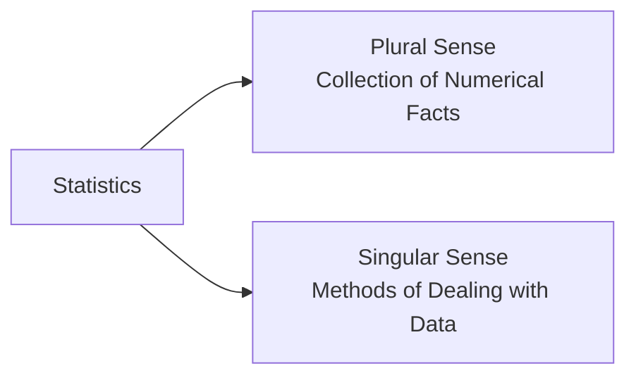
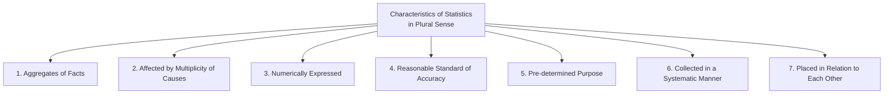
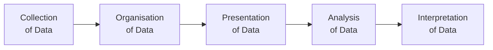
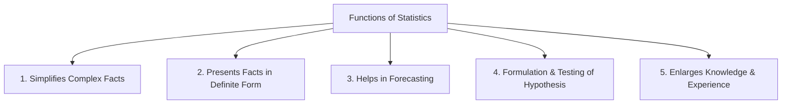
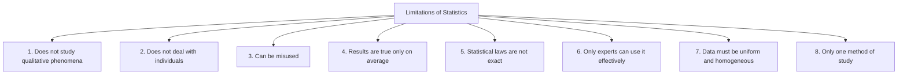

# Chapter 2: Meaning, Scope & Importance of Statistics — Complete Revision Notes

> **Subject:** Statistics for Economics | **Class 11**

---

## 1. Introduction

The word **'Statistics'** seems to have been derived from:

| Language | Word |
|----------|------|
| Latin | *Status* |
| Italian | *Statisto* |
| German | *Statistik* |
| Greek | *Statistique* |

Each of these words means a **political state**. Thus, originally statistics was used as a tool to collect information about the state — its population, wealth, army, etc.

Statistics has two distinct meanings:

---

## 2. Meaning of Statistics — Two Perspectives

### 2.1 Statistics in the Plural Sense (As Numerical Data)

In the plural sense, **Statistics** refers to:

> *"Aggregates of facts, affected to a marked extent by multiplicity of causes, numerically expressed, enumerated or estimated according to reasonable standards of accuracy, collected in a systematic manner for a predetermined purpose and placed in relation to each other."*

This definition highlights **seven essential characteristics** of statistics:

---

#### 1. Aggregates of Facts

Statistics are a **number of facts** — single and isolated figures are not statistics because such figures cannot be compared and no conclusions can be drawn from them.

| Valid Statistics | Not Statistics |
|-----------------|---------------|
| Height of 50 students in a class | Height of a single student |
| Monthly sales of a company for 12 months | "Ram is 52 years old" (alone) |
| Population of India across different years | "Kanhaiya is 40 years old" (alone) |

> **Example:** Saying "Vicky is 24 years old" is not statistics. But saying "The ages of 50 students in a class range from 14 to 18 years" is statistics because it is an aggregate.

#### 2. Affected by Multiplicity of Causes

Numerical figures (data) are influenced by a **variety of factors**. It is not easy to study the effects of any one factor separately by ignoring other factors.

- **Example:** The price of a crop is affected by rainfall, soil quality, transport cost, government policy, market demand, etc. — not just one factor.

#### 3. Numerically Expressed

The statistical approach is **numerical**. Any fact, to be called statistics, must be expressed in **numbers or quantitatively**.

- **Example:** "Prices are rising" is not statistics. But "Inflation rate is 10%" is statistics.
- Qualitative facts like honesty, beauty, or intelligence cannot be called statistics unless quantified.

#### 4. Reasonable Standard of Accuracy

Data must be collected with a **reasonable standard of accuracy**. Accuracy should be determined by the nature and purpose of the investigation.

- **Example:** For population census, near 100% accuracy is needed. For a market survey, approximate figures may be acceptable.

#### 5. Collected for a Pre-determined Purpose

The purpose of collecting statistical data must be **decided in advance**, otherwise the usefulness of the data collected would be negligible.

- Data collected in an unsystematic manner without a clear purpose will be confusing and cannot be used to draw valid conclusions.

#### 6. Collected in a Systematic Manner

For accuracy and reliability, figures should be collected in a **systematic manner**. If collected haphazardly, the reliability deteriorates.

- A suitable **plan for collection** should be prepared before gathering data.

#### 7. Placed in Relation to Each Other

Statistical data must be **comparable** — they should be placed in relation to each other to draw meaningful conclusions.

- **Example:** Comparing the marks of 10 students: Nikhil = 57, Sakshi = 43, Surya = 75, Ayan = 58, Akriti = 72, Chinmayi = 78, Daksh = 49, etc. — these figures only become meaningful when compared with each other.

---

### 2.2 Statistics in the Singular Sense (As a Method)

In the singular sense, **Statistics** is defined as:

> *"The collection, organisation, presentation, analysis and interpretation of numerical data."*

Statistics in the singular sense is a **body of methods and tools** used to process raw data and draw conclusions.

| Stage | Description |
|-------|-------------|
| **1. Collection of Data** | Gathering raw numerical information from primary or secondary sources |
| **2. Organisation of Data** | Classifying and arranging raw data into meaningful categories |
| **3. Presentation of Data** | Displaying data in tables, charts, diagrams, or graphs |
| **4. Analysis of Data** | Applying statistical tools to study patterns, relationships, and trends |
| **5. Interpretation of Data** | Drawing conclusions and making inferences from the analysed data |

---

### 2.3 Plural Sense vs Singular Sense — Comparison Table

| Basis | Statistics in Plural Sense | Statistics in Singular Sense |
|-------|---------------------------|------------------------------|
| **Deals with** | Numerical information (raw data) | Methods and tools for data analysis |
| **Nature** | Descriptive — describes facts | Analytical — processes and analyses data |
| **State** | Often in raw/unprocessed form | Helps in processing raw data |
| **Role** | Provides the raw material | Provides the operational technique |
| **Nature of study** | Quantitative | Operational/analytical |

---

## 3. Functions of Statistics

Statistics performs the following important functions:

### 3.1 To Simplify Complex Facts

It is very difficult for an individual to understand and conclude from huge numerical data. Statistical methods try to present the great mass of complex data into **simple and understandable form**.

- **Example:** Instead of looking at thousands of individual price figures, statistics gives us a single number — like the **inflation rate of 10%** or the **average price index**.

### 3.2 To Present Facts in Definite Form

Quantitative facts can easily be believed and trusted in comparison to abstract and qualitative facts. Statistics summarises generalised facts and presents them in a **definite form**.

| Vague Statement | Definite Statement (Statistics) |
|-----------------|-------------------------------|
| "Prices are rising" | "Inflation rate is 10%" |
| "Many people are unemployed" | "Unemployment rate is 6.2%" |
| "The company is doing well" | "The company's profit increased by 15%" |

### 3.3 To Help in Forecasting

Business is full of risks and uncertainties. Correct **forecasting** is essential to reduce uncertainties. Statistical tools (like interpolation, time series analysis, etc.) help in making projections for the future.

- **Example:** A company uses past sales data to forecast next quarter's demand and plan production accordingly.

### 3.4 Formulation and Testing of Hypothesis

Statistical methods are extremely useful in **formulating and testing hypotheses**. They help in verifying whether a particular assumption about a population is true or false based on sample data.

- **Example:** Testing whether a new medicine is effective or whether a new policy has impacted people's lives.

### 3.5 To Enlarge Individual Knowledge and Experience

Statistics enables people to **enlarge their horizon**. It sharpens the faculty of rational thinking and reasoning and is helpful in propounding new theories and concepts.

- **Example:** Studying global trade statistics helps understand the economic position of different countries.

---

## 4. Importance of Statistics

### 4.1 Importance to the Government

The role of government has increased significantly, requiring much greater information in the form of numerical figures to fulfil welfare objectives and efficient administration.

| Application | Example |
|-------------|---------|
| **Policy Formulation** | Time-series analysis, index numbers, forecasting, demand analysis used to frame economic policies |
| **Election Analysis** | Political groups use statistical analysis to gauge their popularity among the masses |
| **Planning** | Five-Year Plans rely heavily on statistical data about resources, population, and production |
| **Welfare Schemes** | Data on poverty, unemployment, health, and education helps design targeted programmes |

### 4.2 Importance in Economics

#### (A) Formulation of Economic Laws
The famous **'Law of Demand'** and the concept of **'Elasticity of Demand'** have been developed by the **Inductive method of generalisation**, which is based on statistical principles.

- Statistics provides the empirical evidence needed to establish economic relationships.

#### (B) Helps in Understanding and Solving Economic Problems
Statistical data and methods play a vital role in understanding and solving economic problems such as:
- **Poverty** — measuring its extent and identifying affected regions
- **Unemployment** — calculating unemployment rates and trends
- **Inequality** — analysing disparities in income and wealth distribution

#### (C) Study of Market Structures
Study of **perfect competition, monopoly, oligopoly**, etc. requires statistical comparison of market prices, costs, and profits of individual firms. Statistics also facilitates **inter-sectoral** (comparing different sectors) and **inter-temporal** (comparing across time periods) comparison.

#### (D) Helps in Establishing Mathematical Relationships
Statistical methods can estimate mathematical relationships and cause-and-effect relationships between various economic variables.

- **Example:** The relationship between price and quantity demanded — as price increases, demand decreases — is established statistically.

#### (E) Useful to Study Behaviour of Economic Concepts
**Trend-series analysis** is used to study the behaviour of:
- Prices
- Production and consumption of commodities
- Money in circulation
- Bank deposits and clearings

#### (F) Price Analysis
Statistical surveys of prices help in studying:
- Theories of prices
- Pricing policy
- Price trends
- Relationship to the general problem of inflation

### 4.3 Importance in Economic Planning

At every stage of economic planning, there is a need for figures and statistical methods.

| Stage | Role of Statistics |
|-------|-------------------|
| **Assessing Resources** | Statistical techniques assess the amounts of various resources available in the economy |
| **Determining Growth Rate** | Helps determine whether the specified rate of growth is sustainable |
| **Identifying Problem Areas** | Statistical analysis may reveal crucial areas like increasing inflation that require immediate attention |

### 4.4 Importance in Business

| Application | Description |
|-------------|-------------|
| **Establishing a Business Unit** | Before starting a business, feasibility involves detailed information about location, size of output, availability of inputs, taxes, market size, turnover, etc. Statistics provides guidelines for making key decisions. |
| **Making Marketing Strategy** | Before a product is launched, market research uses statistical techniques (like pilot surveys) to analyse data on population, purchasing power, consumer habits, competitors, pricing, etc. Such studies reveal the possible market potential for the product. |
| **Quality Control** | Statistical quality control helps maintain product standards |
| **Inventory Management** | Statistics helps determine optimal stock levels |
| **Financial Analysis** | Ratio analysis, trend analysis help in financial decision-making |

---

## 5. Scope of Statistics

The scope of statistics is very wide and covers almost all fields of human activity:

| Field | Application |
|-------|-------------|
| **Economics** | Demand analysis, production functions, price indices, national income accounting |
| **Business** | Market research, quality control, sales forecasting, inventory management |
| **Government** | Policy formulation, planning, census, budget allocation |
| **Sciences** | Biology (population genetics), Physics (error analysis), Medicine (drug trials) |
| **Social Sciences** | Psychology (intelligence tests), Sociology (population studies) |
| **Education** | Examining student performance, evaluating teaching methods |
| **Sports** | Player performance analysis, match predictions |

---

## 6. Limitations of Statistics

Despite its wide applicability, statistics has certain limitations that must be kept in mind:

### 6.1 Does Not Study Qualitative Phenomena

Statistics can be applied **only to problems that can be expressed quantitatively**. Qualitative characteristics such as honesty, poverty, welfare, beauty, health, etc. cannot directly be measured in numbers.

| Can Study | Cannot Directly Study |
|-----------|----------------------|
| Literacy rate | Level of intelligence |
| Income level | Degree of happiness |
| Production output | Quality of a product |
| Number of crimes | Sense of security |

### 6.2 Does Not Deal with Individuals

Statistics deals **only with aggregates of facts** — no importance is attached to individual items. Individual cases are ignored in statistical analysis.

- **Example:** The statement "India's life expectancy is 67 years" doesn't mean every individual lives exactly 67 years — some live 105 years, some die earlier.

### 6.3 Can Be Misused

Statistics can be misused by **ignorant or wrongly motivated persons**. Anyone can misuse statistics and draw any type of conclusion they like.

> **Famous quote:** *"There are three kinds of lies — lies, damned lies, and statistics."* — Mark Twain

### 6.4 Results Are True Only on Average

Statistical results are true **on an average** as they are affected by a large number of causes. Statistical laws are **not universally true**.

- **Example:** If the average marks of a class are 60, it doesn't mean every student scored 60 — some scored 90, some 30.

### 6.5 Statistical Laws Are Not Exact

Statistical laws are **probabilistic** in nature. Inferences based on them are only **approximate** and not exact like inferences based on mathematical or scientific laws.

| Science/Mathematics | Statistics |
|--------------------|------------|
| 2 + 2 = 4 (exact) | Average rainfall = 50 cm (approximate) |
| Laws are universal | Laws are probabilistic |

### 6.6 Only Experts Can Make Best Possible Use

The techniques of statistics are **not so simple** to be used by any layman. These techniques can only be used by experts as they are complicated in nature.

### 6.7 Data Must Be Uniform and Homogeneous

It is essential that data must be **uniform and homogeneous**. Heterogeneous data are not comparable.

- **Example:** It would be meaningless to compare the heights of trees with the heights of men because these are heterogeneous in nature.

### 6.8 Statistics Is Only One Method of Study

Statistical methods are only a **means to understand** any given problem rather than a method to solve it completely. They must be supplemented with other methods of analysis.

- **Example:** Statistics can show that unemployment is rising, but it alone cannot solve the problem — policy decisions are needed.

---

## 7. Importance of Statistics — Summary Table

| Area | Key Contribution |
|------|------------------|
| **Government** | Policy formulation, planning, election analysis, welfare schemes |
| **Economics** | Economic laws, solving economic problems, market analysis, price analysis |
| **Economic Planning** | Resource assessment, growth sustainability, identifying problem areas |
| **Business** | Feasibility studies, marketing strategy, quality control, inventory management |
| **General** | Simplifies complex data, helps in forecasting, hypothesis testing |

---

## 8. Practice Questions

### 8.1 Multiple Choice Questions

**Q1.** The word 'Statistics' is derived from which language?

- (a) Latin word *Status*
- (b) Italian word *Statisto*
- (c) German word *Statistik*
- **(d) All of the above**

**Q2.** In the plural sense, statistics refers to:

- **(a) Collection of numerical facts**
- (b) Methods of data analysis
- (c) Statistical tools and techniques
- (d) Interpretation of data

**Q3.** Which of the following is NOT a characteristic of statistics in the plural sense?

- (a) Aggregates of facts
- (b) Numerically expressed
- (c) Collected in a haphazard manner
- **(d) Pre-determined purpose**

**Q4.** Statistics in the singular sense is defined as:

- (a) Numerical data
- (b) Aggregates of facts
- **(c) Collection, organisation, presentation, analysis and interpretation of data**
- (d) Political state information

**Q5.** Which of the following is a function of statistics?

- (a) To complicate facts
- (b) To hide information
- **(c) To simplify complex data**
- (d) To avoid numerical analysis

**Q6.** Statistical laws are:

- (a) Exact and universal
- (b) Always 100% accurate
- **(c) Probabilistic and true only on average**
- (d) The same as mathematical laws

**Q7.** Which of the following can statistics study?

- (a) Honesty of a person
- (b) Beauty of a painting
- **(c) Inflation rate of a country**
- (d) Intelligence of a student

**Q8.** Statistics deals only with:

- (a) Individual items
- (b) Qualitative facts
- **(c) Aggregates of facts**
- (d) Subjective opinions

**Q9.** In economic planning, statistics helps in:

- (a) Making policies without data
- **(b) Assessing availability of resources**
- (c) Ignoring inflation trends
- (d) Avoiding numerical analysis

**Q10.** The five stages of statistical investigation in the singular sense are:

- (a) Collection, Organisation, Presentation, Analysis, Interpretation
- **(b) Collection, Organisation, Presentation, Analysis, Interpretation**
- (c) Collection, Organisation, Calculation, Presentation, Conclusion
- (d) Collection, Tabulation, Graph, Analysis, Result

---

### 8.2 Assertion-Reason Questions

**Q11.**

**Assertion (A):** "Ram is 52 years old" is not statistics.

**Reason (R):** Statistics always deals with aggregates of facts, not individual figures.

**Alternatives:**

- **(a) Both A and R are true, and R is the correct explanation of A**
- (b) Both A and R are true, but R is NOT the correct explanation of A
- (c) A is true but R is false
- (d) A is false but R is true

**Q12.**

**Assertion (A):** Statistics can be used to study any type of problem.

**Reason (R):** Statistics can only study problems that can be expressed quantitatively.

**Alternatives:**

- (a) Both A and R are true, and R is the correct explanation of A
- (b) Both A and R are true, but R is NOT the correct explanation of A
- (c) A is true but R is false
- **(d) A is false but R is true** *(Statistics cannot study problems that are qualitative in nature)*

**Q13.**

**Assertion (A):** Statistical laws are probabilistic in nature.

**Reason (R):** Inferences based on statistical laws are only approximate, not exact.

**Alternatives:**

- **(a) Both A and R are true, and R is the correct explanation of A**
- (b) Both A and R are true, but R is NOT the correct explanation of A
- (c) A is true but R is false
- (d) A is false but R is true

---

### 8.3 True or False Questions

**Q14.** State whether the following statements are True or False:

- (i) Statistics in the plural sense deals with methods and tools of analysis. → **False** (That is the singular sense)
- (ii) Single and isolated figures cannot be called statistics. → **True**
- (iii) Statistics can be misused by ignorant or wrongly motivated persons. → **True**
- (iv) Statistical laws are as exact as the laws of physics. → **False** (They are probabilistic)
- (v) Statistics can directly study qualities like honesty and beauty. → **False** (Statistics only studies quantitative phenomena)
- (vi) Statistics helps in forecasting future trends. → **True**

---

### 8.4 Match the Following

**Q15.** Match the stage of statistical investigation with its description:

| Column A | Column B |
|----------|----------|
| 1. Collection of Data | (a) Drawing conclusions from analysed data |
| 2. Organisation of Data | (b) Displaying data in tables and charts |
| 3. Presentation of Data | (c) Gathering raw numerical information |
| 4. Analysis of Data | (d) Classifying data into meaningful categories |
| 5. Interpretation of Data | (e) Applying statistical tools to study patterns |

**Answers:** 1 → (c), 2 → (d), 3 → (b), 4 → (e), 5 → (a)

---

**Q16.** Match the characteristic with its explanation:

| Column A | Column B |
|----------|----------|
| 1. Aggregates of Facts | (a) Data must be comparable |
| 2. Numerically Expressed | (b) Data is influenced by many factors |
| 3. Multiplicity of Causes | (c) A group of figures, not single values |
| 4. Placed in Relation | (d) Expressed in quantitative terms |

**Answers:** 1 → (c), 2 → (d), 3 → (b), 4 → (a)

---

### 8.5 Application Questions

**Q17.** "Statistics deals with aggregates only." Explain with an example.

**Answer:**
Statistics does not study individual items — it deals only with **aggregates of facts**. An individual figure by itself has no statistical meaning.

**Example:** 
- "Surya scored 75 marks in economics" — this is just an individual figure, NOT statistics.
- But the statement "The average marks of 50 students in economics is 62.5" — this IS statistics because it is an aggregate.
- Similarly, "Nikhil is 57 years old" is not statistics, but "The average age of 100 employees in the company is 42 years" is statistics.

The purpose of statistics is to study patterns and trends in a group, not to focus on individuals.

**Q18.** Explain the difference between the plural sense and singular sense of statistics with suitable examples.

**Answer:**

| Basis | Plural Sense | Singular Sense |
|-------|-------------|----------------|
| **Meaning** | Deals with numerical facts/data | Deals with methods and techniques |
| **Nature** | Descriptive (what the data shows) | Analytical (how to process data) |
| **Example** | "The population of India is 140 crore" — this is numerical data | "The method used to calculate the growth rate" — this is a statistical method |

**Analogy:** If statistics is a car, then:
- **Plural sense** = The car itself (the data)
- **Singular sense** = The engine and mechanics (the methods to process data)

**Q19.** Discuss any four limitations of statistics.

**Answer:**

1. **Does not study qualitative phenomena** — Statistics can only study problems expressed in numbers. Qualities like honesty, beauty, intelligence, and health cannot be directly measured statistically. For example, you can count the number of crimes in a city but cannot directly measure the sense of security people feel.

2. **Results are true only on average** — Statistical results hold true for a group but may not apply to individuals. For example, if India's life expectancy is 67 years, a particular person may live 105 years or die at 40. The average conceals individual variations.

3. **Can be misused** — Statistics can be manipulated to prove any point. People with wrong motives can select data that supports their argument and ignore data that contradicts it. As the saying goes, "There are three kinds of lies — lies, damned lies, and statistics."

4. **Statistical laws are not exact** — Unlike mathematical laws (2+2=4), statistical laws are probabilistic. Inferences based on statistics are approximate, not exact. For example, we might say there is a 90% chance of rain tomorrow — it's not guaranteed.

**Q20.** Explain the five stages of statistical investigation.

**Answer:**

The five stages in the singular sense of statistics are:

| Stage | What Happens | Example |
|-------|-------------|---------|
| **1. Collection of Data** | Gathering raw numerical information | Conducting a survey of 500 households about their monthly income |
| **2. Organisation of Data** | Classifying and arranging data | Grouping income data into categories: ₹0-10,000, ₹10,001-25,000, etc. |
| **3. Presentation of Data** | Displaying data visually | Creating a bar chart showing income distribution |
| **4. Analysis of Data** | Applying statistical tools | Calculating the average income, median income, etc. |
| **5. Interpretation of Data** | Drawing conclusions | "60% of households earn less than ₹25,000 per month" |

These stages follow a logical sequence — you cannot analyse data before collecting it, and you cannot interpret before analysing.

---

## Chapter at a Glance — Quick Revision Card

| Topic | Key Point |
|-------|-----------|
| **Origin of word 'Statistics'** | Latin *Status* / Italian *Statisto* / German *Statistik* — means political state |
| **Plural Sense** | Collection of numerical facts — data |
| **Singular Sense** | Methods of dealing with data — Collection, Organisation, Presentation, Analysis, Interpretation |
| **7 Characteristics (Plural)** | Aggregates, Multiplicity of causes, Numerical, Accurate, Pre-determined purpose, Systematic, Comparable |
| **Functions** | Simplify complex facts, Present in definite form, Forecasting, Hypothesis testing, Enlarge knowledge |
| **Importance to Government** | Policy formulation, election analysis, planning |
| **Importance in Economics** | Economic laws, solving problems, market structures, price analysis |
| **Importance in Business** | Feasibility, marketing strategy, quality control |
| **Limitations** | Cannot study qualitative phenomena, does not deal with individuals, can be misused, true only on average, not exact, experts needed, needs uniform data, only one method |

---

> *Sources: NCERT Class 11 Statistics for Economics — Chapter 1: Meaning, Scope & Importance of Statistics & verified against standard reference materials*
