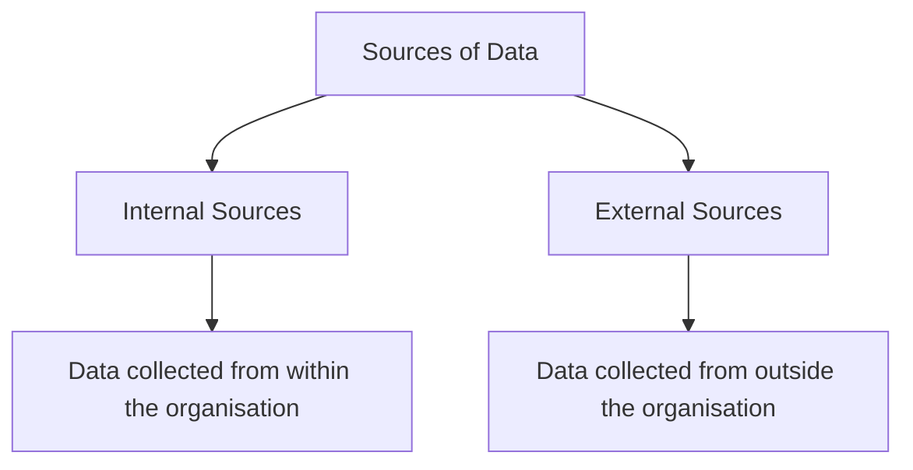
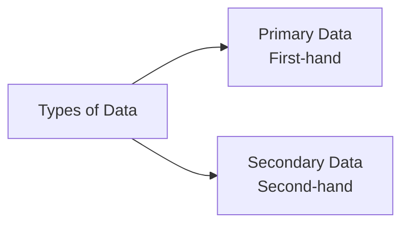
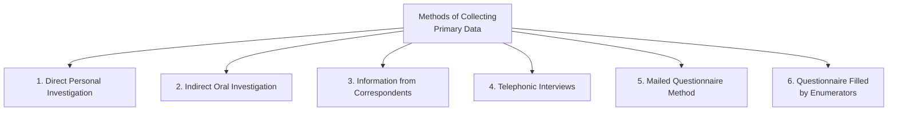
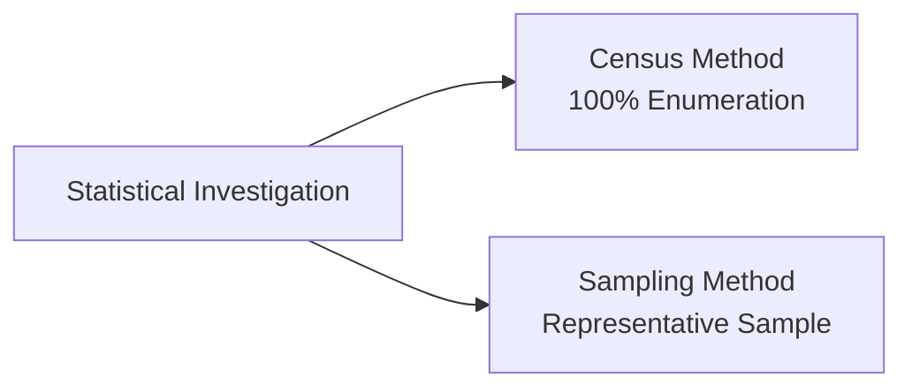
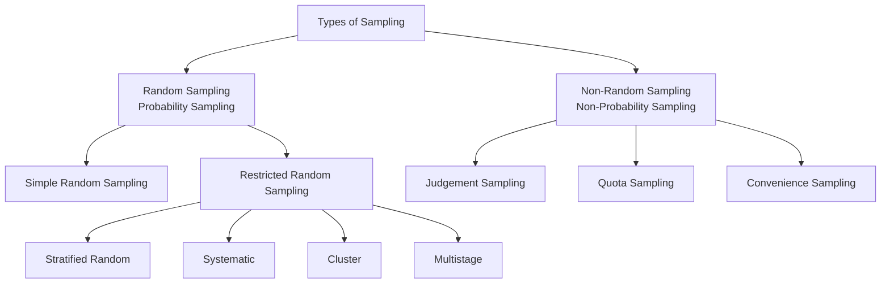
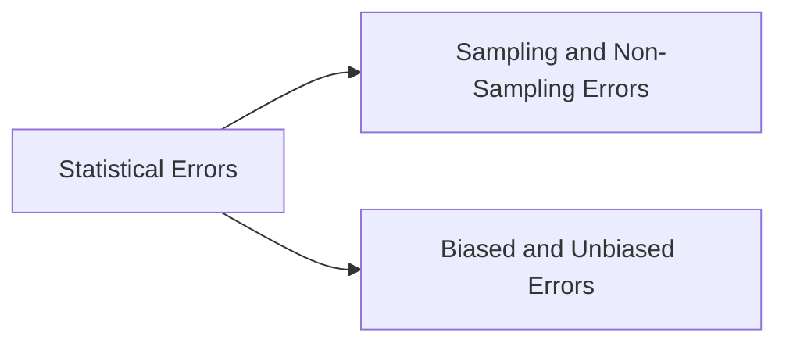
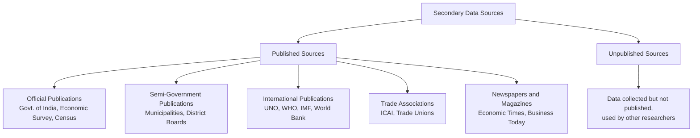

# Chapter 3: Collection of Data — Complete Revision Notes

> **Subject:** Statistics for Economics | **Class 11**

---

## 1. Introduction

The purpose of collecting data is to gather evidence for reaching a sound and clear solution to a problem. Data collection is the first and most important step in any statistical investigation.

```txt
Problem → Need for Evidence → Collect Data → Analyse → Solution
```

---

## 2. Sources of Data

Data can be obtained from two types of sources:



| Source | Meaning | Example |
|--------|---------|---------|
| **Internal Source** | Data collected from an organisation's own reports and records | Employee records (name, age, gender), sales data, annual reports |
| **External Source** | Data collected from outside the organisation | Tourism data gathered from external agencies for UP Tourism |

---

## 3. Types of Data: Primary vs Secondary



### 3.1 Primary Data

**Definition:** Data originally collected by an investigator or agency from its source of origin for the first time for a specific purpose.

* **Key characteristics:** Original, first-hand, collected for a specific purpose
* **Example:** Population census conducted by the Government of India — data is collected directly from people

### 3.2 Secondary Data

**Definition:** Data which is not directly collected but obtained from published or unpublished sources. It has already been collected and processed by someone else. Also known as **Second-hand Data**.

* **Key characteristics:** Already collected, obtained from published/unpublished sources, ready for use
* **Example:** A researcher using data from The Times of India for their study

### 3.3 Primary vs Secondary Data — Comparison Table

| Basis | Primary Data | Secondary Data |
|-------|-------------|----------------|
| **Originality** | Original — collected by the investigator themselves | Not original — uses data collected by others |
| **Source** | Collected directly using methods of data collection | Already collected and processed by someone else |
| **Time required** | Longer time needed for collection | Less time required |
| **Cost** | Expensive — requires money, personnel, and planning | Cheaper — obtained from published or unpublished material |
| **Accuracy** | High | Moderate — precautions needed before use |

---

## 4. Methods of Collecting Primary Data

There are **six methods** of collecting primary data:



---

### 4.1 Direct Personal Investigation (Personal Interview)

**What it is:** The investigator collects data through direct contact with the informant and conducts on-the-spot enquiry.

**Suitable when:**
* Detailed information is required
* The area of investigation is limited
* The nature of enquiry is confidential
* Maximum accuracy is needed
* Originality is important

| Merits | Demerits |
|--------|----------|
| Originality of data | Not suitable for wide areas |
| Reliable and accurate | Expensive and time-consuming |
| Flexibility — questions can be adapted | Personal bias/prejudice possible |
| Uniformity in data | Requires trained personnel |
| Suitable for all types of questions | |

---

### 4.2 Indirect Oral Investigation

**What it is:** The investigator approaches third parties who possess information about the subject of enquiry, rather than the informants themselves.

**Suitable when:**
* Informants are unable to give information due to ignorance or unwillingness
* The area of investigation is very large
* Secret or sensitive information needs to be gathered
* The problem is complex and requires expert opinion

| Merits | Demerits |
|--------|----------|
| Wide coverage | Indirect information — not original |
| Economical | Lack of accuracy |
| Free from investigator bias | Possibility of witness partiality |
| Expert opinion can be obtained | Lack of interest from informants |
| | Lack of uniformity |

### 4.3 Direct Personal vs Indirect Oral Investigation

| Basis | Direct Personal Investigation | Indirect Oral Investigation |
|-------|------------------------------|----------------------------|
| **Coverage** | Suitable for limited areas | Can cover wide areas |
| **Originality** | Data is original | Lacks originality |
| **Reliability** | More reliable and accurate | Less reliable and accurate |
| **Cost** | Expensive | Economical |

---

### 4.4 Information from Correspondents

**What it is:** Local agents or correspondents are appointed and trained to collect information from respondents.

**Real-life example:** News channels like CNN or News 18 have correspondents in different cities who collect and report news.

**Suitable when:**
* Regular and continuous information is required
* The area of investigation is very large
* A high degree of accuracy is not required

| Merits | Demerits |
|--------|----------|
| Wide coverage | Lack of originality |
| Economical | Lack of uniformity |
| Suitable for special purposes | Risk of partiality |
| Continuity of data | Lacks high degree of accuracy |
| | Time-consuming |

---

### 4.5 Telephonic Interviews

**What it is:** Data is collected through an interview over the telephone with the interviewer.

**Suitable when:**
* Respondents have a telephone connection
* Data needs to be collected quickly

| Merits | Demerits |
|--------|----------|
| Wide coverage | Limited use — not everyone has a telephone |
| Economical | Visual feedback is not possible |
| Doubts can be clarified | Respondents may be confused |

---

### 4.6 Mailed Questionnaire Method

**What it is:** The investigator prepares a questionnaire with a covering letter and sends it to respondents by mail. Respondents fill it out themselves and return it.

**Suitable when:**
* The field of investigation is very large
* Respondents are literate and likely to cooperate

| Merits | Demerits |
|--------|----------|
| Wide coverage | Limited scope — only for literate respondents |
| Economical | Less accuracy — questions may be misunderstood |
| Originality — respondent fills it themselves | Lack of interest — respondents may not return it |
| Free from investigator bias | Risk of misinterpretation |
| Maintains secrecy (can be anonymous) | Time-consuming |

---

### 4.7 Questionnaire Filled by Enumerators

**What it is:** The enumerator personally visits informants with a questionnaire, asks questions, and records their replies in their own language.

**Suitable when:**
* Adequate finance and trained enumerators are available
* A wide area needs to be covered
* Accuracy of results is important

| Merits | Demerits |
|--------|----------|
| Wide coverage | Costly method |
| Accurate and reliable information | Time-consuming |
| Better response due to personal contact | Risk of partiality |
| Limited chance of bias | Inability of untrained enumerators |
| Useful for illiterate respondents | |

> **Note:** A **questionnaire** is filled by the informant themselves, whereas a **schedule** is filled by the enumerator.

---

### 4.8 Quick Comparison — All 6 Methods

| Method | Coverage | Cost | Accuracy | Speed | Best For |
|--------|----------|------|----------|-------|----------|
| Direct Personal | Limited | High | Very High | Slow | Confidential/small areas |
| Indirect Oral | Wide | Low | Moderate | Medium | Sensitive info, expert opinion |
| Information from Correspondents | Wide | Low | Moderate | Medium | Regular/continuous data |
| Telephonic Interviews | Wide | Low | Moderate | Fast | Quick surveys |
| Mailed Questionnaire | Wide | Low | Moderate | Slow | Literate respondents, large area |
| Questionnaire by Enumerators | Wide | High | High | Slow | Illiterate respondents, accuracy needed |

---

## 5. Construction of a Good Questionnaire

The following principles should be followed when constructing a questionnaire:

1. **Covering Letter** — Attach a letter explaining the purpose of the survey
2. **Simple and Short Questions** — Avoid long and complicated questions
3. **Logical Arrangement** — Start with simple questions, difficult ones later
4. **Avoid Personal Questions** — People are reluctant to answer personal questions
5. **Avoid Leading Questions** — Do not suggest an answer (e.g., "Do you also think this product is good?")
6. **Avoid Double Negatives** — Questions like "Do you not disagree?" create confusion
7. **Avoid Questions Requiring Calculations** — Respondents generally avoid calculations
8. **Clear Instructions** — Explain clearly how to fill the questionnaire
9. **Pre-testing (Pilot Survey)** — Test the questionnaire on a small sample first
10. **Attractive Appearance** — A well-designed questionnaire gets better responses

---

## 6. Census Method vs Sampling Method



---

### 6.1 Census Method (Complete Enumeration)

**What it is:** Data is collected from each and every element of the population. Also known as **Complete Enumeration**, **100% Enumeration**, or **Complete Survey**.

**Example:** The Census of India is conducted every 10 years. Every household and every individual is surveyed.

| Merits | Demerits |
|--------|----------|
| Provides intensive and in-depth information | Very expensive, especially for large populations |
| Highly accurate and reliable | Requires more time and manpower |
| Suitable for heterogeneous populations | Cannot be used for infinite populations |
| | Cannot be used if the study involves destruction (e.g., testing tyres on road) |

---

### 6.2 Sampling Method

**What it is:** Only a few representative items (a sample) are selected from the population, and data collected from them is used to draw conclusions about the entire population.

**Example:** To find the average monthly wages of 600 workers, we survey only 60 workers instead of all 600. The average of the 60 workers is taken as representative of all 600.

| Merits | Demerits |
|--------|----------|
| Reduced cost — cheaper than census | 100% accuracy cannot be achieved |
| Greater speed — faster data collection | Sample may not be representative |
| Greater accuracy — if done scientifically, can be more accurate than census | Risk of bias in sample selection |
| Greater scope — possible even with specialised equipment | Requires specialised knowledge |
| Detailed enquiry — smaller size allows deeper study | Not suitable for heterogeneous populations |

---

### 6.3 Factors Affecting Sample Size

| Factor | If this is HIGH | Sample Size |
|--------|-----------------|-------------|
| Population Size | Large population | Larger sample |
| Accuracy Desired | More accuracy needed | Larger sample |
| Heterogeneity | Population is diverse | Larger sample |
| Nature of Study | Extensive (non-repeated) study | Larger sample |
| Non-cooperation | Many respondents may not cooperate | Larger sample |

---

### 6.4 Requisites of a Good Sample

1. **Representative** — Randomly selected so that every unit has an equal chance of being chosen
2. **Adequacy** — Large enough to represent all characteristics of the population
3. **Homogeneity** — The more homogeneous the population, the better the sample
4. **Independence** — Selection of each item should be independent of others
5. **Matches Objective** — The sample should serve the purpose of the investigation

---

### 6.5 Census vs Sampling — Comparison Table

| Basis | Census Method | Sampling Method |
|-------|--------------|----------------|
| **Nature of Enquiry** | Extensive — every unit is studied | Limited — only a few units are studied |
| **Economy** | High cost, time, and labour | Less cost, time, and labour |
| **Suitability** | Suitable for heterogeneous populations | Suitable for homogeneous populations |
| **Reliability and Accuracy** | Quite reliable and accurate | Less reliable and accurate |
| **Nature of Error** | Only error of bias possible | Sampling error in addition to bias error |
| **Organisation and Supervision** | Difficult to organise and supervise | Comparatively easier to organise and supervise |

---

## 7. Principles of Sampling

The theory of sampling is based on two important principles:

### 7.1 Law of Statistical Regularity

> If a random sample of adequate size is selected from a large population, it tends to possess the same characteristics as those of the population.

**In simple terms:** A properly selected random sample of sufficient size will accurately represent the entire population.

### 7.2 Law of Inertia of Large Numbers

> The aggregates or averages obtained from a large group are more stable than those obtained from a small group. The larger the sample size, the more accurate the results are likely to be.

**In simple terms:** More data leads to more stable and reliable results. Smaller groups have greater fluctuations.

---

## 8. Types of Sampling



---

### 8.1 Random Sampling (Probability Sampling)

Every item in the universe has a known chance of being chosen for the sample. No discrimination is involved.

#### (A) Simple Random Sampling (Unrestricted Random Sampling)

Every item of the population has an equal chance of being selected.

| Method | How it Works |
|--------|-------------|
| **Lottery Method** | Write names/numbers on slips, fold them, place in a bowl, mix thoroughly, and pick randomly |
| **Random Number Table** | Use a random number table to select items scientifically |

| Merits | Demerits |
|--------|----------|
| No personal bias | Unsuitable for small sampling |
| Based on probability — scientific | Difficult to prepare a sampling frame (complete list required) |
| Accuracy can be assessed | Time-consuming |
| Increasingly representative of the population | |

#### (B) Restricted Random Sampling

A random sample is selected under certain restrictions. Important methods include:

| Type | Explanation | Example |
|-------|-------------|---------|
| **Stratified Random** | Population is divided into groups (strata), and items are randomly selected from each group | Divide school students by class (6th, 7th, 8th...) then randomly select students from each class |
| **Systematic** | From a complete list, every nth item is selected | From a list of 1000, select every 10th item (10, 20, 30...) |
| **Cluster** | Population is divided into clusters, and a given number of clusters are chosen at random | School has 100 sections, randomly pick 10 sections, survey all students in those sections |
| **Multistage** | An extension of cluster sampling carried out in multiple stages | Country → 3 States → 2 Cities → 10 Localities → Households |

---

### 8.2 Non-Random Sampling (Non-Probability Sampling)

The selection of a sample depends on the judgement and convenience of the investigator rather than on chance.

#### (A) Judgement Sampling

The sample items are chosen based exclusively on the judgement of the investigator. The investigator must be well-trained and knowledgeable about the population.

| Merits | Demerits |
|--------|----------|
| Simple and easy — no complicated procedures | Personal prejudice/bias may affect selection |
| Proper representation (if investigator is skilled and unbiased) | Error of judgement possible |
| Avoids irrelevant items — only important ones selected | Not an objective method — sampling error cannot be measured |

#### (B) Quota Sampling

The population is subdivided into various groups, and a quota (number of items to be selected from each subgroup) is fixed. Within the quota, selection depends on the investigator's judgement.

| Merits | Demerits |
|--------|----------|
| Reliable results (if investigators are skilled) | Risk of personal prejudice |
| Economical — low cost of preparation and fieldwork | Sampling error cannot be estimated |

#### (C) Convenience Sampling

The investigator selects sample units based on convenience and accessibility.

| Merits | Demerits |
|--------|----------|
| Economical — less expensive and time-consuming | Sample does not represent the population |
| Easy to locate and contact respondents | Prone to bias by nature |
| Suitable for pilot surveys and pre-testing | Results are often unsatisfactory and misleading |

> **Key Difference:** In **random sampling**, chance decides who is selected. In **non-random sampling**, the investigator decides who is selected.

---

## 9. Statistical Errors

### 9.1 Sources of Statistical Errors

**Statistical Error** refers to the difference between the collected data and the actual value of facts. (Note: A **mistake** is a wrong calculation or use of an inappropriate method.)

**Sources of errors:**

| Error Type | Description |
|------------|-------------|
| **Error of Origin** | Arises from improper definition of the subject, investigator bias, defective questionnaire, improper sampling, or inherent instability of data |
| **Error of Manipulation** | Arises from errors in counting, measurement, description, and approximation of figures |
| **Error of Inadequacy** | Arises from incomplete or unrepresentative data, or from careless or unqualified investigators |
| **Error of Interpretation** | Occurs when data is misinterpreted |

### 9.2 Types of Statistical Errors



### 9.3 Measures of Statistical Errors

| Type | Formula | Example |
|-------|---------|---------|
| **Absolute Error** | \|Actual Value - Estimated Value\| | Actual = ₹1000, Estimated = ₹880 → Error = ₹120 |
| **Relative Error** | Absolute Error ÷ Actual Value | 120 ÷ 1000 = 0.12 or 12% |

---

## 10. Secondary Data — Sources and Precautions

### 10.1 Sources of Secondary Data



**Important Published Sources in India:**

| Source | Examples |
|--------|----------|
| Central and State Governments | Economic Survey, Five-Year Plans, Census of India, India Annual Book |
| Semi-Government | Municipalities, District Boards — data on birth, death, education |
| International | UNO, WHO, IMF, World Bank reports |
| Trade Associations | Institute of Chartered Accountants, Trade Unions |
| Newspapers and Magazines | Economic Times, Financial Express, Business Today |

### 10.2 Limitations of Secondary Data

1. No proper procedure may have been followed to collect the data
2. May be influenced by the prejudices of the original investigator
3. Sometimes lacks standard of accuracy
4. May not cover the full period required for investigation

### 10.3 Precautions Before Using Secondary Data

1. **Reliability** — Who collected the data? What method was used?
2. **Suitability** — Is the data suitable for the current purpose?
3. **Adequacy and Accuracy** — Is the data sufficient and accurate?

---

## 11. Important Organisations

### 11.1 Census of India

| Feature | Detail |
|---------|--------|
| **What it is** | The most complete and continuous demographic record of India's population |
| **Frequency** | Every 10 years (conducted continuously since 1881) |
| **First census after independence** | 1951 |
| **Most recent census** | 2011 (15th Indian census, 7th after independence) |
| **Responsible authority** | Office of the Registrar General and Census Commissioner, India (Ministry of Home Affairs) |
| **Data collected** | Size, density, sex ratio, literacy, migration, rural-urban distribution |

### 11.2 National Sample Survey Office (NSSO)

| Feature | Detail |
|---------|--------|
| **Established** | 1950 as the National Sample Survey (NSS) |
| **Recommended by** | National Income Committee headed by Prof. P. C. Mahalanobis |
| **Reorganised as NSSO** | March 1970 |
| **Purpose** | To fill gaps in statistical data for computation of national income, especially for the unorganised/household sector |

**Types of surveys conducted by NSSO:**

1. Socio-economic surveys
2. Annual Survey of Industries
3. Agricultural surveys

**Divisions of NSSO:**

| Division | Function |
|----------|----------|
| **SDRD** | Survey Design and Research Division |
| **FOD** | Field Operations Division |
| **DPD** | Data Processing Division |
| **CPD** | Co-ordination and Publication Division |

**Key Activities:**

* Conducts multi-subject integrated socio-economic surveys
* Undertakes field work for the Annual Survey of Industries
* Conducts sample checks on area enumeration and crop estimation surveys
* Prepares urban frames for drawing urban samples
* Collects price data from rural and urban sectors
* Conducts ad-hoc surveys and pilot enquiries for methodological studies

---

## 12. Practice Questions

### 12.1 Multiple Choice Questions

**Q1.** A good questionnaire should have:

* (a) Minimum questions
* (b) Concise wording
* (c) Clear language
* **(d) All of the above**

**Q2.** In random sampling:

* **(a) Each element has an equal chance of being selected**
* (b) The sample is always full of bias
* (c) The cost involved is very low
* (d) The cost involved is high

**Q3.** The quickest method of collecting primary data is:

* (a) Direct Personal Investigation
* (b) Indirect Oral Investigation
* **(c) Telephonic Interview**
* (d) Mailed Questionnaire Method

**Q4.** Stratified sampling is preferred when:

* (a) The population is perfectly homogeneous
* **(b) The population is non-homogeneous (heterogeneous)**
* (c) Random sampling is not possible
* (d) Small samples are required

**Q5.** Data collected from 'The Times of India' is an example of:

* (a) Primary Data
* **(b) Secondary Data**
* (c) Census data

**Q6.** After every ten years, information about the population of India is collected through:

* **(a) Census**
* (b) Sample survey
* (c) Both (a) and (b)
* (d) Neither (a) nor (b)

---

### 12.2 Assertion-Reason Questions

**Q7.**

**Assertion (A):** The results of Indirect Oral Investigation are very accurate.

**Reason (R):** In Indirect Oral Investigation, information is obtained from other persons, not directly from the informants.

**Alternatives:**

* (a) Both A and R are true, and R is the correct explanation of A
* (b) Both A and R are true, but R is NOT the correct explanation of A
* (c) A is true but R is false
* **(d) A is false but R is true** *(Indirect Oral Investigation is NOT very accurate)*

**Q8.**

**Assertion (A):** Census method is also known as '100% Enumeration'.

**Reason (R):** Data is collected from each and every element of the population under the census method.

**Alternatives:**

* **(a) Both A and R are true, and R is the correct explanation of A**

---

### 12.3 True or False Questions

**Q9.** State whether the following statements are True or False:

* (i) There are many sources of data. → **False** (There are only two: Primary and Secondary)
* (ii) Telephone survey is the most suitable method when the population is literate and spread over a large area. → **False** (Mailed Questionnaire is more suitable for literate populations)
* (iii) Data collected by the investigator is called secondary data. → **False** (It is called primary data)
* (iv) There is a certain bias involved in non-random selection of samples. → **True**

---

### 12.4 Identify the Method

**Q10.** Identify the appropriate method of collecting primary data:

* (i) Local agents are appointed and trained to collect information → **Information from Correspondents**
* (ii) Investigator collects data through direct contact with the informant → **Direct Personal Investigation**
* (iii) Data collected through a telephone interview → **Telephonic Interviews**
* (iv) Enumerator personally visits informants with a questionnaire → **Questionnaire Filled by Enumerators**
* (v) Investigator approaches third parties for information → **Indirect Oral Investigation**
* (vi) Questionnaire sent to respondents by mail → **Mailed Questionnaire Method**

---

### 12.5 Application Questions

**Q11.** In a village of 200 farms, a study was conducted to find the cropping pattern. Out of 50 farms surveyed, 50% grew only wheat. What are the population and sample size?

**Answer:** Population = **200 farms** | Sample = **50 farms**

**Q12.** Which method gives better results — Census or Sampling?

**Answer:** In terms of **accuracy**, the **Census method** is better because it studies every unit of the population. However, it is very time-consuming, expensive, and sometimes not feasible.

**Sampling** is considered a better method in practice because:

1. **Reduced cost** — data collection is limited to a fraction of the population
2. **Greater speed** — only representative units are approached
3. **Greater accuracy** — when conducted scientifically, it can be more accurate than census
4. **Greater scope** — possible even when specialised investigators or equipment are limited

**Q13.** Explain how you would use the lottery method to select 3 students out of 10.

**Answer:**

1. Write the names of all 10 students on separate slips of paper of identical size and shape
2. Fold the slips and place them in a bowl
3. Mix the slips thoroughly
4. Ask a blindfolded or unbiased person to pick three slips, one by one
5. The names on the three drawn slips are the selected students

---

## Chapter at a Glance — Quick Revision Card

| Topic | Key Point |
|-------|-----------|
| **Primary Data** | First-hand, original, collected by the investigator |
| **Secondary Data** | Already collected, from published or unpublished sources |
| **6 Collection Methods** | Direct, Indirect, Correspondents, Telephonic, Mailed, Enumerators |
| **Census** | 100% enumeration, accurate but expensive and time-consuming |
| **Sampling** | Few representative units, economical and fast |
| **Random Sampling** | Equal chance — includes Simple, Stratified, Systematic, Cluster, Multistage |
| **Non-Random Sampling** | Based on judgement — includes Judgement, Quota, Convenience |
| **Law of Statistical Regularity** | A random, adequate sample reflects population characteristics |
| **Law of Inertia of Large Numbers** | Larger samples give more stable results |
| **NSSO** | Set up in 1950 on recommendation of National Income Committee headed by P.C. Mahalanobis |

---

*Sources: NCERT Class 11 Statistics for Economics — Chapter 2: Collection of Data & verified against official records*
