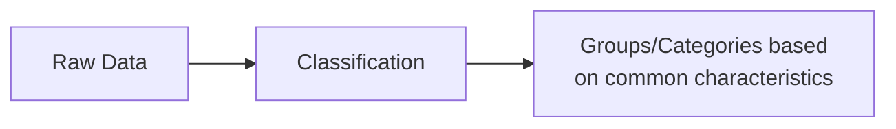
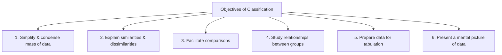
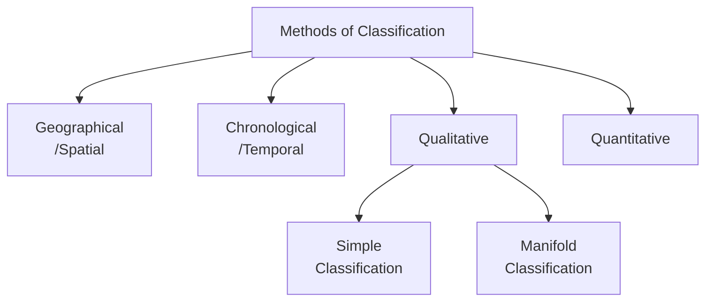
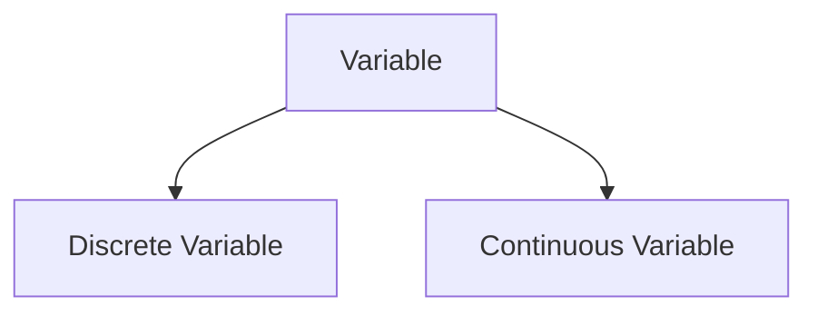
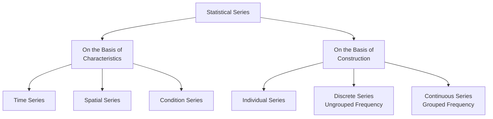
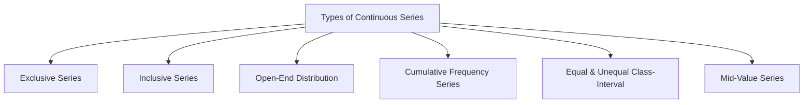

# Chapter 4: Organisation of Data — Complete Revision Notes

> **Subject:** Statistics for Economics | **Class 11**

---

## 1. Introduction

The data collected from primary and secondary sources is referred to as **'raw data'** or **'unclassified data'**. This raw data is like a pile of bricks — it needs to be arranged systematically before it can be used constructively.

**Organisation of data** means to present the data in a form which facilitates easy understanding and makes it suitable for further processing and interpretation.

```txt
Raw Data → Organisation → Classification → Tabulation → Analysis → Interpretation
```

---

## 2. Meaning of Classification

**Classification** is the process of arranging data into sequences and groups according to their common characteristics or separating them into different but related parts.

In simple words — classification is the process of **sorting data into groups** based on shared features.



---

### 2.1 Objectives of Classification



| Objective | Explanation |
|-----------|-------------|
| **Simplify & Condense** | Reduces huge data into manageable groups |
| **Explain Similarities & Dissimilarities** | Shows which items are alike and which are different |
| **Facilitate Comparisons** | Makes it easy to compare different groups |
| **Study Relationships** | Helps understand how variables are related |
| **Prepare for Tabulation** | Classification is the first step before creating tables |
| **Present Mental Picture** | Gives a clear overall view of the data |

### 2.2 Requisites of a Good Classification

| Requisite | Meaning |
|-----------|---------|
| **Suitable** | The classification should serve the purpose of investigation |
| **Unambiguous & Clear** | Each item should clearly belong to only one class |
| **Exhaustiveness** | Every observation must find a place in some class — no data should be left out |
| **Flexible** | Should be adaptable to different situations |
| **Mutually Exclusive** | Each observation must belong to only one class — no overlapping |
| **Stability** | Classification should be stable for comparison purposes |

---

## 3. Methods of Classification



---

### 3.1 Geographical Classification (Spatial Classification)

When data is classified according to **geographical location or region** (such as countries, states, districts, etc.), it is known as geographical classification.

**Example — Population of 5 States of India (Census 2011):**

| State | Andhra Pradesh | Tamil Nadu | Rajasthan | Karnataka | Gujarat |
|-------|---------------|------------|-----------|-----------|---------|
| Population (in '000) | 84,665 | 72,138 | 68,621 | 61,130 | 60,383 |

*Source: Census of India, 2011*

---

### 3.2 Chronological Classification (Temporal Classification)

When data is classified with respect to **different periods of time** (such as decade, years, months, etc.), it is known as chronological classification.

**Example — Population of Delhi (1951–2011):**

| Year | 1951 | 1961 | 1971 | 1981 | 1991 | 2001 | 2011 |
|------|------|------|------|------|------|------|------|
| Population (in '000) | 1,744 | 2,659 | 4,066 | 6,220 | 9,421 | 13,851 | 16,753 |

*Source: Census of India, 2011*

---

### 3.3 Qualitative Classification

In qualitative classification, data is classified on the basis of **descriptive characteristics** or **attributes** like sex, literacy, region, caste, education, etc. — which cannot be measured quantitatively.

#### (A) Simple Classification
When facts are classified into **two classes** according to **one attribute only**, it is called simple classification.

**Example — Population classified by Gender:**

```
        Population
        /        \
     Males     Females
```

#### (B) Manifold Classification
When facts are classified according to **more than one attribute**, or when each class is **sub-divided into more than two sub-classes**, it is called manifold classification.

**Example — Population classified by Gender, Literacy & Religion:**

```
                        Population
                      /            \
                  Males             Females
                 /      \          /        \
           Literate  Illiterate  Literate  Illiterate
           /     \     /    \    /    \     /       \
         Hindu Non-Hindu ...   ...   ...   ...     ...
```

---

### 3.4 Quantitative Classification (Numerical Classification)

In this classification, data is classified on the basis of characteristics which can be **measured** — such as height, weight, income, expenditure, production, or sales.

**Example — Age Distribution of Students:**

| Age (in Years) | Number of Students |
|----------------|-------------------|
| 10–12 | 150 |
| 12–14 | 130 |
| 14–16 | 100 |
| 16–18 | 120 |
| **Total** | **500** |

---

### 3.5 Methods of Classification — Comparison Table

| Basis | Geographical | Chronological | Qualitative | Quantitative |
|-------|-------------|---------------|-------------|--------------|
| **Criteria** | Location/Region | Time Period | Attributes (non-measurable) | Quantities (measurable) |
| **Example** | States, Countries | Years, Months | Gender, Literacy | Height, Weight, Income |
| **Nature** | Spatial | Temporal | Descriptive | Numerical |
| **Further division** | — | — | Simple/Manifold | Discrete/Continuous |

---

## 4. Concept of Variable

A **variable** refers to a quantity or characteristic whose value **varies** from one investigation to another. The difference in value may be with respect to individuals, items, places, or time.

Each value within such a range is called a **'variate'**.



### 4.1 Discrete Variable (Discontinuous Variable)

**Definition:** Variables which are capable of taking only **exact or finite values** and generally not any fractional value.

- **Change in value:** Increases in complete numbers (1, 2, 3...)
- **Data collection:** Obtained by **counting**
- **Examples:** Number of workers in a factory, number of students in a class, number of children in a family

**Example — Number of Children in 40 Families:**

| Number of Children | Number of Families |
|-------------------|-------------------|
| 0 | 7 |
| 1 | 5 |
| 2 | 25 |
| 3 | 3 |
| **Total** | **40** |

> Note: You cannot have 2.5 children in a family — it must be a whole number.

### 4.2 Continuous Variable

**Definition:** Those variables which can take **all possible values** (integral as well as fractional) in a given specified range.

- **Change in value:** Can increase in fractions as well as whole numbers
- **Data collection:** Obtained by **measurement**
- **Examples:** Height of a person (5.6 ft, 5.7 ft), weight of individuals (42.7 kg, 55.3 kg), temperature

**Example — Weight of 47 Students:**

| Weight (in kg) | Number of Students |
|----------------|-------------------|
| 40–45 | 22 |
| 45–50 | 6 |
| 50–55 | 9 |
| 55–60 | 10 |
| **Total** | **47** |

> Note: Weight can be 42.7 kg, 55.3 kg — measurements can be in fractions.

---

### 4.3 Discrete vs Continuous Variable — Comparison

| Basis | Discrete Variable | Continuous Variable |
|-------|-------------------|---------------------|
| **Meaning** | Takes only exact/finite values, generally no fractions | Can take all possible values (integral + fractional) |
| **Change in Value** | Increases in complete numbers (1, 2, 3...) | Can increase in fractions as well |
| **Data Collection** | Obtained by **counting** | Obtained by **measurement** |
| **Examples** | Number of workers, number of students, number of cars | Height, weight, temperature, time |

---

## 5. Frequency and Frequency Distribution

### 5.1 Frequency

**Frequency** refers to the number of times a given value appears in a distribution.

**Example:** Suppose there are 20 students in a class:
- 9 students scored 70 marks
- 6 students scored 85 marks
- 5 students scored 92 marks

Here, frequencies are **9, 6,** and **5** respectively.

### 5.2 Frequency Distribution

A **frequency distribution** is a table in which the frequencies and the associated values of a variable are written side by side.

```txt
Marks (Variable)  →  70    85    92
Frequency         →   9     6     5
```

---

## 6. Statistical Series

The arrangement of classified data in some **logical order** — like according to size, according to time of occurrence, or according to some other measurable or non-measurable characteristics — is known as a **Statistical Series**.

### 6.1 Kinds of Statistical Series



---

### 6.2 On the Basis of Characteristics

| Type | Description | Example |
|------|-------------|---------|
| **Time Series** | Values arranged in chronological order | Population of Delhi from 1951–2011 |
| **Spatial Series** | Data arranged according to location/region | Population of different states |
| **Condition Series** | Data classified under certain conditions | Students passed under different grading systems |

---

### 6.3 On the Basis of Construction

#### (A) Individual Series

Individual series refers to that series in which items are listed **singly** — each item is given a separate value.

**Unorganised Individual Series (Raw Data):**
Marks of 10 students: 35, 40, 38, 17, 25, 45, 36, 29, 42, 22

**Organised Individual Series (Ordered):**

| S. No. | 1 | 2 | 3 | 4 | 5 |
|--------|---|---|---|---|---|
| Marks | 35 | 40 | 38 | 17 | 25 |

---

#### (B) Discrete Series (Ungrouped Frequency Distribution)

A discrete series is that series where individual values differ from each other by a **definite amount** (usually by whole numbers).

**Construction using Tally Marks:**

| Marks | Tally Marks | Frequency |
|-------|-------------|-----------|
| 10 | \|\| | 2 |
| 15 | |||| | 4 |
| 20 | ||| | 3 |
| 25 | || | 2 |
| **Total** | | **11** |

> **Tally marks:** The symbol '|' denotes one value and '~~||||~~' (four lines crossed by a diagonal) represents 5 values.

---

#### (C) Continuous Series (Grouped Frequency Distribution)

A continuous series represents **continuous variables**, showing a **range of values** of different items of the series.

**Example:**

| Class Interval (Marks) | Frequency (Students) |
|----------------------|---------------------|
| 10–20 | 6 |
| 20–30 | 5 |
| 30–40 | 9 |
| 40–50 | 10 |
| **Total** | **30** |

---

## 7. Terms Related to Frequency Distribution

| Term | Meaning | Formula/Example |
|------|---------|----------------|
| **Tally Marks** | A simple tool used to count frequencies. '|' = 1, '~~||||~~' = 5 | Marks: 10, 10, 15, 15, 15|
| **Frequency** | Number of times a value appears | 9 students scored 70 → frequency = 9 |
| **Class Frequency** | Number of values in a particular class | Class 10–20 has frequency 6 |
| **Class Limits** | Two extreme ends of a class | In 10–20: 10 = Lower, 20 = Upper |
| **Class Width/Interval** | Difference between upper and lower class limits | 20 − 10 = 10 |
| **Class Mid-point** | Middle value of a class | (Upper Limit + Lower Limit) ÷ 2 |
| **Class with Maximum Concentration** | Class with the highest frequency | Highest frequency tells where most data lies |
| **Class with Minimum Concentration** | Class with the lowest frequency | Lowest frequency tells where least data lies |
| **Relative Frequency** | Frequency of a group as a % of total frequency | (Group Frequency ÷ Total Frequency) × 100 |

### 7.1 Class Mid-point Formula

```
Class Mid-point = (Upper Class Limit + Lower Class Limit) / 2
```

**Example:** For class 20–30 → Mid-point = (30 + 20) / 2 = 25

### 7.2 Relative Frequency Formula

```
Relative Frequency = (Frequency of a Group ÷ Total Frequency) × 100
```

**Example — Shoe Sizes:**

| Shoe Size | Frequency | Relative Frequency |
|-----------|-----------|-------------------|
| 7 | 4 | (4/30) × 100 = 13.33% |
| 8 | 7 | (7/30) × 100 = 23.33% |
| 9 | 9 | (9/30) × 100 = 30% |
| 10 | 6 | (6/30) × 100 = 20% |
| Others | 4 | (4/30) × 100 = 13.33% |
| **Total** | **30** | **100%** |

---

## 8. Types of Continuous Series



---

### 8.1 Exclusive Series

**Definition:** Classes where the **upper limit of one class-interval becomes the lower limit of the next class** are known as exclusive classes.

| Classes (Marks) | Frequency |
|----------------|-----------|
| 10–20 | 6 |
| 20–30 | 5 |
| 30–40 | 9 |
| 40–50 | 10 |
| **Total** | **30** |

> **Key rule:** A student scoring 20 marks would be included in the class **20–30** (not 10–20). The upper limit is excluded from the current class and included in the next class.

**Also known as:** Mutually exclusive classification — excludes the upper class limit but includes the lower class limit.

---

### 8.2 Inclusive Series

**Definition:** The series in which **both lower and upper limits** of a class-interval are included in the interval itself.

| Classes | Frequency |
|---------|-----------|
| 10–19 | 6 |
| 20–29 | 5 |
| 30–39 | 9 |
| 40–49 | 10 |
| **Total** | **30** |

> **Key rule:** A student scoring 29 marks is included in 20–29, and a student scoring 39 is included in 30–39.

> **Note:** For calculation purposes, inclusive series must be **converted to exclusive series** by adjusting class boundaries.

**Conversion Formula:**
```
Correction Factor = (Upper Limit of 1st Class - Lower Limit of 2nd Class) / 2
```
Then subtract the factor from lower limits and add to upper limits.

**Example — Converting Inclusive to Exclusive:**

| Inclusive | Exclusive (after conversion) |
|-----------|------------------------------|
| 10–19 | 9.5–19.5 |
| 20–29 | 19.5–29.5 |
| 30–39 | 29.5–39.5 |
| 40–49 | 39.5–49.5 |

---

### 8.3 Exclusive vs Inclusive Series — Comparison

| Basis | Exclusive Method | Inclusive Method |
|-------|-----------------|------------------|
| **Counting of upper limit** | Upper limit is counted in the **next** class | Upper limit is counted in the **same** class |
| **Overlap of limits** | Upper limit of one class = lower limit of next class | Upper limit and lower limit of next class are **different** (usually by 1) |
| **Conversion needed** | No conversion needed before calculation | Must be converted to exclusive method for calculation |
| **Example** | 10–20, 20–30, 30–40 | 10–19, 20–29, 30–39 |

---

### 8.4 Open-End Distribution

**Definition:** In a frequency distribution, if the **lower limit of the first class** and/or the **upper limit of the last class** is not given, it is known as open-end distribution.

**Example:**

| Marks | Below 20 | 20–30 | 30–40 | 40–50 | Above 50 |
|-------|----------|-------|-------|-------|----------|
| No. of Students | 7 | 6 | 12 | 15 | 8 |

> **Problem:** Open-end classes create difficulty in graphic presentation of data.

---

### 8.5 Cumulative Frequency Distribution

In cumulative frequency distribution, frequencies are presented in **cumulative form** either in increasing or decreasing order.

#### (A) 'Less Than' Cumulative Frequency Distribution

Frequencies of each class-interval are **added successively from top to bottom**.

| Marks | No. of Students (c.f.) | Calculation |
|-------|----------------------|-------------|
| Less than 10 | 2 | 2 |
| Less than 20 | 7 | 2 + 5 = 7 |
| Less than 30 | 17 | 2 + 5 + 10 = 17 |
| Less than 40 | 29 | 2 + 5 + 10 + 12 = 29 |
| Less than 50 | 46 | 2 + 5 + 10 + 12 + 17 = 46 |
| Less than 60 | 50 | 2 + 5 + 10 + 12 + 17 + 4 = 50 |

#### (B) 'More Than' Cumulative Frequency Distribution

Cumulative frequencies are obtained by finding totals starting from the **highest value to the lowest value**.

| Marks | No. of Students (c.f.) | Calculation |
|-------|----------------------|-------------|
| More than 0 | 50 | 2 + 5 + 10 + 12 + 17 + 4 = 50 |
| More than 10 | 48 | 5 + 10 + 12 + 17 + 4 = 48 |
| More than 20 | 43 | 10 + 12 + 17 + 4 = 43 |
| More than 30 | 33 | 12 + 17 + 4 = 33 |
| More than 40 | 21 | 17 + 4 = 21 |
| More than 60 | 4 | 4 |

---

### 8.6 Equal and Unequal Class-Interval Series

#### (A) Equal Class-Interval Series
When all classes in a series have the **same interval**.

| Class-Interval | Frequency |
|---------------|-----------|
| 10–20 | 7 |
| 20–30 | 4 |
| 30–40 | 3 |
| 40–50 | 6 |
| 50–60 | 3 |
| **Total** | **23** |

#### (B) Unequal Class-Interval Series
When class-intervals are **not equal**.

| Class-Interval | Frequency |
|---------------|-----------|
| 10–20 | 6 |
| 20–40 | 15 |
| 40–70 | 12 |
| 70–80 | 4 |
| 80–110 | 3 |
| **Total** | **40** |

---

### 8.7 Mid-Value Series

**Mid-value** or **Mid-point** is the middle value of a class-interval. When such mid-values are given instead of class limits, it is called a mid-value series.

**Steps to Convert Mid-Value Series to Continuous Series:**

| Step | Action |
|------|--------|
| **Step 1** | Calculate the **difference** between two consecutive mid-values |
| **Step 2** | Divide the difference by 2 to get half the difference |
| **Step 3** | **Subtract** half the difference from each mid-value to get the lower limit |
| **Step 4** | **Add** half the difference to each mid-value to get the upper limit |

**Example:**

| Mid-Value | Half Difference | Lower Limit | Upper Limit | Class Interval | Frequency |
|-----------|----------------|-------------|-------------|----------------|-----------|
| 5 | 5 | 5 − 5 = 0 | 5 + 5 = 10 | 0–10 | 4 |
| 15 | 5 | 15 − 5 = 10 | 15 + 5 = 20 | 10–20 | 8 |
| 25 | 5 | 25 − 5 = 20 | 25 + 5 = 30 | 20–30 | 10 |
| 35 | 5 | 35 − 5 = 30 | 35 + 5 = 40 | 30–40 | 6 |
| 45 | 5 | 45 − 5 = 40 | 45 + 5 = 50 | 40–50 | 2 |
| **Total** | | | | | **30** |

---

## 9. Bivariate Frequency Distribution

### 9.1 Univariate vs Bivariate Frequency Distribution

When data is classified on the basis of **two variables** (such as height and weight, marks in Maths and Statistics, etc.), the distribution is known as **Bivariate frequency distribution** or **Two-way frequency distribution**.

| Basis | Univariate Distribution | Bivariate Distribution |
|-------|------------------------|----------------------|
| **Meaning** | Data classified on the basis of a **single variable** | Data classified on the basis of **two variables** |
| **Purpose** | Describes a particular variable | Determines empirical relationship between two variables |
| **Also known as** | One-way frequency distribution | Two-way frequency distribution |
| **Example** | Height of students in a class | Height **and** Weight of students in a class |

### 9.2 Example — Bivariate Frequency Distribution

**Marks of 15 Students in Accounts and Economics:**

| Accounts \ Economics | 19 | 20 | 21 | 22 | Total |
|---------------------|:--:|:--:|:--:|:--:|:-----:|
| 25 | 3 | — | — | — | 3 |
| 26 | — | 4 | — | — | 4 |
| 27 | — | — | 6 | — | 6 |
| 28 | — | — | — | 2 | 2 |
| **Total** | **3** | **4** | **6** | **2** | **15** |

---

## 10. Key Terms — Quick Reference

| Term | Definition |
|------|------------|
| **Raw Data** | Data collected directly from sources, unprocessed |
| **Classification** | Grouping data based on common characteristics |
| **Variable** | A characteristic whose value varies |
| **Discrete Variable** | Takes only whole numbers (obtained by counting) |
| **Continuous Variable** | Takes any value, including fractions (obtained by measurement) |
| **Frequency** | Number of times a value occurs |
| **Frequency Distribution** | Table showing values and their frequencies |
| **Tally Marks** | Visual tool for counting frequencies |
| **Class Limits** | Lower and upper values of a class interval |
| **Class Width** | Difference between upper and lower class limits |
| **Class Mid-point** | Middle value of a class |
| **Relative Frequency** | Frequency expressed as a percentage of total |
| **Cumulative Frequency** | Running total of frequencies (less than / more than) |

---

## 11. Practice Questions

### 11.1 Multiple Choice Questions

**Q1.** Upper limit of any class is:

- (a) Same as the lower limit of the next class in exclusive series
- (b) Different in inclusive series
- (c) Both (a) and (b)
- **(d) None of these**

**Q2.** In inclusive class-intervals of a frequency distribution:

- (a) Upper limit of each class-interval is included
- (b) Lower limit of each class-interval is included
- **(c) Both (a) and (b)**
- (d) None of these

**Q3.** For determining class frequencies, it is necessary that these classes are:

- **(a) Mutually exclusive**
- (b) Not mutually exclusive
- (c) Independent
- (d) None of these

**Q4.** The lower class boundary is:

- (a) An upper limit to Lower Class Limit
- **(b) A lower limit to Lower Class Limit**
- (c) Both (a) and (b)
- (d) None of these

**Q5.** In an individual series, each variate value has:

- (a) Same frequency
- **(b) Frequency one**
- (c) Varied frequency
- (d) Frequency two

**Q6.** Drinking habit of a person is:

- **(a) An attribute**
- (b) A discrete variable
- (c) A variable
- (d) A continuous variable

**Q7.** The number of observations falling within a class is called:

- (a) Density
- **(b) Frequency**
- (c) Both (a) and (b)
- (d) None of these

**Q8.** Annual income of a person is:

- (a) A continuous variable
- (b) A discrete variable
- (c) An attribute
- **(d) Either (b) or (c)**

**Q9.** An open-end series is that series in which:

- (a) Lower limit of the first class-interval is missing
- (b) Upper limit of the last class-interval is missing
- **(c) Both (a) and (b)**
- (d) Class-intervals are unequal

**Q10.** A frequency distribution can be:

- (a) Discrete
- (b) Continuous
- **(c) Both (a) and (b)**
- (d) None of these

**Q11.** Mutually exclusive classification:

- **(a) Excludes the upper class limit but includes the lower class limit**
- (b) Excludes both the class limits
- (c) Includes the upper class limit but excludes the lower class limit
- (d) Either (b) or (c)

**Q12.** Which of the following is a cumulative frequency distribution?

- (a) Less than Series
- (b) More than Series
- **(c) Both (a) and (b)**
- (d) Open-end Series

**Q13.** Class-interval is measured as:

- (a) Half of the sum of lower and upper limit
- (b) The sum of the upper and lower limit
- (c) Half of difference between upper and lower limit
- **(d) The difference between upper and lower limit**

**Q14.** The data given as 5, 7, 12, 17, 79, 84, 91 will be called as:

- (a) A continuous series
- (b) A discrete series
- **(c) An individual series**
- (d) Time series

---

### 11.2 Assertion-Reason Questions

**Q15.**

**Assertion (A):** In case of Inclusive Series, the value of upper limit of a class never equals the value of lower limit of the next class.

**Reason (R):** Class frequencies are same in both exclusive and inclusive series, although the class-intervals are apparently different in the two cases.

**Alternatives:**

- (a) Both (A) & (R) are True & (R) is the correct explanation of (A)
- **(b) Both (A) & (R) are True & (R) is NOT the correct explanation of (A)** *(R is true but it doesn't explain why upper limit ≠ lower limit)*
- (c) (A) is True but (R) is False
- (d) (A) is False but (R) is True

**Q16.**

**Assertion (A):** Exclusive Series ensures continuity of data.

**Reason (R):** In case of exclusive series, upper limit of one class is the lower limit of succeeding class.

**Alternatives:**

- **(a) Both (A) & (R) are True & (R) is the correct explanation of (A)**
- (b) Both (A) & (R) are True & (R) is not the correct explanation of (A)
- (c) (A) is True but (R) is False
- (d) (A) is False but (R) is True

**Q17.**

**Assertion (A):** Population of different states of India as per Census 2011 is an example of Temporal Classification.

**Reason (R):** In case of Temporal Classification, data is classified with respect to different periods of time.

**Alternatives:**

- (a) Both (A) & (R) are True & (R) is the correct explanation of (A)
- (b) Both (A) & (R) are True & (R) is not the correct explanation of (A)
- (c) (A) is True but (R) is False
- **(d) (A) is False but (R) is True** *(Population of different states is Geographical, not Temporal classification)*

---

### 11.3 Statement-Based Questions

**Q18.** Read the following statements carefully and choose the correct alternative:

**Statement 1:** Classification facilitates grouping of data according to certain similarities and dissimilarities.
**Statement 2:** Classification provides a basis for tabulation and further statistical processing.

**Alternatives:**

- **(a) Both the statements are true**
- (b) Both the statements are false
- (c) Statement 1 is true & Statement 2 is false
- (d) Statement 2 is true & Statement 1 is false

**Q19.** Read the following statements carefully and choose the correct alternative:

**Statement 1:** Discrete Variables are capable of taking exact value as well as fractional value.
**Statement 2:** In case of discrete variable, data is obtained by measurement.

**Alternatives:**

- (a) Both the statements are true
- **(b) Both the statements are false** *(Discrete variables take only whole/exact values, and data is obtained by counting, not measurement)*
- (c) Statement 1 is true & Statement 2 is false
- (d) Statement 2 is true & Statement 1 is false

**Q20.** Read the following statements carefully and choose the correct alternative:

**Statement 1:** In case of open-end distribution, upper limit of first class and lower limit of last class is not given.
**Statement 2:** Open-end classes create problem in the graphic presentation of the data.

**Alternatives:**

- **(a) Both the statements are true**
- (b) Both the statements are false
- (c) Statement 1 is true & Statement 2 is false
- (d) Statement 2 is true & Statement 1 is false

---

### 11.4 Numerical Questions

**Q21.** The following are the marks of 30 students in Statistics. Prepare a frequency distribution taking the class-intervals:

```
12, 33, 23, 25, 18, 35, 37, 49, 54, 51,
37, 15, 33, 42, 45, 47, 55, 69, 65, 63,
46, 29, 18, 37, 46, 59, 29, 35, 45, 27
```

**Answer:** (Sample frequency distribution)

| Class Interval | Tally Marks | Frequency |
|---------------|-------------|-----------|
| 10–20 | |||| | 4 |
| 20–30 | |||| | 4 |
| 30–40 | |||| |||| | 9 |
| 40–50 | |||| ||| | 8 |
| 50–60 | |||| | 4 |
| 60–70 | ||| | 3 |
| **Total** | | **30** |

**Q22.** Prepare a frequency table taking class intervals 20–24, 25–29, 30–34 and so on, from the following data:

```
21, 20, 55, 39, 48, 46, 36, 54, 42, 30,
29, 42, 32, 40, 34, 31, 35, 37, 52, 44,
39, 45, 37, 33, 51, 53, 52, 46, 43, 47,
41, 26, 52, 48, 25, 34, 37, 33, 36, 27,
54, 36, 41, 33, 23, 39, 28, 44, 45, 38
```

*(Hint: Use inclusive classes and then convert if needed)*

**Q23.** From the following data, identify the lower limit of the first class and upper limit of the last class:

| Daily Wages | Less than 120 | 120–140 | 140–160 | 160–180 | Above 180 |
|-------------|:-------------:|:-------:|:-------:|:-------:|:---------:|
| No. of Workers | 35 | 12 | 10 | 40 | 13 |

**Answer:**
- Lower limit of first class = **0** (or not given — open-end)
- Upper limit of last class = **not given** — open-end distribution

**Q24.** Convert the following 'more than' cumulative frequency distribution into a 'less than' cumulative frequency distribution:

| Class-Interval (More than) | 10 | 20 | 30 | 40 | 50 | 60 | 70 | 80 |
|---------------------------|:--:|:--:|:--:|:--:|:--:|:--:|:--:|:--:|
| Frequency | 124 | 119 | 107 | 84 | 55 | 31 | 12 | 2 |

*(Hint: Work backwards — find the frequencies in each class first, then build less than cumulative)*

**Q25.** Prepare a frequency distribution from the following mid-value data:

| Mid Point | 25 | 35 | 45 | 55 | 65 | 75 |
|-----------|:--:|:--:|:--:|:--:|:--:|:--:|
| Frequency | 6 | 10 | 9 | 12 | 8 | 5 |

**Answer:**

Here, difference between mid-values = 10, half difference = 5.

| Mid Point | Lower Limit | Upper Limit | Class Interval | Frequency |
|-----------|-------------|-------------|----------------|-----------|
| 25 | 25−5=20 | 25+5=30 | 20–30 | 6 |
| 35 | 35−5=30 | 35+5=40 | 30–40 | 10 |
| 45 | 45−5=40 | 45+5=50 | 40–50 | 9 |
| 55 | 55−5=50 | 55+5=60 | 50–60 | 12 |
| 65 | 65−5=60 | 65+5=70 | 60–70 | 8 |
| 75 | 75−5=70 | 75+5=80 | 70–80 | 5 |
| **Total** | | | | **50** |

**Q26.** Prepare a bivariate frequency distribution for the following data for 20 students:

| Marks in Maths | 10 | 11 | 10 | 11 | 11 | 14 | 12 | 12 |
|----------------|:--:|:--:|:--:|:--:|:--:|:--:|:--:|:--:|
| Marks in Stats | 20 | 21 | 22 | 21 | 23 | 23 | 22 | 21 |

| Marks in Maths | 13 | 12 | 11 | 12 | 10 | 14 | 14 | 12 |
|----------------|:--:|:--:|:--:|:--:|:--:|:--:|:--:|:--:|
| Marks in Stats | 24 | 23 | 22 | 23 | 22 | 22 | 24 | 20 |

**Answer:** *(Construct a two-way table with Maths marks as rows and Stats marks as columns)*

| Maths \ Stats | 20 | 21 | 22 | 23 | 24 | Total |
|:-----------:|:--:|:--:|:--:|:--:|:--:|:-----:|
| **10** | 1 | — | 2 | — | — | 3 |
| **11** | — | 2 | 1 | 1 | — | 4 |
| **12** | 1 | 1 | 1 | 1 | — | 4 |
| **13** | — | — | — | — | 1 | 1 |
| **14** | — | — | 1 | 1 | 1 | 3 |
| **Total** | **2** | **3** | **5** | **3** | **2** | **15** |

---

## Chapter at a Glance — Quick Revision Card

| Topic | Key Point |
|-------|-----------|
| **Classification** | Arranging data into groups based on common characteristics |
| **4 Methods of Classification** | Geographical, Chronological, Qualitative (Simple/Manifold), Quantitative |
| **Variable** | Characteristic whose value varies — Discrete (counting) or Continuous (measurement) |
| **Frequency** | Number of times a value appears in a distribution |
| **Statistical Series** | Logical arrangement of classified data |
| **Individual Series** | Each item listed singly (unorganised or organised) |
| **Discrete Series** | Ungrouped frequency distribution — values differ by definite amounts |
| **Continuous Series** | Grouped frequency distribution — shows range of values |
| **Exclusive Series** | Upper limit excluded → goes to next class (10–20, 20–30) |
| **Inclusive Series** | Both limits included (10–19, 20–29) — must convert for calculations |
| **Open-end Distribution** | First class lower limit or last class upper limit missing |
| **Cumulative Frequency** | Running total — 'Less than' (top→bottom) or 'More than' (bottom→top) |
| **Mid-Value Series** | Given mid-points → convert by adding/subtracting half the difference |
| **Bivariate Distribution** | Classification based on two variables (two-way table) |

---

> *Sources: NCERT Class 11 Statistics for Economics — Chapter 4: Organisation of Data & verified against standard reference materials*
