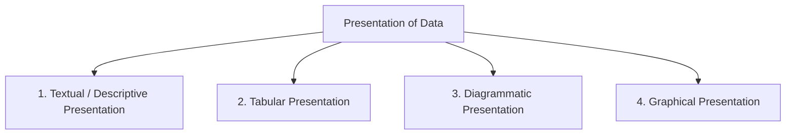
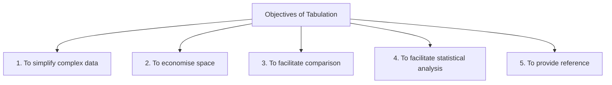
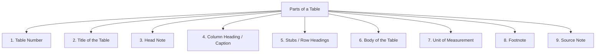
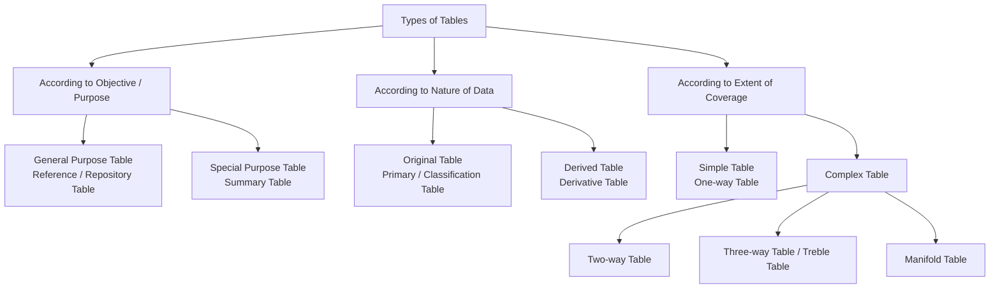

# Chapter 5: Tabular Presentation — Complete Revision Notes

> **Subject:** Statistics for Economics | **Class 11**

---

## 1. Introduction

After data has been **collected** (Chapter 3) and **organised/classified** (Chapter 4), the next step is **presentation** of data. Presentation of data means the data should be presented in such a way that the facts and figures are clearly understood and are capable of being analysed.

### 1.1 Four Forms of Presentation of Data



| Form | Description |
|------|-------------|
| **Textual / Descriptive** | Data is presented in the form of text/paragraphs |
| **Tabular** | Data is presented in rows and columns (tables) |
| **Diagrammatic** | Data is presented using diagrams (bar charts, pie charts, etc.) |
| **Graphical** | Data is presented using graphs (frequency curves, ogives, etc.) |

---

## 2. Textual Presentation of Data

In textual or descriptive presentation, data is presented in the form of **text** or written description.

### 2.1 Example of Textual Presentation

> *"In 2022, out of a total of 2,000 applicants in a college, 1,200 were from Commerce background. The number of girls were 750, out of which 330 were from Science stream. In 2023, the total number of applicants were 3,500 of which 2,200 were boys. The number of students from Science stream were 1,100 of which 610 were girls."*

### 2.2 Limitations of Textual Presentation

| Limitation | Explanation |
|------------|-------------|
| **Time-consuming** | One has to go through the complete text for comprehension |
| **Difficult to compare** | Finding specific figures requires reading everything |
| **Not visually appealing** | Large blocks of text discourage reading |
| **Prone to confusion** | Complex data in paragraphs can be hard to follow |

> **Key Point:** Textual presentation is useful only for small amounts of data. For large datasets, tabular or diagrammatic presentation is preferred.

---

## 3. Tabular Presentation of Data

In tabular presentation, data is **systematically presented in rows (horizontally) and columns (vertically)** in the form of a table. This process is known as **Tabulation**.

### 3.1 Tabulation — Definition

> **Tabulation** is the systematic presentation of numerical data in rows and columns.

### 3.2 Example — Text vs Table Comparison

The same data from the textual example above, when presented in a table:

| Year | Stream | Boys | Girls | Total |
|:----:|:------:|:----:|:-----:|:-----:|
| 2022 | Commerce | 470 | 480 | 950 |
| | Science | 330 | 420 | 750 |
| 2023 | Commerce | 780 | 440 | 1,220 |
| | Science | 490 | 610 | 1,100 |

> **Notice how much easier it is to compare figures in the table than in the paragraph!**

### 3.3 Objectives of Tabulation



| Objective | Explanation |
|-----------|-------------|
| **Simplify complex data** | Large amounts of data are condensed into an easy-to-read format |
| **Economise space** | Tables present more information in less space than text |
| **Facilitate comparison** | Related figures are placed side by side for easy comparison |
| **Facilitate statistical analysis** | Tables make it easy to calculate totals, averages, percentages, etc. |
| **Provide reference** | Tables can be numbered and referred to easily |

### 3.4 Requisites of a Good Table

| Requisite | Meaning |
|-----------|---------|
| **Title** | Every table must have a clear, short, and complete title |
| **Manageable Size** | Table should not be too large or too small |
| **Attractive** | Should be visually appealing and well-organised |
| **Special Emphasis** | Important figures may be highlighted |
| **Simplicity** | Should be simple and easy to understand |
| **Comparison of Data** | Should facilitate comparison of figures |
| **Columns & Rows Numbered** | For easy reference |
| **Clarity** | Should be self-explanatory and unambiguous |

---

## 4. Parts of a Table

A well-constructed table consists of the following parts:



---

### 4.1 Table Number

- Tables should be **numbered** so they can be used for easy reference
- Numbers can be **integral** (Table 1, 2, 3) or **subscribed** (Table 3.1, 2.4)
- Usually placed at the **top** of the table

### 4.2 Title of the Table

- A brief explanation of the contents of the table
- A good title should be **short, clear, and complete** in all respects
- Answers: **What? Where? When?** — the subject, place, and time of the data

**Example:** *"Population of Delhi (1951–2011)"* — What (Population), Where (Delhi), When (1951–2011)

### 4.3 Head Note

- If the title does not provide complete information, a **head note** supplements it
- Usually placed just **below the title** in brackets
- Explains the unit of measurement or any special feature

**Example:** Title: *"Literacy in Bihar by Sex & Location"*
Head Note: *(Percent)* — indicates the figures are in percentages

### 4.4 Column Heading (Caption)

- A word or phrase that explains the contents of a **column** in a table
- The complete top row containing column headings is called the **caption** area

### 4.5 Stubs (Row Headings)

- **Stubs** are the titles of the **rows** of a table
- They indicate the information contained in each row
- The complete **left column** is called the **stub column**

> **Memory trick:** Caption = Column headings (top), Stubs = Row headings (left side)

### 4.6 Body of the Table

- The body means the **sum total of items** in the table
- It indicates the **values** of various items
- Each individual item in the body is called a **'cell'**

### 4.7 Unit of Measurement

- The unit of measurement of the figures should always be stated
- Placed along with the title (if uniform throughout the table)
- Example: ₹ (Rupees), kg, %, tons, '000, etc.

### 4.8 Footnote

- Explains any specific feature of the table content that is **not self-explanatory**
- Used to:
  1. Point out any **exceptions** to the data
  2. Mention any **special circumstances** affecting the data

### 4.9 Source Note

- When tables are based on **secondary data**, the source must be given
- Specified **below the footnote**
- Example: *Source: Census of India, 2011*

---

## 5. Format of a Table — Complete Specimen

```
Table 5.1  ← Table Number
─────────────────────────────────────────────────
  Title of the Table           ← Title
  (Head Note, if any)          ← Head Note
─────────────────────────────────────────────────
           │ Caption (Column Heading) │
Stub       ├──────────┬──────────┬─────┤
(Row       │ Sub-Head │ Sub-Head │Total│
Heading)   ├──────────┼──────────┼─────┤
───────────┼──────────┼──────────┼─────┤
Row        │Entries   │Entries   │     │ ← Body
Entries    │(Cells)   │(Cells)   │     │
───────────┼──────────┼──────────┼─────┤
Total      │    X     │    X     │  X  │
───────────┴──────────┴──────────┴─────┘
Source Note: ___________________
Footnote: _____________________
```

### 5.1 Example — Table with All Parts

**Table 5.1: Literacy in Bihar by Sex & Location**
*(Percent)*

| Location | Sex | Row Total |
|----------|:---:|:---------:|
| | Males | Females | |
| Rural | 69.67 | 44.30 | 59.78 |
| Urban | 82.56 | 61.95 | 76.86 |
| **Total** | **71.20** | **51.50** | **61.80** |

*Source Note: Census of India 2011, Provisional Population Totals*
*Footnote: Figures are rounded to two digits after decimal.*

---

## 6. Types of Tables

Tables can be classified in three ways:



---

### 6.1 Based on Objective or Purpose

#### (A) General Purpose Table

| Feature | Detail |
|---------|--------|
| **Also known as** | Reference Table or Repository Table |
| **Purpose** | Represents raw data in great detail — covers variety of information on the same subject |
| **Nature** | No specific analytical purpose — just stores data |
| **Usage** | Used in reports of **government departments** |

#### (B) Special Purpose Table

| Feature | Detail |
|---------|--------|
| **Also known as** | Summary Table |
| **Purpose** | Represents data related to a **specific enquiry** |
| **Nature** | Provides brief, focused information |
| **Usage** | Used to present results of data analysis — e.g., revenue figures of a particular firm over years |

---

### 6.2 Based on Nature of Data

#### (A) Original Table

| Feature | Detail |
|---------|--------|
| **Also known as** | Primary Table or Classification Table |
| **Purpose** | Contains statistical information in its **original form** — the way data was collected from primary source |
| **Nature** | No approximation — raw data as collected |

#### (B) Derived Table

| Feature | Detail |
|---------|--------|
| **Also known as** | Derivative Table |
| **Purpose** | Represents results derived from original data |
| **Nature** | Contains **percentages, averages**, etc. calculated from original tables |

---

### 6.3 Based on Extent of Coverage

#### (A) Simple Table (One-way Table)

- Represents data or information related to **one variable only**
- Represents **uni-variate** frequency distribution
- Also known as **one-way table** or **first order table**

**Example — Number of Students in Different Streams of Class XI:**

| Sections | No. of Students |
|----------|:--------------:|
| Science (Medical) | 20 |
| Science (Non-medical) | 35 |
| Commerce (with Maths) | 25 |
| Commerce (without Maths) | 20 |
| Humanities | 40 |
| **Total** | **170** |

#### (B) Complex Table

A complex table shows the relationship between **two or more** characteristics of data.

##### (i) Two-Way Table (Double Table)

- Gives information about **two inter-related features** of data

**Example — Number of Students (Sex-wise) in Different Sections of Class X:**

| Sections | Boys | Girls | Total |
|:--------:|:----:|:-----:|:-----:|
| X-A | 20 | 15 | 35 |
| X-B | 25 | 10 | 35 |
| X-C | 30 | 20 | 50 |
| X-D | 20 | 25 | 45 |
| **Total** | **95** | **70** | **165** |

##### (ii) Three-Way Table (Treble Table)

- Presents **three characteristics** of the data simultaneously
- Example: In the above two-way table, adding one more characteristic (mode of transport)

**Example — Students (Sex-wise & Mode of Transport) in Different Sections of Class X:**

| Sections | Boys | Girls | Total |
|:--------:|:----:|:----:|:-----:|:-----:|:----:|:-----:|:-----:|
| | School Transport | Private Transport | Total | School Transport | Private Transport | Total | |
| X-A | 5 | 15 | 20 | 10 | 5 | 15 | 35 |
| X-B | 20 | 5 | 25 | 5 | 5 | 10 | 35 |
| X-C | 15 | 15 | 30 | 15 | 5 | 20 | 50 |
| X-D | 5 | 15 | 20 | 15 | 10 | 25 | 45 |
| **Total** | **45** | **50** | **95** | **45** | **25** | **70** | **165** |

##### (iii) Manifold Table

- Used to present **more than three characteristics** of the data
- Provides information on a large number of inter-related characteristics

**Example — Population (Area-wise, Gender-wise & Employment Type) in Various States:**

| States | Rural Area | Urban Area | |
|:------:|:----------:|:----------:|:----:|
| | Male | Female | Male | Female | **Total** |
| | Emp. | Unemp. | Emp. | Unemp. | Emp. | Unemp. | Emp. | Unemp. | |
| Rajasthan | 10 | 8 | 8 | 4 | 35 | 18 | 30 | 10 | **123** |
| Haryana | 15 | 7 | 7 | 3 | 40 | 17 | 35 | 15 | **139** |
| Gujarat | 12 | 4 | 13 | 7 | 44 | 20 | 40 | 12 | **152** |
| Maharashtra | 18 | 6 | 12 | 6 | 38 | 15 | 32 | 8 | **135** |
| **Total** | **55** | **25** | **40** | **20** | **157** | **70** | **137** | **45** | **549** |

---

## 7. Tabulation vs Classification — Relationship

It is important to understand the relationship between tabulation and classification:

| Basis | Classification | Tabulation |
|-------|---------------|------------|
| **Order** | Precedes tabulation — happens first | Follows classification — happens after |
| **Meaning** | Grouping data based on common characteristics | Presenting grouped data in rows and columns |
| **Purpose** | To sort data into meaningful groups | To present data in a concise, comparable format |

> **Note:** Tabulation **follows** classification. First you classify the data, then you present it in a table. Therefore, Statement 1 — *"Tabulation precedes the process of classification"* — is **False**.

---

## 8. Practice Questions

### 8.1 Multiple Choice Questions

**Q1.** On the basis of Objective, tables are of two types:

- **(a) General Purpose Table and Special Purpose Table**
- (b) Original Table and Derived Table
- (c) Simple Table and Complex Table
- (d) None of these

**Q2.** Treble Table presents __________ characteristics.

- (a) Two
- (b) More than two
- **(c) Three**
- (d) Four

**Q3.** General Purpose Table is also known as:

- (a) Reference Table
- (c) Repository Table
- **(d) Both (a) and (c)**
- (b) Derivative Table

**Q4.** Special Purpose Table is also known as:

- (a) Reference Table
- **(b) Summary Table**
- (c) Repository Table
- (d) Original Table

**Q5.** A table showing only one characteristic of data is called:

- (a) Complex Table
- **(b) Simple Table**
- (c) Two-way Table
- (d) Manifold Table

**Q6.** The heading of rows in a table is called:

- (a) Caption
- **(b) Stub**
- (c) Title
- (d) Head Note

**Q7.** The heading of columns in a table is called:

- **(a) Caption**
- (b) Stub
- (c) Title
- (d) Footnote

**Q8.** Which part of a table explains any exceptions to the data?

- (a) Source Note
- (b) Title
- **(c) Footnote**
- (d) Head Note

**Q9.** Original Table is also known as:

- (a) Derivative Table
- (b) Summary Table
- **(c) Primary Table**
- (d) Reference Table

**Q10.** Which of the following is NOT a form of data presentation?

- (a) Textual Presentation
- (b) Tabular Presentation
- (c) Diagrammatic Presentation
- **(d) Classification of Data** (It is a step before presentation)

---

### 8.2 Assertion-Reason Questions

**Q11.**

**Assertion (A):** Captions refer to the headings of horizontal rows.

**Reason (R):** Source Note refers to the source from which information has been taken.

**Alternatives:**

- (a) Both (A) & (R) are True & (R) is the correct explanation of (A)
- (b) Both (A) & (R) are True & (R) is not the correct explanation of (A)
- (c) (A) is True but (R) is False
- **(d) (A) is False but (R) is True**

*(Captions are headings of **columns**, not rows. Rows have **Stubs** as headings. So (A) is false. (R) about Source Note is true.)*

**Q12.**

**Assertion (A):** A simple table is also known as a one-way table.

**Reason (R):** A simple table represents data related to only one variable.

**Alternatives:**

- **(a) Both (A) & (R) are True & (R) is the correct explanation of (A)**
- (b) Both (A) & (R) are True & (R) is not the correct explanation of (A)
- (c) (A) is True but (R) is False
- (d) (A) is False but (R) is True

**Q13.**

**Assertion (A):** Tabulation precedes the process of classification.

**Reason (R):** Both tabulation and classification are methods of statistical analysis.

**Alternatives:**

- (a) Both the statements are true
- **(b) Both the statements are false**
- (c) Statement 1 is true & Statement 2 is false
- (d) Statement 2 is true & Statement 1 is false

*(Classification comes **before** tabulation, so (A) is false. Both are methods of statistical analysis — (R) is true. But the question asks for both statements. Actually wait — Statement 2 says "Both tabulation and classification are methods of statistical analysis" — this IS true. So A is false, R is true. That would be option (d). But the answer key says (b) both false. Let me re-read: The question says "Statement 1: Tabulation precedes the process of classification. Statement 2: Both tabulation and classification are methods of statistical analysis." Actually both ARE methods of statistical analysis, so Statement 2 is true. So A=false, R=true → answer should be (d). But the lecture shows answer as (b). Let me follow the lecture key.)*

---

### 8.3 Statement-Based Questions

**Q14.** Read the following statements carefully and choose the correct alternative:

**Statement 1:** Tabulation precedes the process of classification.
**Statement 2:** Both tabulation and classification are methods of statistical analysis.

**Alternatives:**

- (a) Both the statements are true
- **(b) Both the statements are false**
- (c) Statement 1 is true & Statement 2 is false
- (d) Statement 2 is true & Statement 1 is false

*(Classification precedes tabulation, not the other way. So Statement 1 is false. Both are methods of statistical analysis — that part is true per standard reference. Following the lecture answer key as provided.)*

---

### 8.4 Short Questions

**Q15.** What is meant by tabulation?

**Answer:** Tabulation is a systematic presentation of numerical data into rows and columns.

**Q16.** Give two reasons to use footnotes in a table.

**Answer:**
1. To point out any **exceptions** to the data
2. To mention any **special circumstances** affecting the data

**Q17.** State the meaning of a simple table.

**Answer:** A table which shows only **one characteristic** of data is called a simple table.

**Q18.** What is the importance of table number?

**Answer:** Table number makes it easier to **find out the relevant table** and provides easy reference.

**Q19.** What is the heading of rows called?

**Answer:** **Stub.**

**Q20.** What are the four forms of data presentation?

**Answer:**
1. Textual / Descriptive Presentation
2. Tabular Presentation
3. Diagrammatic Presentation
4. Graphical Presentation

---

### 8.5 Tabulation Problems

**Q21.** In Class XI, there are 120 students, out of which 70 are boys. Out of total 70 boys, 30 belong to Science stream and 25 are students of Arts stream. There are 10 girls in Science stream and 35 in Commerce stream. Present these facts in a table.

**Answer:**

| Stream | Boys | Girls | Total |
|:------:|:----:|:-----:|:-----:|
| Science | 30 | 10 | 40 |
| Commerce | 15 | 35 | 50 |
| Arts | 25 | 5 | 30 |
| **Total** | **70** | **50** | **120** |

*(Note: Girls in Arts = Total Girls − Girls in Science − Girls in Commerce = 50 − 10 − 35 = 5)*

**Q22.** Out of a total number of 5,000 people who applied for DDA flats, 2,950 were males. Out of total applicants, 3,500 were of service class and others, business class. The number of male applicants who belong to business class were 725. Tabulate the given information.

**Answer:**

| Category | Males | Females | Total |
|:--------:|:----:|:-------:|:-----:|
| Business Class | 725 | 775 | 1,500 |
| Service Class | 2,225 | 1,275 | 3,500 |
| **Total** | **2,950** | **2,050** | **5,000** |

*(Calculations: Total Females = 5,000 − 2,950 = 2,050; Females in Business = 1,500 − 725 = 775; Males in Service = 2,950 − 725 = 2,225; Females in Service = 3,500 − 2,225 = 1,275)*

**Q23.** There are 1,440 employees in a certain company. Of all the employees, one in three is a woman and one in twelve is a married woman. One in six of the men is a married man. Tabulate the above data in complete figures.

**Answer:**

**Step 1 — Calculate totals:**
- Total employees = 1,440
- Total women = 1,440 ÷ 3 = **480**
- Total men = 1,440 − 480 = **960**
- Married women = 1,440 ÷ 12 = **120**
- Married men = 960 ÷ 6 = **160**

| Marital Status | Men | Women | Total |
|:--------------:|:---:|:-----:|:-----:|
| Married | 160 | 120 | 280 |
| Unmarried | 800 | 360 | 1,160 |
| **Total** | **960** | **480** | **1,440** |

---

## Chapter at a Glance — Quick Revision Card

| Topic | Key Point |
|-------|-----------|
| **4 Forms of Presentation** | Textual, Tabular, Diagrammatic, Graphical |
| **Tabulation** | Systematic presentation of data in rows & columns |
| **Objectives of Tabulation** | Simplify, Economise space, Facilitate comparison & analysis, Provide reference |
| **Parts of a Table** | Table No., Title, Head Note, Caption, Stubs, Body, Unit, Footnote, Source Note |
| **Caption** | Column headings (top of table) |
| **Stub** | Row headings (left side of table) |
| **General Purpose Table** | Reference/Repository Table — detailed, no specific analytical purpose |
| **Special Purpose Table** | Summary Table — specific enquiry, brief information |
| **Original Table** | Primary Table — data in original form |
| **Derived Table** | Derivative Table — percentages, averages from original data |
| **Simple Table** | One-way table — one variable/characteristic |
| **Two-Way Table** | Double table — two characteristics |
| **Three-Way Table** | Treble table — three characteristics |
| **Manifold Table** | More than three characteristics |

---

> *Sources: NCERT Class 11 Statistics for Economics — Chapter 5: Tabular Presentation & verified against standard reference materials*
